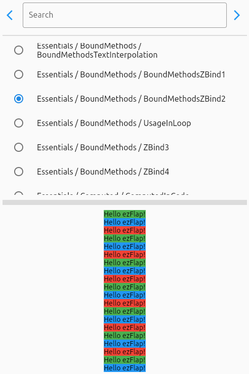

# ezFlap Docs
ezFlap is a reactive markup library for Flutter.

This is the ezFlap documentation repository that is deployed to [https://www.ezflap.io](https://www.ezflap.io).

This repository contains:
 * The ezFlap documentation that is deployed to [https://www.ezflap.io](https://www.ezflap.io).
 * The source code of the examples in the documentation, under `/Examples`.
 * An Example Player application to try (most of) the examples:

Related resources:
 * [ezFlap documentation](https://www.ezflap.io/essentials/introduction/introduction.html)
 * [ezFlap pub.dev package](https://pub.dev/packages/ezflap)
 * [ezFlap GitHub repository](https://github.com/ozlao/ezflap)
