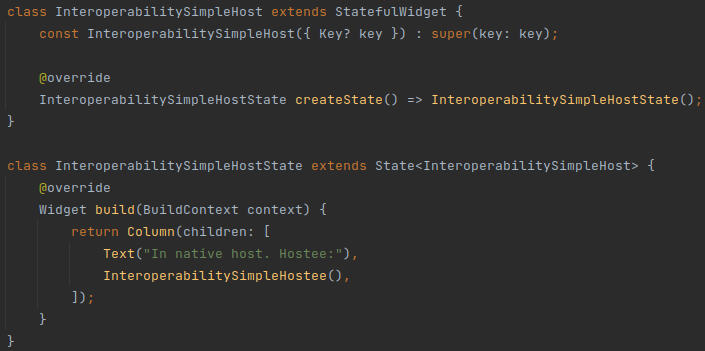

# Interoperability

## Overview
ezFlap widgets can work together with native widgets.

ezFlap widgets can use native widgets, be used in native widgets, and be authored so as to be used by Flutter
developers who don't use ezFlap.

## Use Native Widgets
It is possible to render native widgets using regular ZML widget tags.

Third-party widgets (i.e. widgets that are not built into Flutter) can be used this way as well - as long as their
libraries are imported into the ezFlap widget file.

[ZBuild](/advanced/z-build/z-build.html) can also be used to embed widgets generated the "native" way in the ZML.

## Use in Native Widgets
ezFlap widgets can be used inside native widgets.

### Simple ezFlap Widget
If an ezFlap widget has no interaction with its host (i.e. does not accept props, does not emit events, etc.) - then
it can be used simply by invoking its constructor:

#### Hostee

#### Host

### Interactive ezFlap Widgets
If an ezFlap widget has interactions with its host - an extra initialization step is required.

This initialization step should takes place at the widget's constructor, using the following methods provided by
ezFlap:

 * `initProp` - initialize an `@Ezprop`.
 * `initModel` - initialize an `@EzModel` or an `@EzOptionalModel`, using a getter and a setter functions.
 * `initEmitHandler` - initialize an `@EzEmit` with an event handler function.
 * `initInterpolatedText` - sets the [Interpolated Text](/advanced/interpolated-text/interpolated-text.html) of the widget.

#### Hostee

#### Host

::: warning CAVEAT
Notice how the `_counter` field in the host example above is of type `Rx<int>`.

This is needed for the passed model to be reactive. Without it - the `Counter: {{ '{{' }} counter }}` in the hostee widget will
not be updated on the screen when the user presses the button.

If the model only needs to be updated by the hostee - then it's not necessary to make it reactive (i.e. and so no need
to use an `Rx`).
:::

## Authoring ezFlap Widgets
In some cases we may want an ezFlap widget to support both instantiation methods:
 * From native code, using its constructor to pass props and other data.
 * From ezFlap ZML, using `z-bind` and other attributes to pass props and other data.

One example for such case is when authoring a widget for other people to use.

By default, ezFlap generates code that instantiates ezFlap widgets using their default constructor, which is expected
to work without parameters.

Since native widgets get their data via the default constructor (by default), and since some of the data may be
mandatory (i.e. the default constructor would not work without parameters) - ezFlap's generated code cannot use it.

To allow a widget to be dual-used by both native code and ZML - add a parameter-less custom factory method with the
name `$ezFlapFactory`.

When ezFlap detects such a factory - it generates code to use it instead of the default constructor.

For example:

#### Hostee

In the example above, we added a `$fromZML` parameter to the default constructor, to prevent it from initializing the
widget when invoked from the designated ezFlap factory `$ezFlapFactory()`.

::: tip WHY USE "$"?
We prefix the ezFlap factory with `$` to indicate to future users of the authored widget that this is an internal
factory that they should not call directly.
:::

An ezFlap host of our hostee may look like this:

And the native host could look like this:

