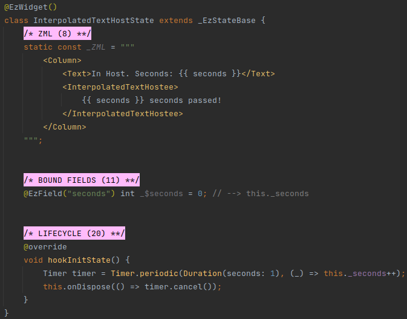
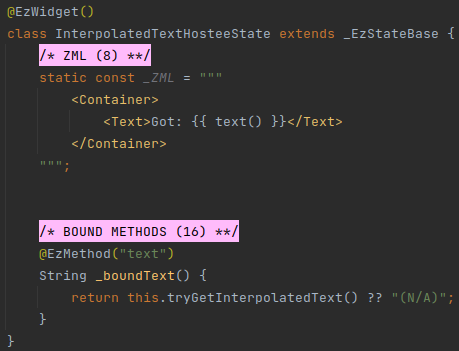

# Interpolated Text
ezFlap processes textual content of a tag (i.e. text between a pair of opening and closing tag) as interpolated text -
according to the [Text Processing](/essentials/transformers/transformers.html#text-processing) rules.

In some cases, like with _Text_ and _TextSpan_ tags - the interpolated text is handled by a transformer and passed to
the appropriate parameter of the tag.

When the tags around the text belong to an ezFlap widget - the interpolated text is accessible using the
`this.tryGetInterpolatedText()` method (i.e. instead of a computed method).

::: warning NOT REACTIVE
The `this.tryGetInterpolatedText()` method is not reactive.

However, it is possible to work around this by accessing it with a bound method, as seen in the below example.

When using a bound method - the UI will update when the text changes.
:::

#### Host

#### Hostee
