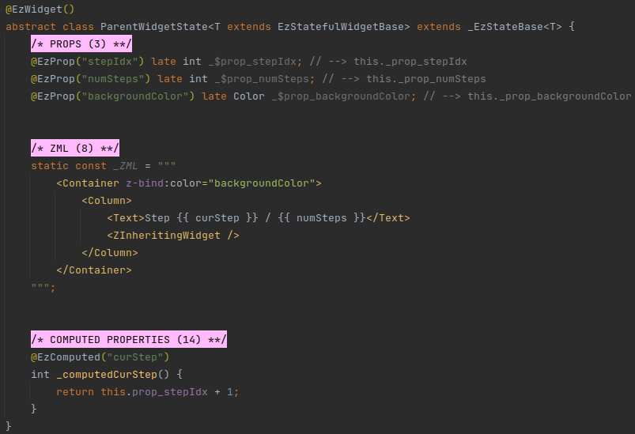
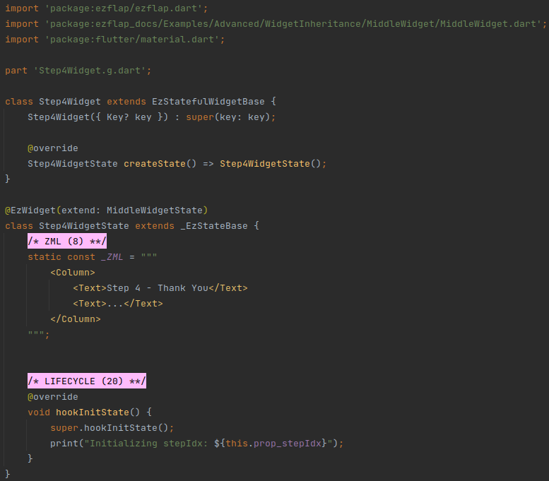

# Widget Inheritance

In some situations it may be convenient to have multiple ezFlap widgets extend a base widget.

For example, we may have a wizard with multiple steps, where each step has its own widget, but all steps share certain
functionality, like props, computed, bound fields, initialization logic, etc.

ezFlap widgets can extend abstract ezFlap widgets.

When an ezFlap widgets extend an abstract ezFlap widgets - it inherits all of its ezFlap functionalities (e.g. props,
etc.) - as if they were its own, except for the parent's ZML and ZSS.

The ZML of the child widget will be embedded in the ZML of its parent, using the `<ZInheritingWidget>` tag.

For example, consider the following parent widget:

In the example above, the `ParentWidget` widget:
 * Has a `ParentWidgetState` class, but no associated `ParentWidget` class.
 * Is `abstract`.
 * Has the `<ZInheritingWidget>` tag as a placeholder for where the ZML of the widgets extending it should be injected.
 * Has props and a computed that are accessible to widgets that extend it.

::: tip NO UNDERSCORE PREFIX
ezFlap generates code for the props, computed, and other ezFlap functionalities without an underscore prefix in order
to make them available to extending widgets.
:::

The ZSS of a parent widget is applied only to the ZML of the parent.

::: warning PARENT ZSS IS NOT APPLIED TO CHILDREN
The ZSS applied to a parent widget is not (automatically) applied to ZML of children widgets.

To apply it, reference the ZML in `@EzWidget` or move it to a ZSS file. See more information in [ZSS](/essentials/zss/zss).
:::

A child widget can look like this:

In the example above, the `Step1Widget` widget:
 * Has both State class (i.e. `Step1WidgetState`) and an associated `Step1Widget` class, like "regular" ezFlap widgets.
 * Passes the class of the widget it extends to the `@EzWidget` annotation, in the `extend` parameter.
 * Inherits all of its parent's props, and adds a `subtitle` prop of its own.
 * Overrides `hookInitState()`, and in it - calls `super.hookInitState()` to give its parent a chance to initialize
   first.

A couple more wizard steps can look like this:

And:

These three step widgets can be used in a wizard widget, like this:

It is possible to have multiple levels of inheritance.

For example, if we wanted to have a `MiddleWidget` between `ParentWidget` and a new `Step4Widget`, then we could
implement them like this:

#### MiddleWidget

#### Step4Widget

