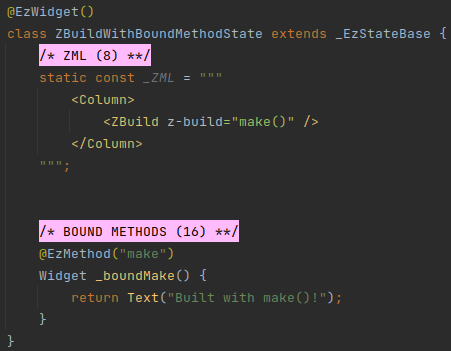

# ZBuild
The special `<ZBuild>` tag allows to inject widgets that are rendered in the "native" way - into the ZML.

It has two variants:
 * Build the widget by invoking a bound method.
 * Build the widget by invoking a builder function.

## Invoking Bound Method
We can use the `z-build` attribute to invoke a bound method that will return a Widget.

#### Example

## Builder Function
Alternatively, we can use the `z-builder` attribute to provide a builder function.

#### Example

When using this variation, the `z-builder` expects a Dart expression that evaluates to `Widget?`.

If the expression evaluates to `null` - nothing is rendered (not even an empty _Container_). 
