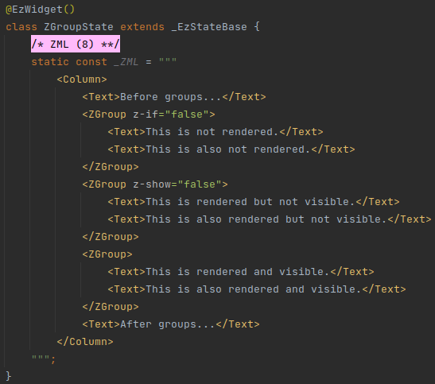

# ZGroup
The special `<ZGroup>` tag allows to apply `z-show` and `z-if` attributes to multiple tags at once.

#### Example

`<ZGroup>` supports only `z-show` and `z-if`.

In the generated code, the provided `z-show` and/or `z-if` attributes are applied to each of the children tags of the
`<ZGroup>` tag individually.
