# Core Widgets
## Overview
ezFlap Core Widgets are thin wrappers around native Flutter widgets.

Core Widgets "convert" native Flutter behaviors to the ezFlap approach.

For example, Core Widgets converts Flutter event callbacks to ezFlap events that are handled with `z-on`.

As another example, for input widgets, Core Widgets allow to get and set the input using `z-model`.

Core Widgets accept all the native parameters their wrapped Flutter widget accepts, except for parameters that are
handled with the ezFlap approach instead.

For example, a Core Widget will not accept a callback function as an `onTap` event handler, because the `onTap` event
would be emitted as an ezFlap event and handled with `z-on` instead.

Core Widgets are named after the native Flutter widgets they wrap, with the prefix `Ez`.

All Core Widgets are listed below, in alphabetical order.

## EzCheckboxListTile
 * Wraps: **CheckboxListTile**
 * Special inputs:
   * Unnamed model.
     * Optional.
     * Type: `bool?`.
   * Prop: `child`.
     * Optional.
     * Type: `Widget?`.
     * Passed to `CheckboxListTile.title` if `title` is not provided.
   * Prop `caption`.
     * Optional.
     * Type: `String`.
     * Wrapped in _Text_ and passed to `CheckboxListTile.title` if both `child` and `title` are not provided. If `caption`
       is not provided as well - then an empty string is used.
   * Prop `isDisabled`.
     * Optional.
     * Type: `bool`.
     * Default value: `false`.
 * Events:
   * Emits `changed`.
     * Signature: `void Function(bool? value)`.
     * Emitted when the checkbox is ticked or unticked.

#### Example
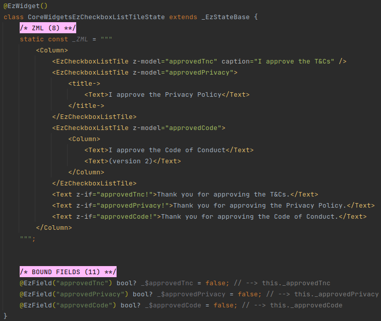

## EzDropdownButton
 * Wraps: **DropdownButton**
 * Special inputs:
   * Unnamed model.
     * Mandatory.
     * Type: `dynamic`.
   * Unnamed children.
     * Optional.
     * Type: `List<DropdownMenuItem<dynamic>>`.
     * When provided - passed to `DropdownButton.items`.
   * Prop `isDisabled`.
     * Optional.
     * Type: `bool`.
     * Default value: `false`.
 * Events
   * Emits `changed`.
     * Signature: `void Function(dynamic value)`.
     * Emitted when the selected item changes.
   * Emits `tap`.
     * Signature: `void Function()`.
     * Emitted when the dropdown button is tapped.

#### Example
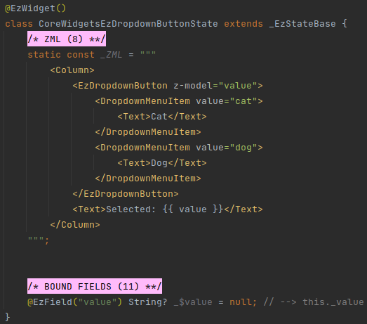

## EzElevatedButton
 * Wraps: **ElevatedButton**
 * Special inputs:
   * Prop `caption`.
     * Optional.
     * Type: `String?`.
     * If `child` is not provided - _Text_ with `caption` is used instead.
   * Prop `icon`.
     * Optional.
     * Type: `Widget?`.
     * When provided - the `ElevatedButton.icon()` constructor is used.
   * Prop `label`.
     * Optional.
     * Only used when `icon` is also provided.
     * If provided - passed to `ElevatedButton.label`. Otherwise - `child` will be used. If `child` is not provided -
       then `caption` will be wrapped in a _Text_ widget and used.
   * Prop `isDisabled`.
     * Optional.
     * Type: `bool`.
     * Default value: `false`.
 * Events:
   * Emits `pressed`.
     * Signature: `void Function()`.
     * Emitted when the button is pressed.
   * Emits `longPress`.
     * Signature: `void Function()`.
     * Emitted when the button is long-pressed.

#### Example
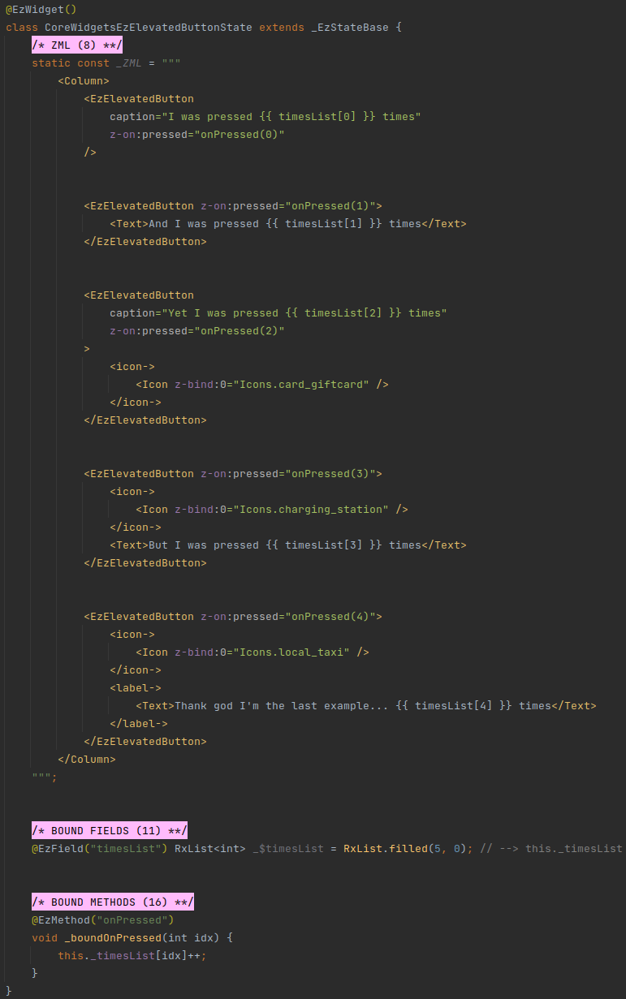

## EzFloatingActionButton
 * Wraps: **FloatingActionButton**
 * Special inputs:
   * Prop `isDisabled`.
     * Optional.
     * Type: `bool`.
     * Default value: `false`.
 * Events:
   * Emits `pressed`.
     * Signature: `void Function()`.
     * Emitted when the button is pressed.

#### Example
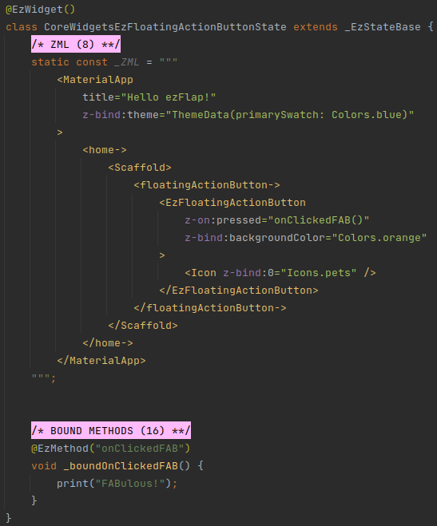

## EzIconButton
 * Wraps: **IconButton**
 * Special inputs:
   * Prop `child`.
     * Optional.
     * Type: `Widget?`.
     * If `child` is provided - it is used as the icon (i.e. it is passed to _IconButton_ in the `icon` parameter).
   * Prop `isDisabled`.
     * Optional.
     * Type: `bool`.
     * Default value: `false`.
 * Events:
   * Emits `pressed`.
     * Signature: `void Function()`.
     * Emitted when the button is pressed.

#### Example
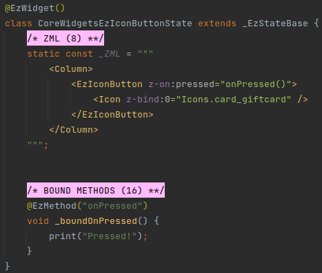

## EzRadioListTile
 * Wraps: **RadioListTile**
 * Special inputs:
   * Unnamed model.
     * Mandatory.
     * Type: `dynamic` (but should be the same actual type as the `value` prop).
   * Prop `value`.
     * Mandatory.
     * Type: `dynamic` (but should be the same actual type as the unnamed model).
   * Prop: `child`.
     * Optional.
     * Type: `Widget?`.
     * Passed to `RadioListTitle.title` if `title` is not provided.
   * Prop: `caption`.
     * Optional.
     * Type: `String?`.
     * Wrapped in _Text_ and passed to `RadioListTitle.title` if both `child` and `title` are not provided. If `caption`
       is not provided as well - then an empty string is used.
   * Prop `isDisabled`.
     * Optional.
     * Type: `bool`.
     * Default value: `false`.
 * Events:
   * Emits `changed`.
     * Signature: `void Function(dynamic value)`.
     * Emitted when the radio is ticked.

#### Example
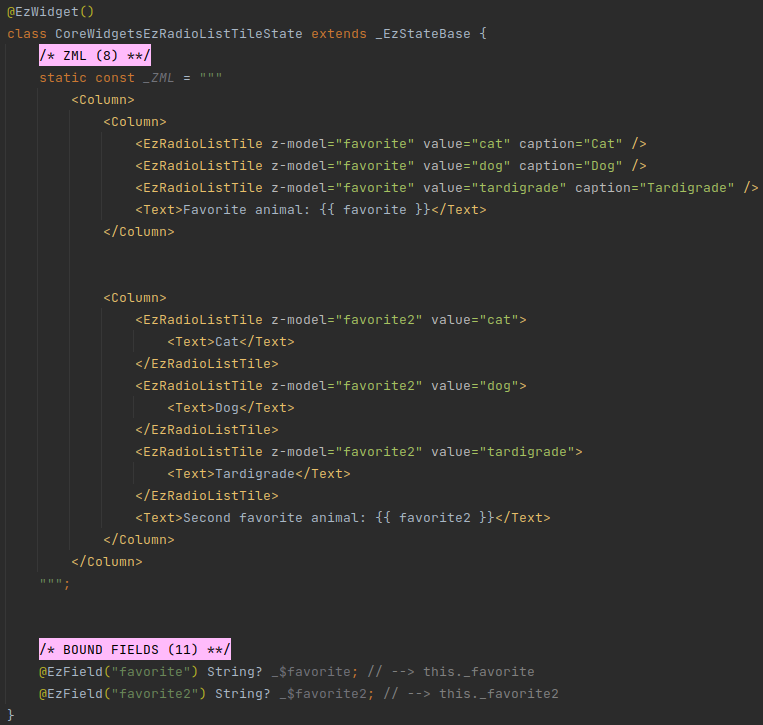

## EzRangeSlider
 * Wraps: **RangeSlider**
 * Special inputs:
   * Unnamed model.
     * Mandatory.
     * Type: `RangeValues`.
   * Prop `isDisabled`.
     * Optional.
     * Type: `bool`.
     * Default value: `false`.
 * Events:
   * Emits `changed`.
     * Signature: `void Function(RangeValues values)`.
     * Emitted on `RangeSlider.onChanged`.
   * Emits `changeStart`.
     * Signature: `void Function(RangeValues values)`.
     * Emitted on `RangeSlider.onChangeStart`.
   * Emits `changeEnd`.
     * Signature: `void Function(RangeValues values)`.
     * Emitted on `RangeSlider.onChangeEnd`.

#### Example
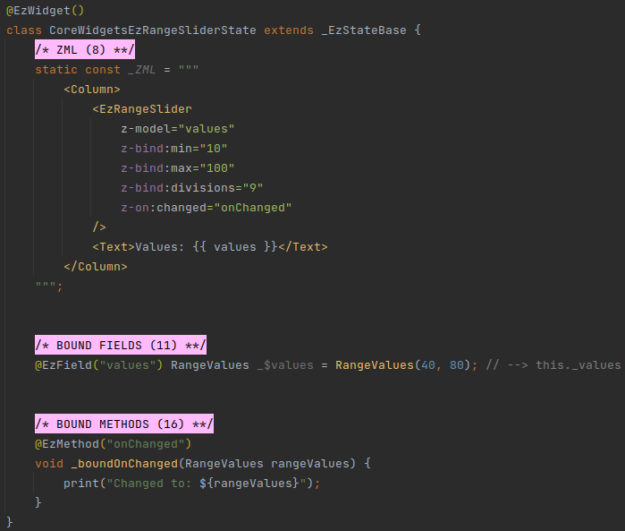

## EzSlider
 * Wraps: **Slider**
 * Special inputs:
   * Unnamed model.
     * Mandatory.
     * Type: `double`.
   * Prop `isDisabled`.
     * Optional.
     * Type: `bool`.
     * Default value: `false`.
 * Events:
   * Emits `changed`.
     * Signature: `void Function(double values)`.
     * Emitted on `Slider.onChanged`.
   * Emits `changeStart`.
     * Signature: `void Function(double values)`.
     * Emitted on `Slider.onChangeStart`.
   * Emits `changeEnd`.
     * Signature: `void Function(double values)`.
     * Emitted on `Slider.onChangeEnd`.

#### Example
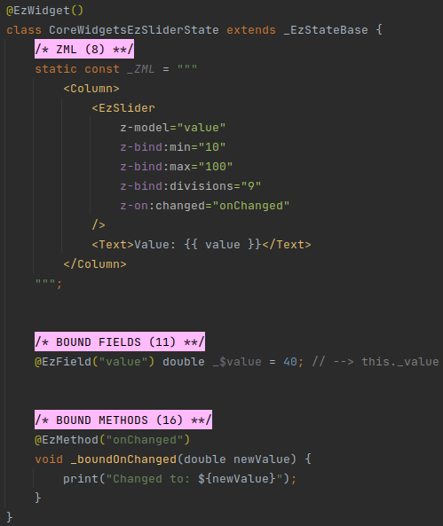

## EzToggleButtons
 * Wraps: **ToggleButtons**
 * Special inputs:
   * Unnamed model.
     * Optional.
     * Type: `List<bool>`.
   * Prop `isDisabled`.
     * Optional.
     * Type: `bool`.
     * Default value: `false`.
 * Events:
   * Emits `pressed`.
     * Signature: `void Function(int idx)`.
     * Emitted when one of the `children` is pressed.

#### Example
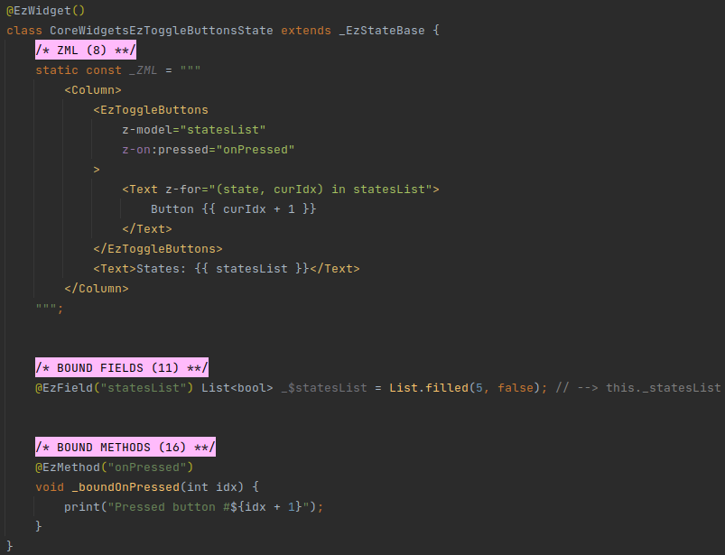

## EzTextButton
 * Wraps: **TextButton**
 * Special inputs:
   * Prop `caption`.
     * Optional.
     * Type: `String?`.
     * If `child` is not provided - _Text_ with `caption` is used instead.
   * Prop `isDisabled`.
     * Optional.
     * Type: `bool`.
     * Default value: `false`.
 * Events:
   * Emits `pressed`.
     * Signature: `void Function()`.
     * Emitted when the button is pressed.
   * Emits `longPress`.
     * Signature: `void Function()`.
     * Emitted when the button is long-pressed.

#### Example
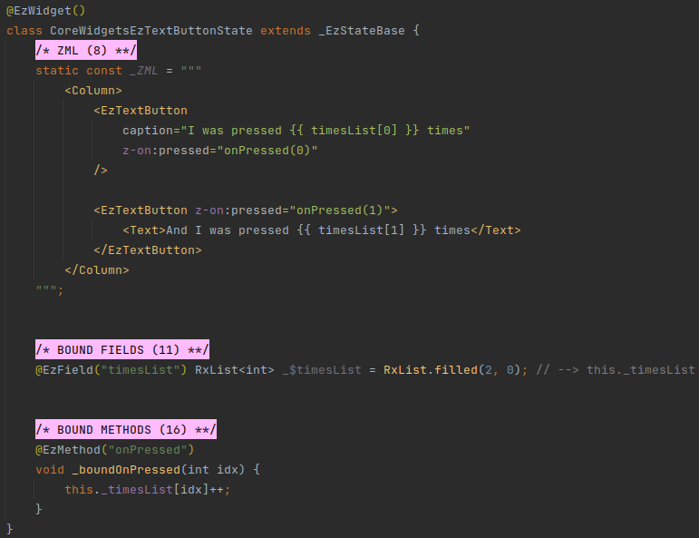

## EzTextField
 * Wraps: **TextField**
 * Special inputs:
   * Unnamed model.
     * Optional.
     * Type: `dynamic`.
 * Events:
   * Emits `changed`.
     * Signature: `void Function(String value)`.
     * Emitted on `TextField.onChanged`.
   * Emits `editingComplete`.
     * Signature: `void Function()`.
     * Emitted on `TextField.onEditingComplete`.
   * Emits `tap`.
     * Signature: `void Function()`.
     * Emitted on `TextField.onTap`.
   * Emits `submitted`.
     * Signature: `void Function(String value)`.
     * Emitted on `TextField.onSubmitted`.
   * Emits `appPrivateCommand`.
     * Signature: `void Function(String value, Map<String, dynamic> map)`.
     * Emitted on `TextField.onAppPrivateCommand`.

### Controller
Unlike _TextField_, _EzTextField_ does not accept a `controller` prop.

_EzTextField_ has its own controller. Value updates to and from the text field are done using the unnamed model.

Additional capabilities may be added in a future version of this widget.

### Casting
The type of _EzTextField_'s unnamed model is `dynamic`.

If the model actually provided from the host is not a `String?` - the content of the text field will be set to the
String representation of the provided value (i.e. using `toString()`).

As the user edits the text in the text field, the model will be updated.

If the actual model is of type `int?`, `double?`, or `num?` - then the context of the textbox will be parsed and the
resulting number (or null, if the value can't be parsed) - will be assigned to the model.

::: warning CAVEAT
In order for the actual model type to be detected correctly, the model must be provided from a bound field of the host
component.

In other words, if the value passed in `z-model` at the host widget is also an `@EzModel` at the host side - then this
won't work.

In such case - use `String` or `String?`.
:::

#### Example
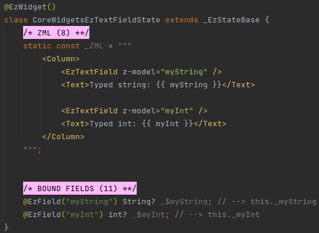

## EzTextFormField
 * Wraps: **TextFormField**
 * Special inputs:
   * Unnamed model.
     * Optional.
     * Type: `dynamic`.
 * Events:
   * Emits `changed`.
     * Signature: `void Function(String value)`.
     * Emitted on `TextField.onChanged`.
   * Emits `editingComplete`.
     * Signature: `void Function()`.
     * Emitted on `TextField.onEditingComplete`.
   * Emits `tap`.
     * Signature: `void Function()`.
     * Emitted on `TextField.onTap`.
   * Emits `fieldSubmitted`.
     * Signature: `void Function(String value)`.
     * Emitted on `TextField.onFieldSubmitted`.
   * Emits `saved`.
     * Signature: `void Function(String? value)`.
     * Emitted on `TextField.onSaved`.

_EzTextFormField_ has the same special behaviors as _EzTextField_ above.

#### Example
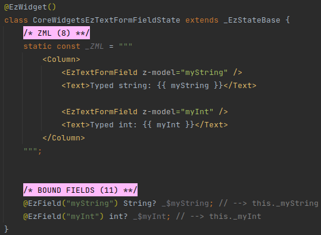
