# Dependency Injection

## Overview
The ezFlap library is primarily about widgets, but it also offers a few additional tools out of the box.

One of these tools is a simple, annotation-based dependency injection (DI) system.

Using the ezFlap DI system is optional.

::: tip USEFUL FOR TESTS
One benefit of using ezFLap DI is its integration with the ezFlap widget testing tools for
[mocking services](/testing/mock/mock.html#services).
:::

ezFlap DI supports two types of injections:
 * Hardcoded, where the injected class itself is referenced directly, and so the specific class that will be injected
   is determined at compile time.
 * Dynamic, where we reference a base class or an interface instead of an actual class, and the actual class can be
   decided in runtime.

## Services
Services are singletons that can be automatically injected into ezFlap widgets and into other services.

#### Example
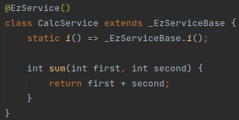

As seen in the above example, to create a service we:
 * Annotate a class with the `@EzService` annotation.
 * Add the static `i()` method: `static i() => _EzServiceBase.i();`.

### Custom Inheritance
ezFlap services always extend the generated `_EzServiceBase` class.

By default, the automatically-generated `_EzServiceBase` class extends ezFlap's `EzServiceBase` class, but it's
possible to make it extend a custom class, by passing that class' type as a parameter to `@EzService`.

::: warning SINGLETON TOO
The custom class needs to extend ezFlap's `EzServiceBase` class (directly or indirectly).
:::

#### Example
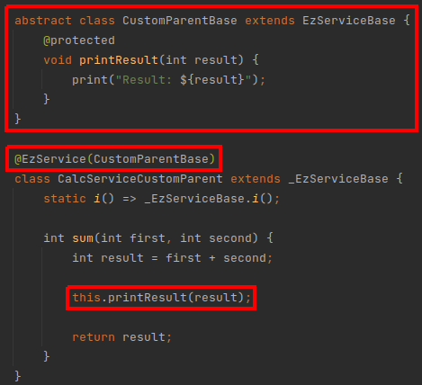

## Injection Targets
ezFlap services are injected with the `@EzDI` annotation into:
 * ezFlap widgets.
 * Other ezFlap services.

### ezFlap Widgets
ezFlap services can be injected into ezFlap widgets.

#### Example
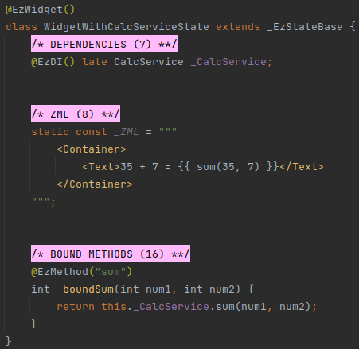

### ezFlap Services
ezFlap services can be injected into other ezFlap services.

#### Example
_CalcService_ is injected into _AdvancedCalcService_:

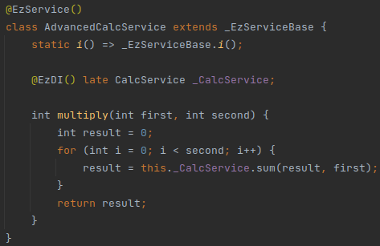

Both _CalcService_ and _AdvancedCalcService_ are injected into a widget:

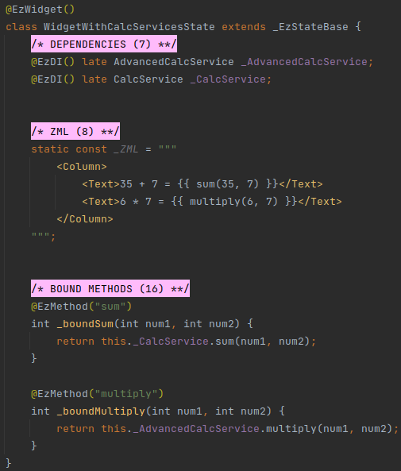

## Custom Targets
ezFlap services can be used in classes that don't support injection (i.e. classes that are neither ezFlap widgets, nor
other services).

To access an ezFlap service from such a class - get the service's instance using its `i()` function.

#### Example
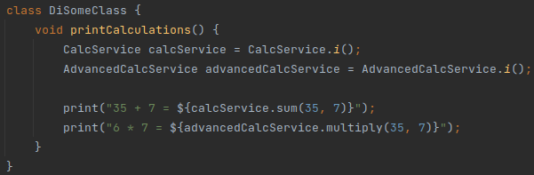

It's often convenient to use getters:

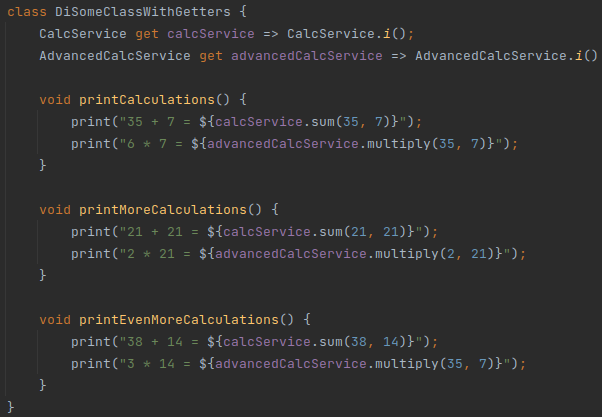

::: tip SERVICES ARE SINGLETONS
Services are singletons, and `@EzDI` is guaranteed to inject the same instance every time, in every target.

Directly calling the `i()` function is guaranteed to always return the same instance as well (which would also be the
same instance that is injected by `@EzDI`).
:::

## Injection Provider
In the above sections, we saw how to inject a service with the `@EzDI` annotation.

When using `@EzDI` - the injected service classes are specified directly, and so it is determined at compile time which
service would be injected.

Sometimes it can be useful to use an abstraction instead of a concrete class, and determine in runtime which service
will actually be injected.

This is accomplished with the `@EzDIProvider` annotation, and a couple of additional ezFlap helper classes.

In the below example, we will create a couple of services that return animals.

Each service will return a single animal, and the "choice" of which service to inject will be made in runtime.

For this, we will create the following classes:
 * AnimalProviderBase - an abstract class that will define the functionality expected from the concrete service classes.
 * AnimalResolver - allows to choose which provider to use.
 * CatAnimalProvider - a concrete service that will return a cat.
 * DogAnimalProvider - a concrete service that will return a dog.

#### AnimalProviderBase
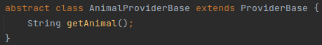

#### AnimalResolver
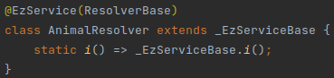

#### CatAnimalProvider
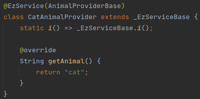

#### DogAnimalProvider

Finally, we tie it all up in an ezFlap widget, using the `@EzDIProvider` annotation.

In the below example, the user can change which service is used as the animal provider by pressing a button:

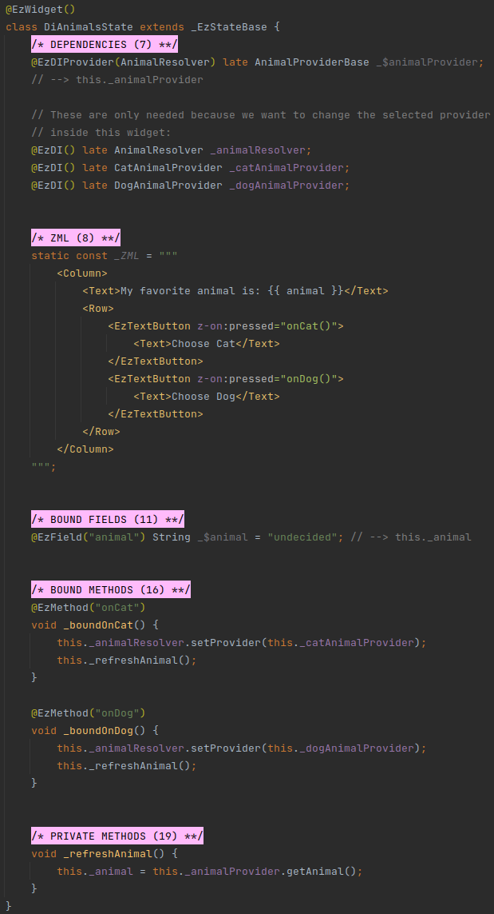

Note that, in the example above, we also inject `AnimalResolver`, `CatAnimalProvider`, and `DogAnimalProvider` with
`@EzDI`.

We only need to do this because we want to change the selected provider from within the widget.

This is useful for example purposes, but in most real life scenarios we would set the provider even before the widget
is rendered (e.g. during the bootstrapping phase of the application).

### Injection Hooks
Injection provider classes extend the `ProviderBase` class (in the example above `AnimalProviderBase` extends ezFlap's
`ProviderBase`).

The following hooks can be overridden by injection provider classes (e.g. such as `AnimalProviderBase`, or the classes
that extend it, like `CatAnimalProvider`):
 * `void hookAttachedToResolver()`
 * `void hookDetachedFromResolver()`

These hooks are called as a provider class is attached to or detached from the resolver.
