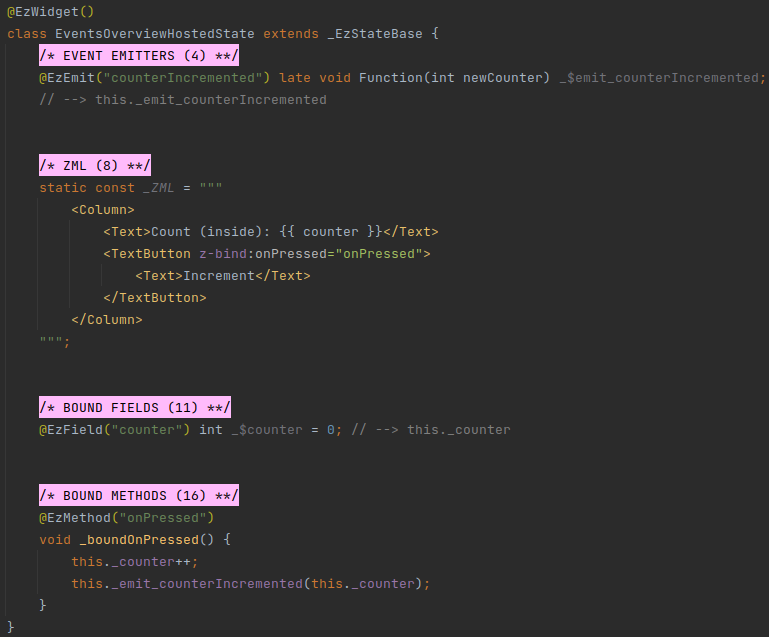
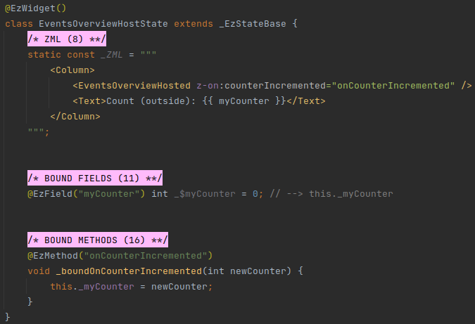
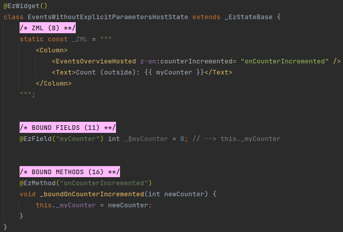
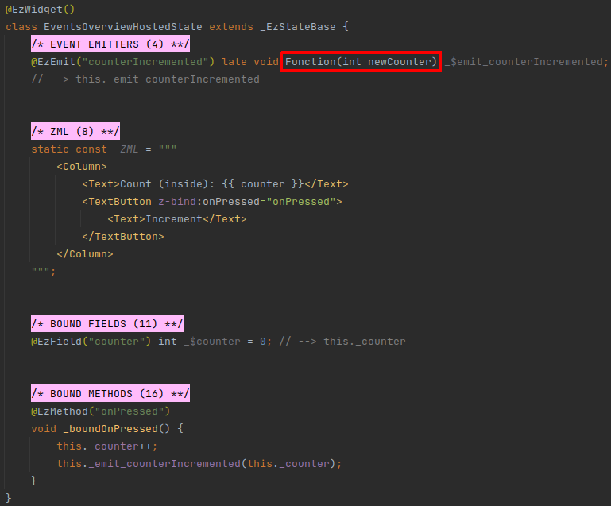
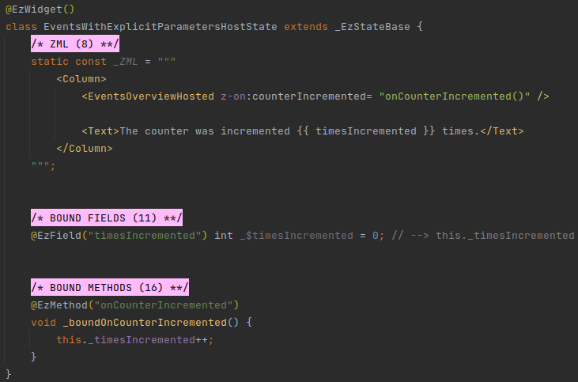
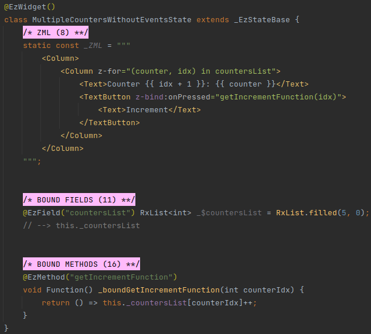
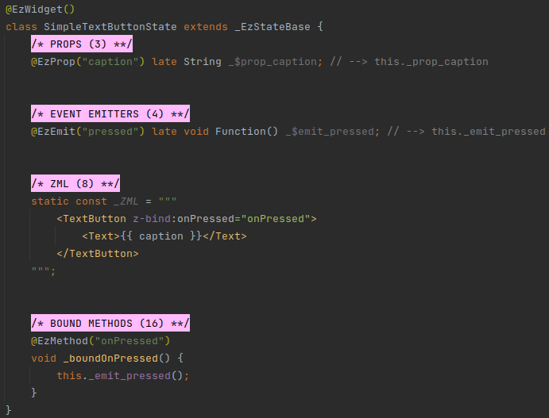
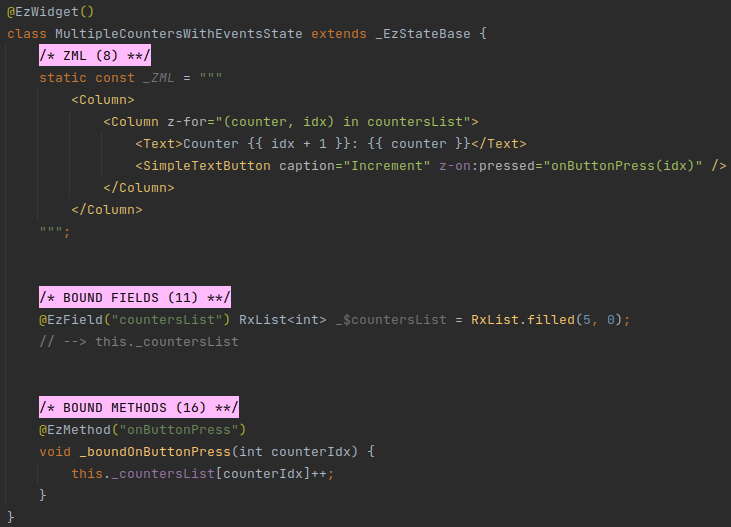
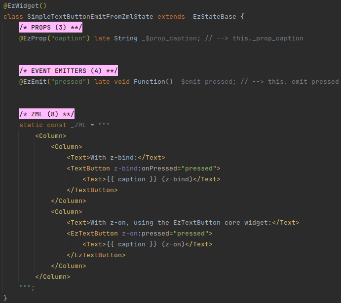
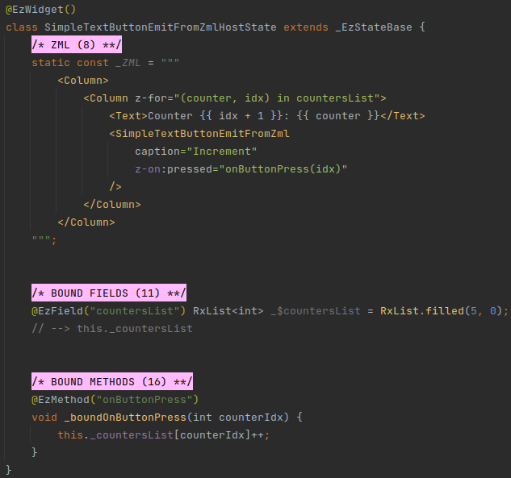

# Events

## Overview
[Props](/deep-dive/props/props) allow top-down communication with the widget - the widget's host uses attributes to pass
data down to the ezFlap widget using attributes.

Events allow bottom-up communication with the host widget - the hosted widget emits events and the host widget can listen to
them.

#### Example
We use the `@EzEmit` annotation to define an event in the hosted widget:



We use the `z-on` attribute prefix to register a bound method of the host widget as a listener for the event:



In the above example, the `EventsOverviewHost` widget registers  its `onCounterIncremented` bound method as a listener
for the `counterIncremented` event of the `EventsOverviewHosted` widget.

When the user presses the _TextButton_ in the `EventsOverviewHosted` widget - the local `counter` bound field is
incremented, and then broadcasted in the `counterIncremented` event.

This causes the `onCounterIncremented` event handler to be invoked, and assign the new counter (which is passed to it
as a parameter) to the local `myCounter`.

::: tip EVENT HANDLING IS OPTIONAL
It is not mandatory to register listeners to events.

When no listeners are registered to an event - the event is ignored.
:::


## @EzEmit
Events are defined in the widget that emits them (i.e. in the hosted widget).

Events are defined using fields of type `Function` that are annotated with the `@EzEmit` annotation.

The signature of the `Function` type determines the data that will be sent with the event.

The value passed to `@EzEmit` as parameter is the event's Assigned Name.

Events do not return values, and so the `Function` in their type needs to have a `void` return type.


## z-on
Event handlers are defined and registered to events in the host widget, using the `z-on` attribute prefix.

Attributes prefixed with `z-on` are assigned to events in the hosted widget by matching their names against the Assigned
Names of the hosted widget's events (i.e. the value passed to each event's `@EzEmit` annotation). 

The `z-on` attributes syntax has two variations:
 * Without explicit parameters.
 * With explicit parameters.


### Without Explicit Parameters
#### Example


In the above example, the `onCounterIncremented` bound method is passed in `z-on:counterIncremented`. Note how
`onCounterIncremented` has no parentheses.

With this syntax, `onCounterIncremented` must have the same signature as the `counterIncremented` event emitter
function in `EventsOverviewHosted`:



::: tip WHEN IS IT USEFUL?
Registering a bound method with an event listener without explicitly specifying its parameters is useful when the event
has parameters that we want to receive.
:::

### With Explicit Parameters
#### Example 1


In the above example, the `onCounterIncremented` bound method has a different signature from the `counterIncremented`
event.

The event includes a single integer parameter for the new value of the counter, but the host's `onCounterIncremented`
function accepts no parameters.

In the above example, we don't care about the actual value of the counter, but only about the number of times it was
increased.

Therefore, we have no need for the updated counter value, and we don't need to accept any parameter.

We express this by explicitly providing the parentheses in 
```
z-on:counterIncremented="onCounterIncremented()"
```

This technique is commonly used when working with loops.

Imagine that we want to have multiple counters, with a button next to each one.

Whenever a button is pressed - its counter needs to increase by one.

We can implement the UI with a `z-for` loop, but we need a way to pass the index of each counter to the method that
will increase it.

This is how it can be done with a native _TextButton_ and a bound method, **without** an event:



In the above example, we use `z-bind:onPressed` to assign a handler for the native Flutter `onPressed` callback of
_TextButton_.

The _TextButton_ `onPressed` parameter expects a `void Function()` callback.

Instead of passing a bound method directly, we call `getIncrementFunction` with the current counter's index as
parameter, and pass its result to `onPressed`.

`getIncrementFunction` returns a `void Function()` that increments the specific counter.

So, technically, five separate handler functions are created, one for each counter, and each one is passed to the
`onPressed` parameter of the _TextButton_ of a counter.

This can be simplified by creating a wrapper widget for _TextButton_, and instead of accepting the `onPressed` handler
with `z-bind` - emit an event, and handle it with a `z-on` attribute with the index passed as an explicit parameter.

This way, it's not necessary to implement a `getIncrementFunction` method that creates the actual handler functions.

The _TextButton_ wrapper could look like this:



And we would use it like this:



::: tip EzTextButton
The ezFlap core widgets package offers such a widget out of the box: [EzTextButton](/deep-dive/core-widgets/core-widgets.html#eztextbutton).
:::

::: warning EITHER / OR
It is not possible to combine the two modes.

In other words, it is not possible to have the event handler functions receive both local parameters that are passed
using the explicit parameters syntax, **and** also receive parameters sent with the event from the widget that emitted
it.
:::


### Conventions
Strongly-recommended conventions that may become mandatory in a future version:
 * The event's Assigned Name (the name provided as parameter to the `@EzEmit` annotation) should be in camelCase.
 * The event's `void Function` field name should begin with `_$emit_`, followed by the Assigned Name.

Optional suggested conventions:
 * Place the `@EzEmit` annotation at the same line as the declaration.
 * Add a `// --> this._emit_<Assigned Name>` comment at the end of every event field declaration.
 * Use [Live Templates](/tooling/live-templates/live-templates) to generate event declarations quickly and
   consistently, and without having to remember the syntax.


## Usage
### From Code
Events can be invoked from code.

When invoked from code, an event emitter is accessed using the Derived Name of its declaration.

The Derived Name is the text following the `_$`, prefixed with an underscore.

For example, the Derived Name of:
```dart
@EzEmit("pressed") late void Function() _$emit_pressed;
```

Would be `_emit_pressed`.


### From ZML
Events can also be invoked directly from ZML, by assigning them to `z-on` or `z-bind` attributes:



The above example shows both variations - `z-bind` with a native _TextButton_, and `z-on` with the _EzTextButton_
core widget.

Both the `z-bind` and `z-on` emit the same `pressed` event, which can be caught exactly the same as we've seen before:


