# JSON

## Overview
ezFlap offers the `@EzJson` annotation to allow easy serialization of data classes into JSON, and deserialization from
JSON.

The ezFlap JSON serializer/deserializer has the following features:
 * Serialize primitives: `int`, `num`, `double`, and `String`.
 * Serialize collections of primitives: `List<int>`, `Set<num>`, `Map<String, String>`, etc.
 * Serialize reactive collections: `RxList<String>`, `RxMap<String, double>`, etc.
 * Serialize collections of collections of primitives: `List<Set<num>>`, `Map<String, Map<String, double>>`, etc.
 * Serialize collections of collections of collections of primitives (and so on, to infinity).
 * Serialize referenced instances of `@EzJson` data classes.
 * Serialize collections of instances of `@EzJson` data classes (recursively).
 * Serialize into a `Map<String, dynamic>` (which can be passed to [json.encode](https://api.dart.dev/stable/2.15.1/dart-convert/JsonCodec-class.html)).
 * Serialize into a String (as JSON).
 * Deserialize (all of the above).
 * Works well with `@EzReactive` to make data classes both serializable and reactive.


## @EzJson
We use the `@EzJson` annotation to add JSON support to a class.

We use the `@EzValue` annotation to add JSON support to a field in the class.

#### Example
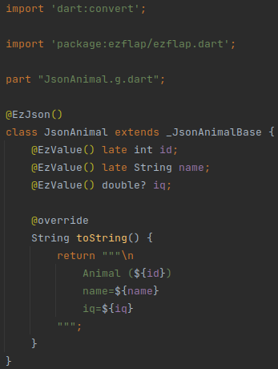

The above example shows how to use `@EzJson` and `@EzValue`.

Additionally:
 * Our data class (`JsonAnimal`) extends the generated `_JsonAnimalBase` class.
   * The name `_JsonAnimalBase` is created automatically according to the name of our class (i.e. _JsonAnimal_).
 * A couple of fields are `late` and one is nullable. Both variations are supported.
   * Default values are not currently supported.


## Serialization
### Simple class
This is how a `JsonAnimal` instance can be serialized:

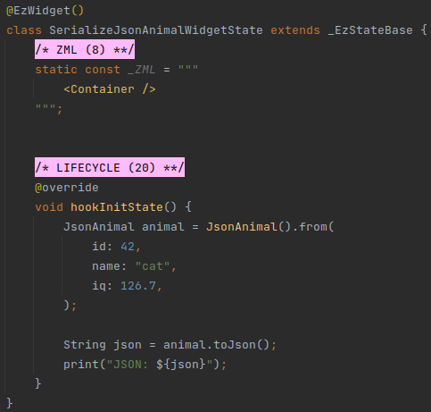

In the above example, we instantiate `JsonAnimal` with `JsonAnimal()` and then populate it using the
`_JsonAnimalBase.from()` method.

This method is generated automatically, and has a named parameter for each `@EzValue` field.

The output of the above example is:
```json
{"id":42,"name":"cat","iq":126.7,"previousOwnersList":["Alice","Bob"]}
```

### Recursive Classes
Let's create a `JsonOwner` class:

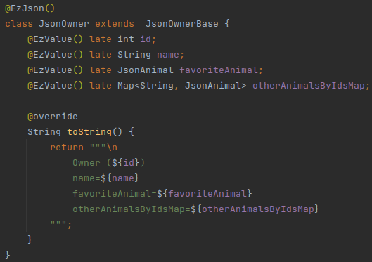

The `JsonOwner` class contains `JsonAnimal` instances in a couple of fields:
 * `favoriteAnimal` - holds a single instance.
 * `otherAnimalsByIdsMap` - holds multiple `JsonAnimal` instances with their `id` as the key.

Let's serialize it:

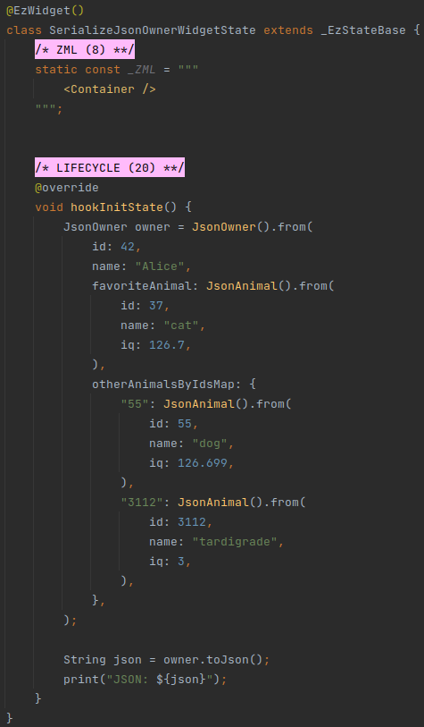

The output of the above example is:
```json
{"id":42,"name":"Alice","favoriteAnimal":{"id":37,"name":"cat","iq":126.7},"otherAnimalsByIdsMap":{"55":{"id":55,"name":"dog","iq":126.699},"3112":{"id":3112,"name":"tardigrade","iq":3.0}}}
```

::: warning ONLY STRING KEYS IN MAPS
Serializable _Maps_ must have keys of type _String_.
:::

### Deep Collections
Let's see what happens when we use a deep hierarchy of collections:

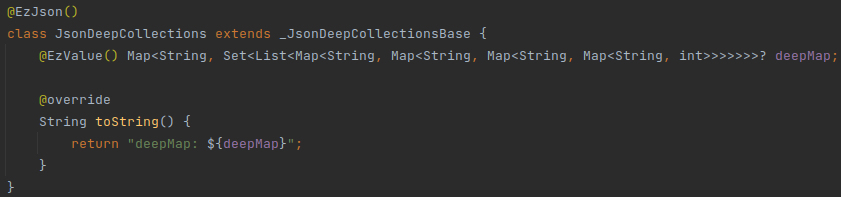

And then serialize:

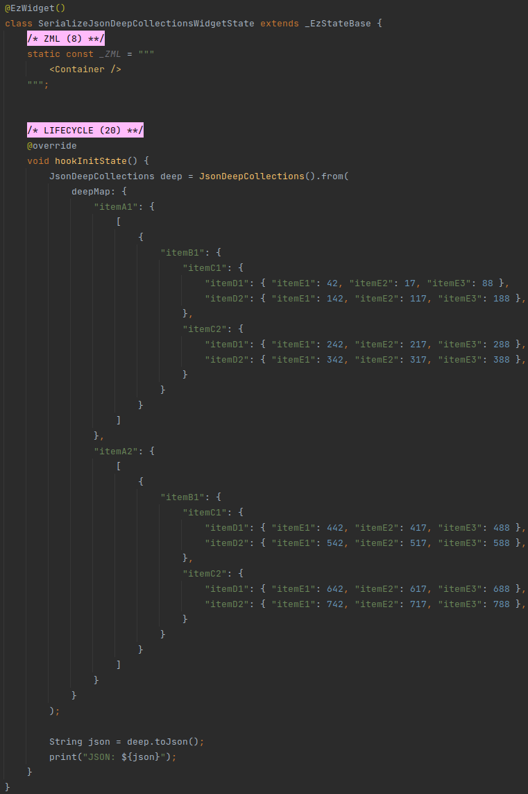

The output of the above example is:
```json
{"deepMap":{"itemA1":[[{"itemB1":{"itemC1":{"itemD1":{"itemE1":42,"itemE2":17,"itemE3":88},"itemD2":{"itemE1":142,"itemE2":117,"itemE3":188}},"itemC2":{"itemD1":{"itemE1":242,"itemE2":217,"itemE3":288},"itemD2":{"itemE1":342,"itemE2":317,"itemE3":388}}}}]],"itemA2":[[{"itemB1":{"itemC1":{"itemD1":{"itemE1":442,"itemE2":417,"itemE3":488},"itemD2":{"itemE1":542,"itemE2":517,"itemE3":588}},"itemC2":{"itemD1":{"itemE1":642,"itemE2":617,"itemE3":688},"itemD2":{"itemE1":742,"itemE2":717,"itemE3":788}}}}]]}}
```


### Serialization to Map
An `@EzJson` class can also be serialized into a map.

Instead of using `toJson()` - use `toJsonMap()`:

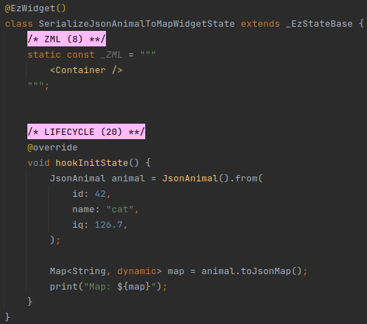

The output of the above example is:
```
Map: {id: 42, name: cat, iq: 126.7}
```


## Deserialization
There are four ways to deserialize data into an `@EzJson` class:
 * As a new instance, with a static factory:
   * From JSON.
   * From `Map<String, dynamic>`.
 * Into an existing instance, using a member method:
   * From JSON.
   * From `Map<String, dynamic>`.

### With Static Factories
The generated code contains two static factories that can be used to instantiate and then populate an `@EzJson` class
from JSON and from a _Map_:
 * `factoryFromJson`.
 * `factoryFromJsonMap`.

Dart does not support static method inheritance, so we "re-define" these methods in our own data class, and delegate
the actual logic to corresponding generated methods in the generated parent class.

#### Example
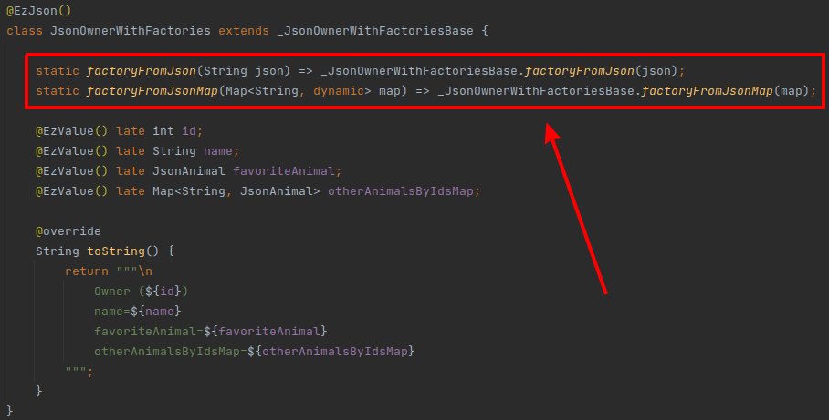

This is how a `JsonAnimalWithFactories` instance can be instantiated from JSON:

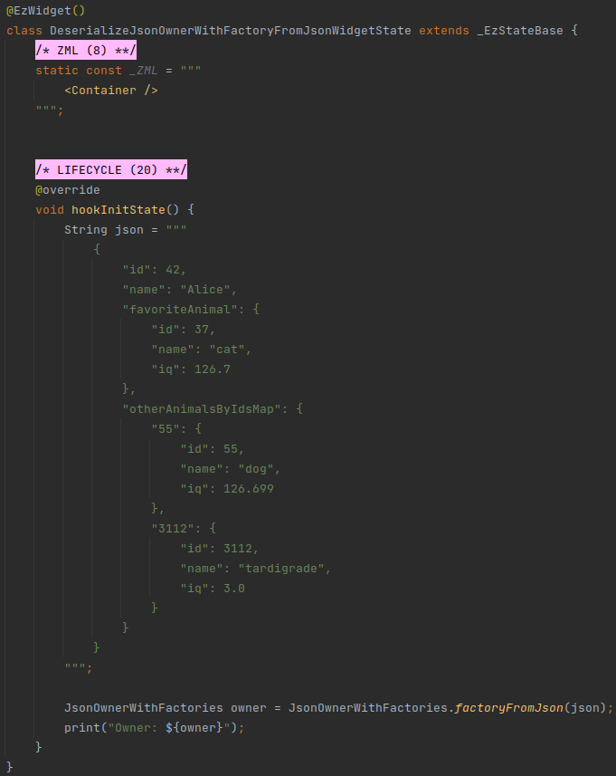

This is how a `JsonAnimalWithFactories` instance can be instantiated from `Map<String, dynamic>`:

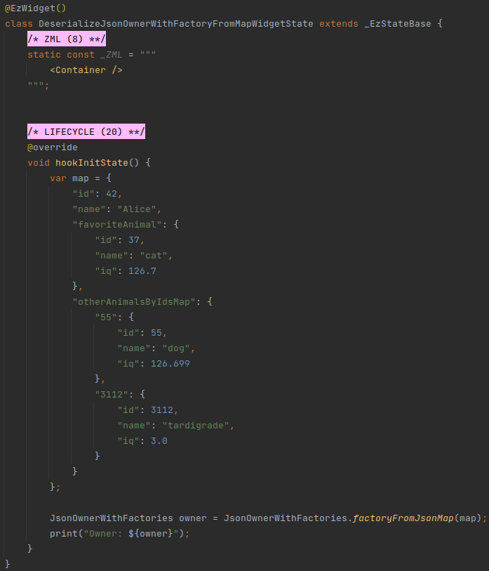


### With Member Methods
We can also populate an existing instance of an `@EzJson` class using its `fromJson()` and `fromJsonMap()` functions.

#### Example
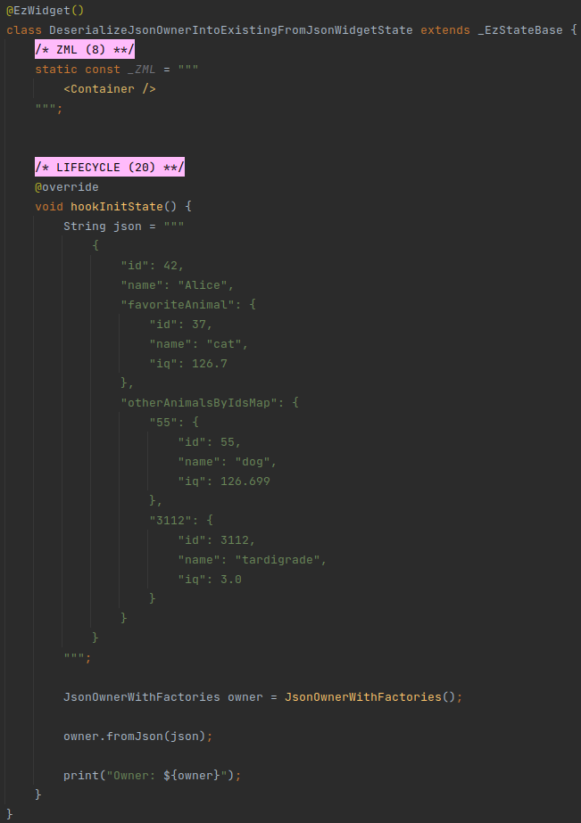


## Making Classes Reactive
`@EzJson` classes support reactive collections:

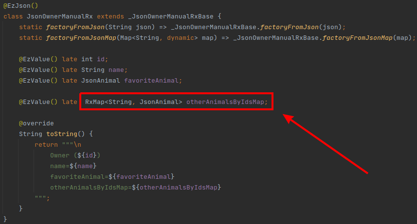

::: warning CAVEAT
`Rx` wrappers around primitives are not supported.
:::


### With @EzReactive
To make primitives and other data classes reactive - use `@EzReactive`:

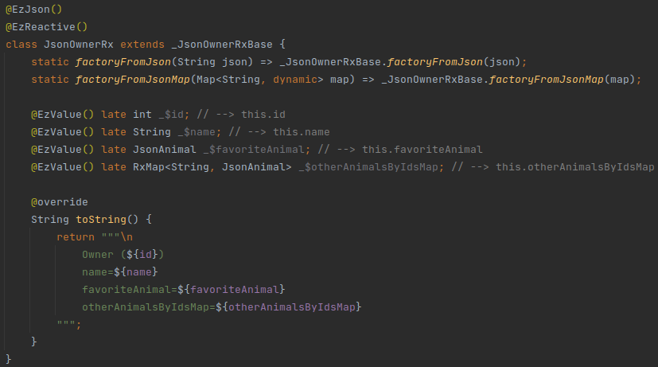

In the above example, the `@EzReactive` annotation is added underneath `@EzJson`, and we can see that the names of the
fields are now in the `_$<name>` format.

Non-reactive `@EzJson` classes support "natural" field names.

When adding `@EzReactive` - we need to use the "pseudo" field names.

Like with non-JSON reactive data classes - the fields are accessed using their "natural" names (e.g.
`JsonOwnerRx._$name` is accessed as `JsonOwnerRx.name`).

::: tip BUT WHY?
The reason for this difference is that the fields in `@EzReactive` classes need to be replaced with getter/setter
properties (which are created in the generated code).

However, the code generated for non-reactive `@EzJson` data classes does not need such properties, and therefore can
work with "actual" fields directly.
:::
