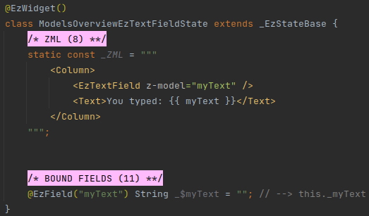
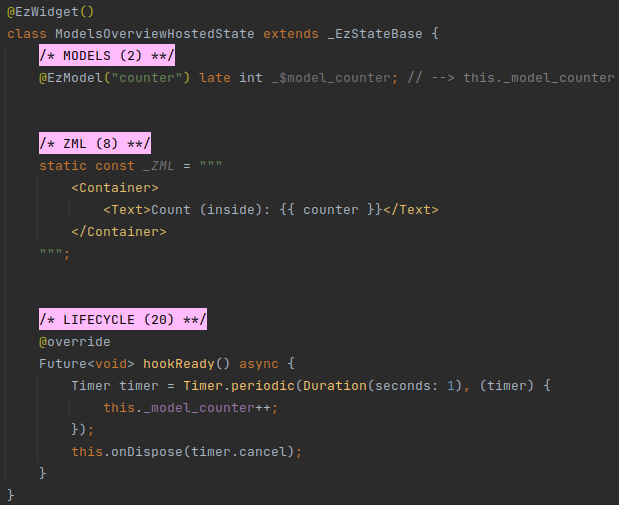
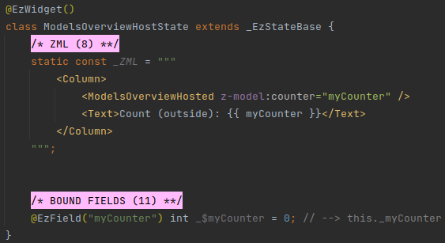
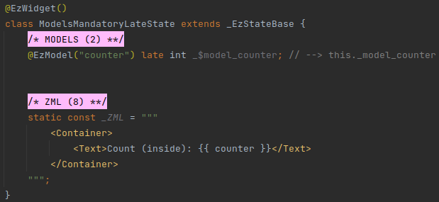
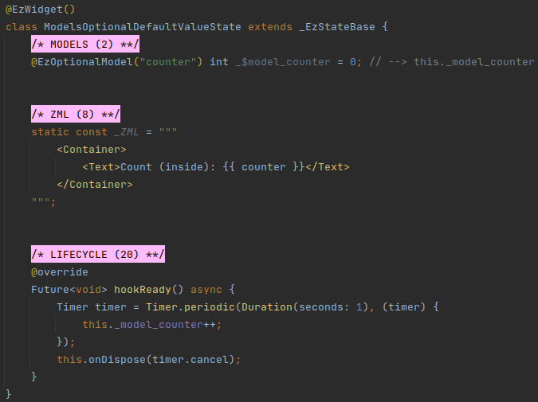
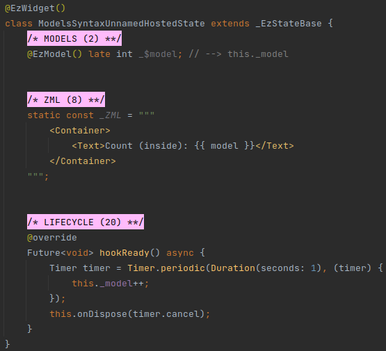
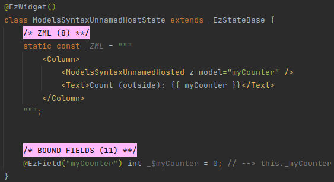

# Models

## Overview
[Props](/deep-dive/props/props.html) allow top-down communication with the widget - the widget's host uses attributes to pass
data down to the hosted widget using attributes.

[Events](/deep-dive/events/events.html) allow bottom-up communication with the host widget - the hosted widget emits events and the
host widget can listen to them.

Models allow bi-directional communication by letting both the host and the hosted widgets update and read the same
piece of data.

::: tip WHAT FOR?
Models are especially useful when developing generic input widgets.

For example, imagine a widget that wraps around a _TextField_ widget to handle the controller logic in a black box, and
synchronize the text entered by the user with the host widget using `z-model`:



In the above example, a text field appears, and the text that is typed in it is rendered underneath.

Read about _EzTextField_ and other useful ezFlap core widgets in [Core Widgets](/deep-dive/core-widgets/core-widgets.html).

The syntax of using `z-model` as a whole attribute rather than a prefix is explained under [Syntax](#syntax) below.
:::

#### Example
We use the `@EzModel` annotation to define a model in the hosted widget:



We use the `z-model` attribute prefix to pass a bound field of the host widget into the model of the hosted widget:



In the above example, the `ModelsOverviewHost` widget passes its `myCounter` bound field into the `counter` model of
the hosted `ModelsOverviewHosted` widget.

The `ModelsOverviewHosted` widget increments the model by 1 every second.

This change is reflected both in `ModelsOverviewHosted` (in the `counter` model) and in `ModelsOverviewHost` (in the
`myCounter` bound field).


## Reactivity
Models are **reactive**.

Whenever the value of a model changes, whether from inside the hosted widget or outside - the hosted widget's `build()`
method is called automatically, and the display is refreshed to reflect the new value.


## Mandatory Model
Models that are annotated with `@EzModel` are mandatory.

This means that they must be provided by the host widget if they are accessed by the hosted widget.

Mandatory models must be declared with `late`:

#### Example
 


## Optional Model
Models can also be optional.

Optional models are annotated with the `@EzOptionalModel` annotation.

Host widgets pass data into optional models the same way they pass it into mandatory models: with the `z-model`
attribute prefix.

Optional models can be accessed by the hosted widget even when the host widget does not pass a value into them.

#### Example


In the above example, if the host widget doesn't pass a value into the `counter` optional model, then ezFlap will
generate an "alternative" reactive variable to represent the model.

The hosted widget can render the model and modify it as if it were a "real" model passed down from the host.

Changes to the "fake" model will reflect in the UI as expected.


## Syntax
Models are defined using the `@EzModel` and `@EzOptionalModel` annotations.

Models are accessed using the `z-model` attribute prefix.

The name following `z-model` corresponds to the model's Assigned Name (which is, as usual, the string that is passed
as parameter to the `@EzModel` or `@EzOptionalModel` annotation).

One more variation exists.

There can exist a single unnamed model per widget.

To define an unnamed model - we use the `@EzModel` annotation without a parameter:



We use `z-model` as the entire attribute rather than just a prefix in order to pass data into an unnamed model: 



An unnamed model is automatically given the Assigned Name: `model`.


### Conventions
Strongly-recommended conventions that may become mandatory in a future version:
 * The model's Assigned Name (the name provided as parameter to the `@EzModel` and `@EzOptionalModel` annotations)
   should be in camelCase.
 * The model's name should begin with `_$model_`, followed by the Assigned Name.
 * An unnamed model's name should be `_$model`.

Optional suggested conventions:
 * Place the `@EzModel` and `@EzOptionalModel` annotations at the same line as the declaration.
 * Add a `// --> this._model_<Assigned Name>` comment at the end of every model field declaration.
 * Use [Live Templates](/tooling/live-templates/live-templates.html) to generate model declarations quickly and
   consistently, and without having to remember the syntax.


## Usage
Models can be used in the same places where bound fields and other reactive data can be used.

When used in code, a model is accessed using the Derived Name of its declaration.

The Derived Name is the text following the `_$`, prefixed with an underscore.

For example, the Derived Name of:
```dart
@EzModel("title") String? _$model_title;
```

Would be `_model_title`.

The Derived Name of:
```dart
@EzModel() String? _$model;
```

Would be `_model`.


### Check Existence
We can check if an optional model has actually been provided by the host:
```dart
if (this._model_title_isProvided()) {
    // ...
}
```


### Check Type
A helper method to check the model's type is available for every model.

This can be useful when the model's field is of type `dynamic`, and the actual type of the data passed from the host
widget is only known at runtime, and we need to use different logic for different types (e.g. to do automatic type
conversions, etc).

For example:
```dart
if (this._model_title_isOfType<String>()) {
    // ...
}
```