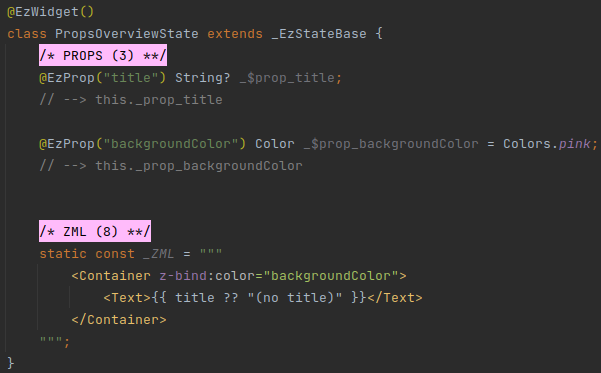
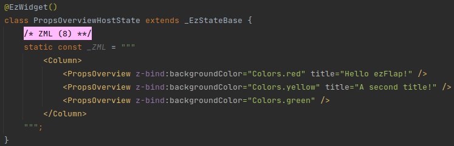
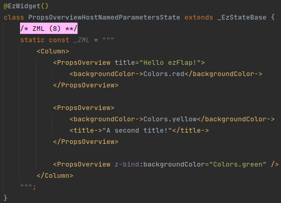
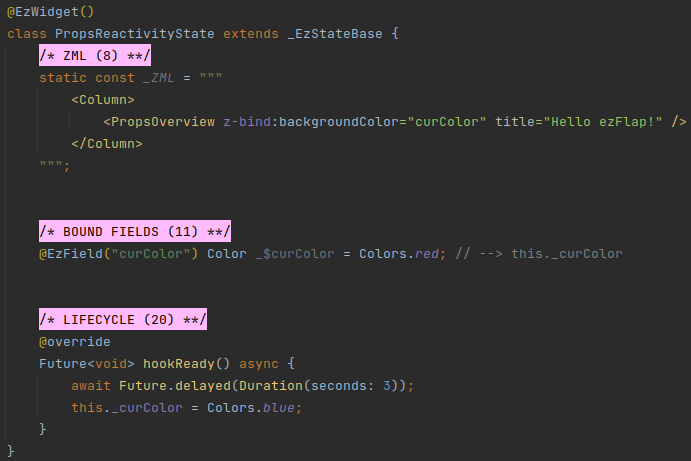
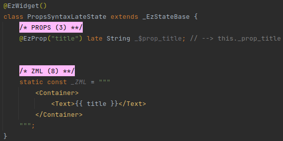
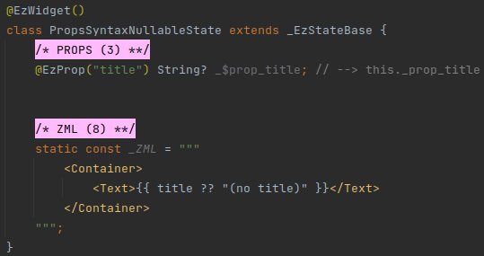
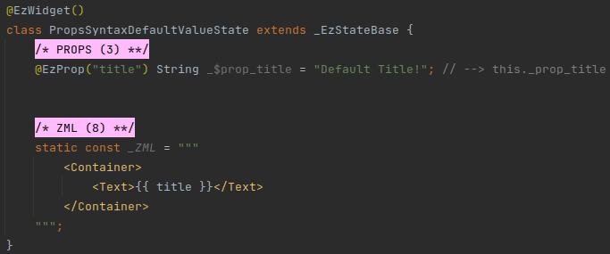

# Props

## Overview
Native Flutter widgets receive data from their host widgets using constructor parameters.

ezFlap widgets use _Props_ instead.

A _Prop_ is similar to a constructor parameter, only that instead of being specified in a constructor - it is specified
as a field in the widget class, and marked with the `@EzProp` annotation.

#### Example


Then, the ezFlap widget in the example above, can be hosted in other ezFlap widgets:



In the above example, the _PropsOverview_ ezFlap widget will be rendered three times, with a different background color
and title each time.

It is also possible to pass data to Props using named parameter tags:



::: tip KEYS
When the hosted widget passes a key using the `z-bind:key` or `key` attributes, if the constructor of the hosted
widget's non-state class (i.e. the class that extends _EzStatefulWidgetBase_) accepts a `key` named parameter - then
the key provided by the host widget is passed to the constructor.

If a `key` prop exists as well - the key is **also** passed to it.
:::

::: warning REMEMBER TO IMPORT
Remember to import the classes of the ezFlap widgets you use.

If they are not imported - the code generator will log errors and generate incorrect code.
:::

::: tip USE IN NATIVE FLUTTER WIDGETS
ezFlap widgets can be hosted in native Flutter widgets.

If:
 * You want to gradually add ezFlap to an existing codebase.
 * Or, you want to author ezFlap widgets that will also be usable in native Flutter widgets.

Then read more about ezFlap [Interoperability](/advanced/interoperability/interoperability.html).
:::

## Reactivity
Props are **reactive**.

Props are read-only inside the ezFlap widget where they are defined.

Their values change when the values of the attributes that are assigned to them in the host widget change.

#### Example


In the above example, the background color of _PropsOverview_ changes after three seconds from red to blue.

## Syntax
Props can be declared in three variations: _late_, _Nullable_, and _Default Value_.

### late
#### Example


Like _late_ [Bound Fields](/essentials/bound-fields/bound-fields.html), _late_ Props must not be accessed before they are
made available by the host widget.


### Nullable
Props can be declared as nullable.

#### Example


When a Prop is declared as nullable, the same rules that regular Dart nullable rules apply to it.


### Default Value
Props can have a default value.

When a prop has a default value - if the host doesn't pass a value to it - the default value is used.

#### Example


### Conventions
Strongly-recommended conventions that may become mandatory in a future version:
 * The prop's Assigned Name (the name provided as parameter to the `@EzProp` annotation) should be in camelCase.
 * The prop's name should begin with `_$prop_`, followed by the Assigned Name.

Optional suggested conventions:
 * Place the `@EzProp` annotation at the same line as the declaration.
 * Add a `// --> this._prop_<Assigned Name>` comment at the end of every field declaration.
 * Use [Live Templates](/tooling/live-templates/live-templates.html) to generate prop declarations quickly and
   consistently, and without having to remember the syntax.


## Usage
Props can be used in the same places where bound fields and other reactive data can be used.

When used in code, a prop is accessed using the Derived Name of its declaration.

The Derived Name is the text following the `_$`, prefixed with an underscore.

For example, the Derived Name of:
```dart
@EzProp("title") String? _$prop_title;
```

Would be `_prop_title`.

The Derived Name of:
```dart
@EzProp("title") String? _$superCustomName;
```

Would be `_superCustomName`.