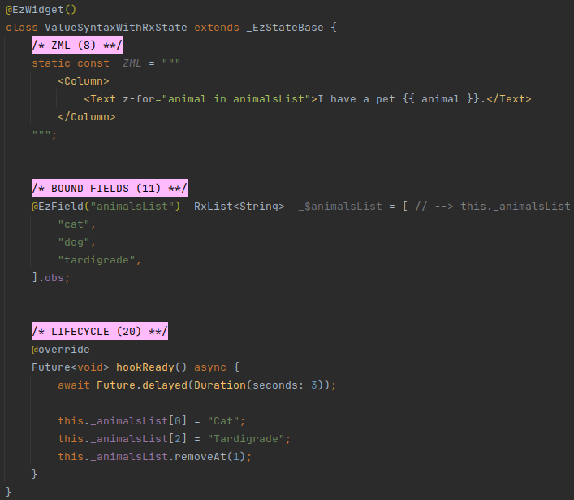
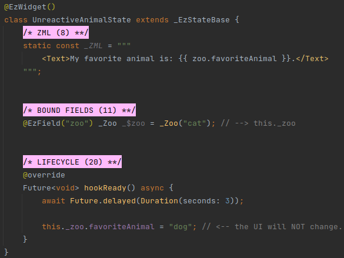
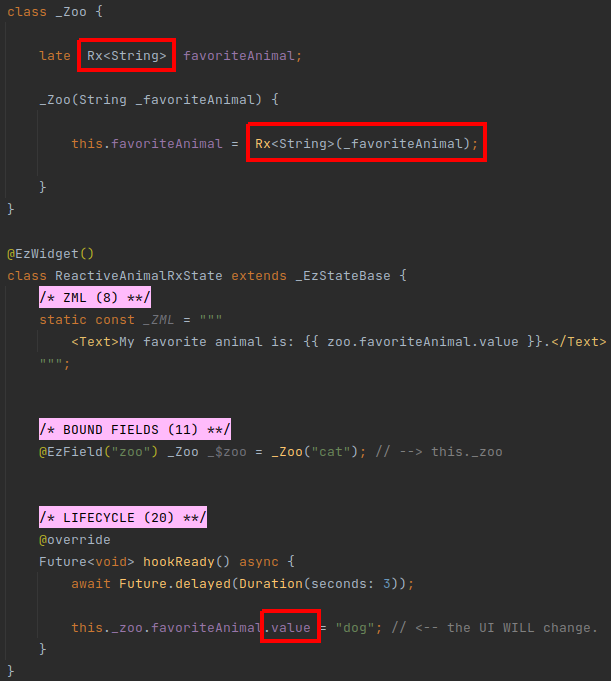
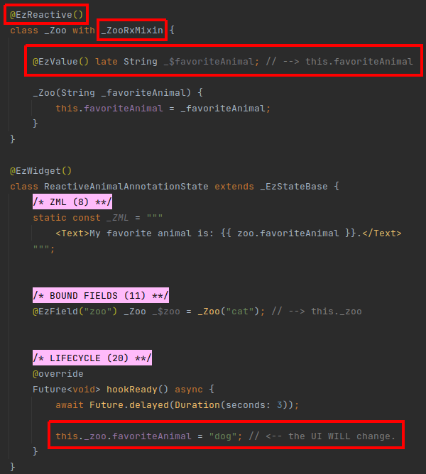

# Reactive Data Entities

## Overview
ezFlap is a **reactive** markup library.

We have seen many examples for that in the previous chapters and examples.

Until now, we mostly focused on the reactivity of widget data (bound fields, props, computed, etc).

For example, we say that bound fields are reactive, because when the value of a bound field that is referenced in the
ZML is changed - the UI reacts to this change (i.e. updates) automatically.

Another example is computed methods. If a computed method depends (i.e. uses) explicitly or implicitly on reactive
data - then, once the data is changed - the UI is updated.

However, in addition to these, we often need the state of our own classes (i.e. their fields) to be made reactive.

In this chapter, we will see how to make the fields of our own custom classes reactive.

There are two categories of _Reactive Types_:
 * _Rx_ types.
 * `@EzReactive` classes.

## Rx* Types
_Rx_ types are provided by the [GetX](https://pub.dev/packages/get) library.

It is possible to wrap any data in the _Rx_ class.

For example, we could create a widget field such as:
```dart
	Rx<String> myReactiveString = "Hello ezFlap!".obs;
```

`myReactiveString` would be an instance of the _Rx_ class.

We would access the actual stored string using the `value` property of the _Rx_ class:
```dart
	myReactiveString.value = "New value!";
	print("The value inside myReactiveString is: " + myReactiveString.value);
```

If `myReactiveString` is accessed from inside a computed or a bound method - it will become a dependency.

As a dependency, changes to the value of `myReactiveString` will cause the UI to update.

::: tip SIMILARITY TO BOUND FIELDS
The above method of using an _Rx_ wrapper around a value is similar (but not identical) to declaring a field as a bound
field.

In fact, this is similar to how the code ezFlap generates for bound fields work.

However, bound fields are superior in two ways:
 * Bound fields are accessible in the ZML.
 * With bound fields we don't need to explicitly type `.value` to get to the actual value of the field.
:::

The technique of wrapping a value in _Rx_ can be useful when we want non-widget fields of **other** classes to be
reactive.

However, the reactive collection classes are useful as bound field types:
 * *RxList*
 * *RxSet*
 * *RxMap*

They serve as replacements for the native _List_, _Set_, and _Map_. They provide the same methods and functionality as
their native counterparts, with a reactivity layer on top.

#### Example


In the above example, using `RxList<String>` as the type of `animalsList` ensures that changing the values in this list
(i.e. adding a value, removing a value, or updating a value) will cause the UI to update and reflect the change.

::: tip RX WRAPPERS
When initializing an _Rx_ wrapper with a hardcoded primitive, an array, or a list - we add the `.obs` suffix to the
value.

This is a [GetX](https://pub.dev/packages/get) feature that automatically instantiates and initializes the _Rx_ wrapper.

For example:

```dart
Rx<int> anInt = 42.obs;
RxList<int> aList = [ 42 ].obs;
RxMap<String, int> aMap = { "42": 42 }.obs;
```
:::


## @EzReactive
In addition to widgets, most applications also have data classes.

For example, we may store the information of the user in a data class. Or the results of an API call.

If we store an instance of such a custom class in a bound field - we can access it from ZML.

However, if we use native Flutter types for the data members - they will not be reactive.

#### Example


In the above example, `_Zoo.favoriateAnimal` is a native _String_ and so not reactive.

`_Zoo` is instantiated, initialized with the string "cat", and stored in the `this._zoo` bound field.

The ZML renders the value of `zoo.favoriteAnimal`.

The widget's `hookReady()` method waits for three seconds and then changes `this._zoo.favoriteAnimal` to "dog".

This change is not reflected in the UI, because `_Zoo.favoriteAnimal` is not reactive.

We can make `_Zoo.favoriteAnimal` reactive by declaring it as an `Rx<String>`:

#### Example


In the above example, `_Zoo.favoriteAnimal` is reactive, and so the text in the UI changes after three seconds from
"cat" to "dog".

However, note how we write `this._zoo.favoriteAnimal.value` instead of `this._zoo.favoriteAnimal` when getting and
setting the value.

This feels a little redundant. What's worse, it forces us to keep track of which of the members of our data classes are
reactive and which aren't.

A better way to create classes with reactive data is with the ezFlap `@EzReactive` annotation.

#### Example


Let's examine the definition of the `_Zoo` class in the above example:
 * It is prefixed with `@EzReactive()`.
 * It uses the (generated) `_ZooRxMixin` mixin.
 * Its `favoriteAnimal` member is prefixed with `@EzValue`.
 * Its `favoriteAnimal` member was renamed to `_$favoriteAnimal`.
 * Its constructor no longer creates an `Rx<String>` wrapper to initialize `favoriteAnimal`.

When ezFlap processes an `@EzReactive` class, it generates the necessary data structures and properties to reactivate
its members that are prefixed with the `@EzValue` annotation.

All the necessary code is generated in the `_ZooRxMixin` which needs to be added as a mixin to the data class.

::: tip MIXIN NAME
The name of the generated mixin class is `_<name of data class>RxMixin`.

If the class name itself starts with one or more underscores - they are trimmed.
:::

Note that similar to working with various annotations in ZML, the `@EzValue` annotation is applied to a "pseudo-field"
that is not actually accessed by any code.

The field name is prefixed with `_$` (like when working with ZML annotations), and we write the name of the property
that will be generated by ezFlap for it in a comment to the right of the field, as a reminder.

Now, when we access `this._zoo.favoriteAnimal` (whether to get its value or to set it) - we simply access
`this._zoo.favoriteAnimal` (or, in the ZML: `zoo.favoriteAnimal`). The wrapping and unwrapping into and out of an _Rx_
instance is handled automatically for us, by the generated code.

::: tip THERE'S MORE TO IT
In addition to making data classes more convenient to use, `@EzReactive` is also designed to work well with ezFlap's
[JSON classes](/deep-dive/json/json).
:::
