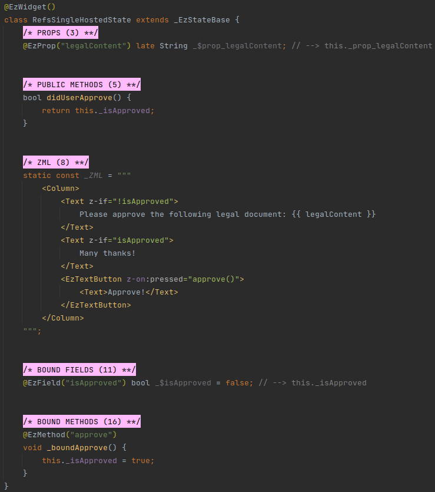
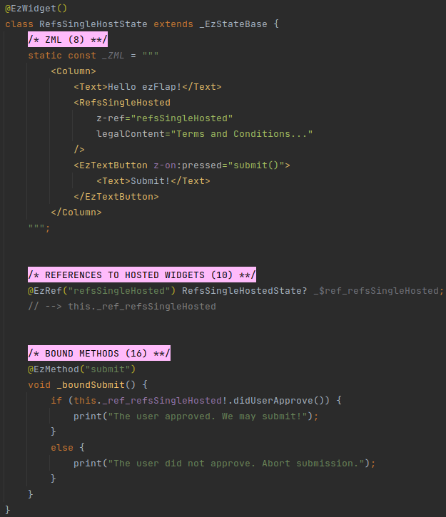
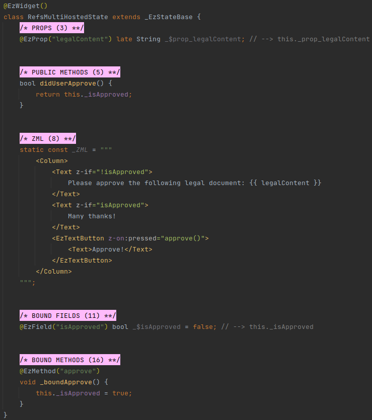
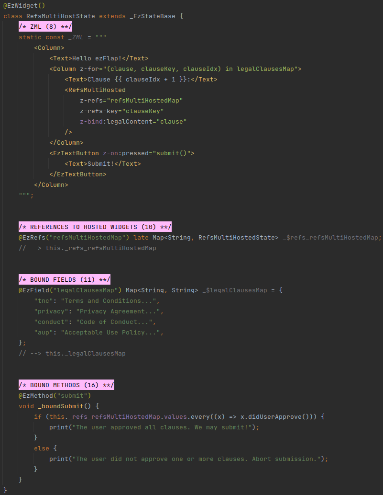
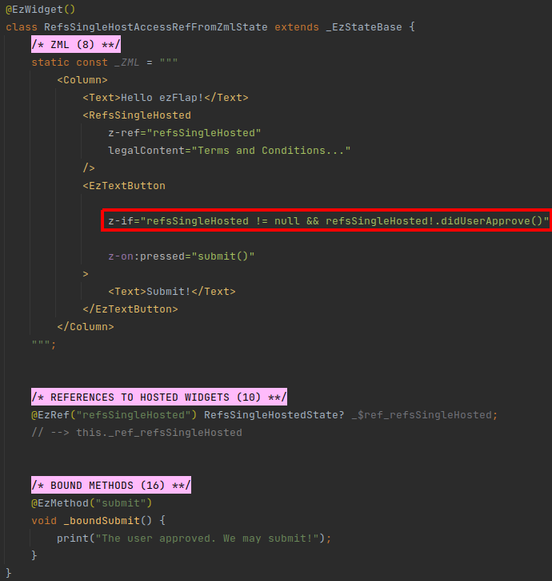

# Refs

## Overview
Refs allow a host widget to access the public functions and fields of a hosted widget.

## Single Widget
To reference a single occurrence of a widget, we create a field to contain the instance of the hosted widget's class,
and annotate it with the `@EzRef` annotation.

`@EzRef` fields must be nullable.

`@EzRef` fields start out with `null` in them.

They are populated automatically by ezFlap shortly after the widgets they are assigned to (with the `z-ref` attribute)
are instantiated.

For example:

#### Hosted

#### Host

In the above example, _RefsSingleHost_ hosts _RefsSingleHosted_.

The `z-ref` attribute is used to map the hosted widget to the `@EzRef` field where its instance is to be stored.

The mapping is done using the Assigned Name, which is the value passed as parameter to the `@EzRef` attribute.

In the above example, _RefsSingleHost_ calls the _didUserApprove()_ public method of the hosted _RefsSingleHosted_
widget when the user presses the "Submit!" button.

::: warning USE THE WIDGET CLASS
Like all Flutter stateful widgets, ezFlap widgets consist of two classes.

For example: _RefsSingleHost_ and _RefsSingleHostState_.

The type of the `@EzRef` field must be the **State** class of the hosted widget.
:::

## Multiple Widgets
Sometimes a host widget hosts multiple instances of the same widget.

Such instances can be referenced by multiple, individual `@EzRef` fields, but with more than just a few instances - it
becomes cumbersome. Further, this technique can't be used when the hosted widget instances are created with a `z-for`
loop.

In such cases, we use a _Map_ field and annotate it with the `@EzRefs` annotation.

In the following example, we use the _RefsMultiHosted_ widget, which is identical to the _RefsSingleHosted_ from the
previous section (but has a different name):

#### Hosted

And here is a host widget that uses `@EzRefs`:

#### Host

The refs map is extended, shrunk, and updated by ezFlap automatically, as the set of rendered referenced hosted widgets
changes.

We use the `z-refs` attribute with the refs' Assigned Name to tell ezFlap which `@EzRefs` field to use.

We use the `z-refs-key` attribute with the key under which the specific instance of the hosted widget should be stored
in the refs _Map_.

::: warning IMPORT GETX
When using `@EzRefs`, ezFlap uses _RxMap_ internally, so `package:get/get.dart` needs to be imported.
:::

## Conventions
Strongly-recommended conventions that may become mandatory in a future version:
 * The ref's and refs' Assigned Name (the name provided as parameter to the `@EzRef` and `@EzRefs` annotations) should
   be in camelCase.
 * The ref's name should begin with `_$ref_`, followed by the Assigned Name.
 * The refs' name should begin with `_$refs_`, followed by the Assigned Name.

Optional suggested conventions:
 * Place the `@EzRef` and `@EzRefs` annotations at the same line as the declaration.
 * Add a `// --> this._ref_<Assigned Name>` comment at the end of every ref field declaration.
 * Add a `// --> this._refs_<Assigned Name>` comment at the end of every refs field declaration.
 * Use [Live Templates](/tooling/live-templates/live-templates.html) to generate ref and refs declarations quickly and
   consistently, and without having to remember the syntax.

## Usage

### In Code
When used in code, a ref or refs is accessed using the Derived Name of its declaration.

### In ZML
Hosted widgets can be accessed through their refs from ZML.

For example:

## Reactivity
`@EzRef` and `@EzRefs` fields are reactive.

When their values change (i.e. as hosted widget instances are added or removed with `z-if`, `z-for`, or other
methods) - anything that depends on them is also re-evaluated.

Additionally, when accessing hosted widgets via refs, if internally the hosted widget accesses reactive data - then
this data becomes a dependency of the accessing code.

The above example demonstrates this.

The host widget calls `refsSingleHosted!.didUserApprove()` in a `z-if` in its ZML.

At first, `didUserApprove()` returns false.

Once the user presses the "Approve!" button (in the hosted widget) - the `isApproved` bound field of the hosted widget
is set to true.

Since bound fields are reactive - the `isApproved` bound field of the hosted widget becomes a dependent of the  `z-if`
of the host widget.

As a result, when the user presses the "Approve!" button - the `z-if` in the host widget is re-evaluated automatically,
calls `refsSingleHosted!.didUserApprove()`, gets back _true_, and renders the "Submit!" button.
