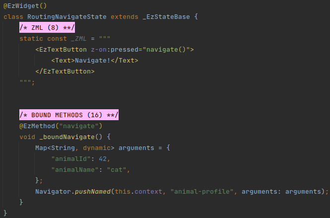
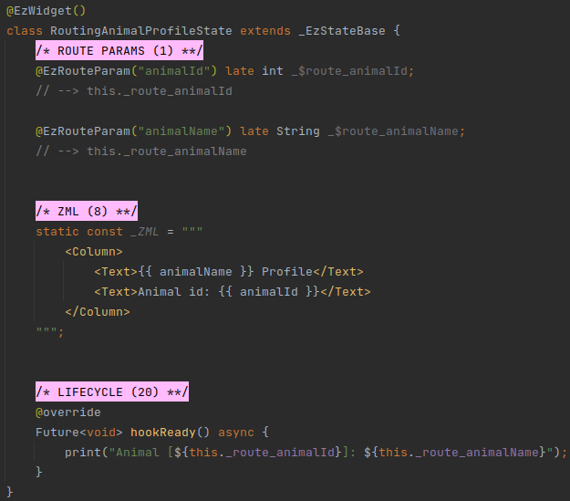
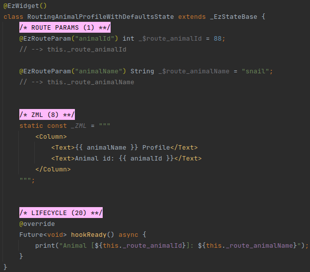

# Routing
## Overview
ezFlap can be used alongside any routing method.

However, if route parameters are available in Flutter's native `ModalRoute` (i.e. in
`ModalRoute.of(this.context).settings.arguments`) - then ezFlap's `@EzRouteParam` annotation can be used to easily
access them.

## Route Params
Route params are fields that are prefixed with the `@EzRouteParam` annotation.

For example, consider the following navigation code:

Then, in an ezFlap widget that renders in the `animal-profile` route, we can use `@EzRouteParam` to access the arguments:

In the above example, the `animalId` and `animalName` route params are initialized automatically by ezFlap.

They can be accessed in the ZML using their Assigned Names, and in the code, using their Derived Names.

### Conventions
Strongly-recommended conventions that may become mandatory in a future version:
 * The route param's Assigned Name (the name provided as parameter to the `@EzRouteParam` annotation) should be in
   camelCase.
 * The route param's name should begin with `_$route_`, followed by the Assigned Name.

Optional suggested conventions:
 * Place the `@EzRouteParam` annotation at the same line as the declaration.
 * Add a `// --> this._route_<Assigned Name>` comment at the end of every route param field declaration.
 * Use [Live Templates](/tooling/live-templates/live-templates.html) to generate route param declarations quickly and
   consistently, and without having to remember the syntax.

### Default Values
Route params can be assigned default values that would be used if arguments in their names are not found in
`ModelRoute`.

#### Example

