# Slots

## Overview
Slots can be used when we want a host widget to have a part of itself rendered inside a hosted widget.

For example, we could create a generic _Section_ widget that would have a fixed structure of a title and content, and
let the host widget pass part of itself as the content.

#### Hosted Section
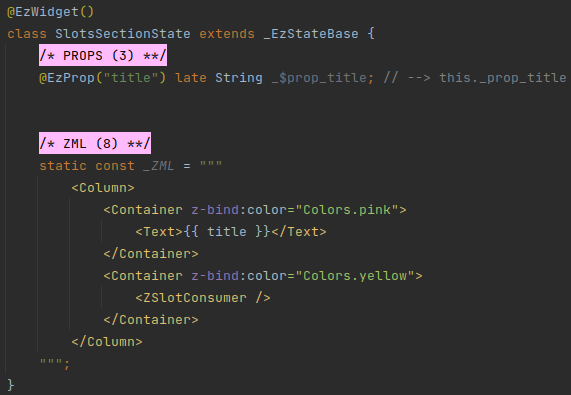

The slot from the host widget will be rendered in place of the `<ZSlotConsumer>` tag in the hosted widget.

#### Host
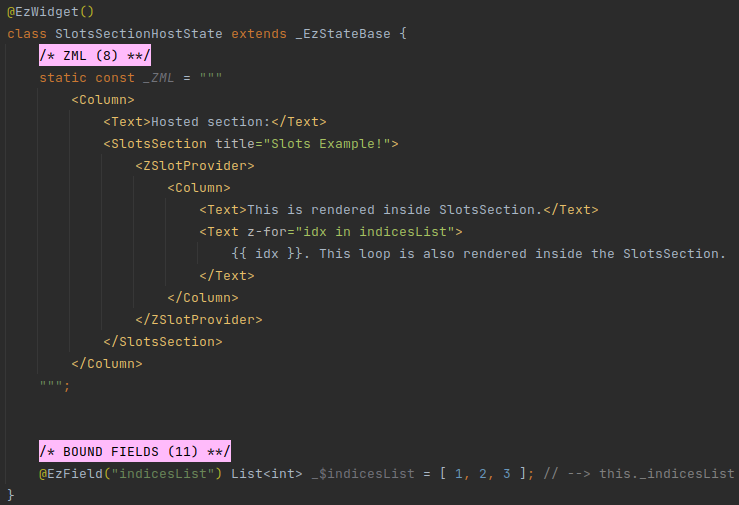

We provide the content to be used in place of the `<ZSlotConsumer>` tag in _SlotsSection_ inside `<ZSlotProvider>`.

## Provider Slot
The content of a slot is provided inside a `<ZSlotProvider>` tag.

The `<ZSlotProvider>` tag needs to be placed inside the tag of the ezFlap widget that should consume it (i.e. render
it).

It is possible to provide multiple, separate slots to a widget. To do that, we need to use named slots.

We name a slot by passing the `z-name` attribute to `<ZSlotProvider>`:

#### Hosted
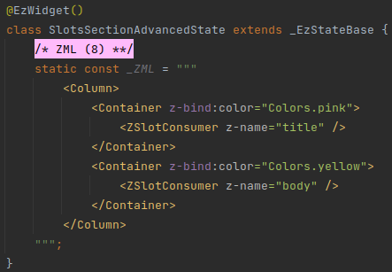

#### Host
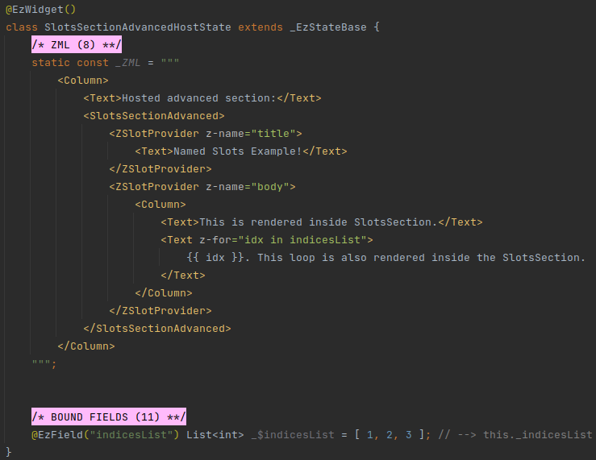

If our host widget only needs to provide a single unnamed slot - then the `<ZSlotProvider>` tag can be omitted:

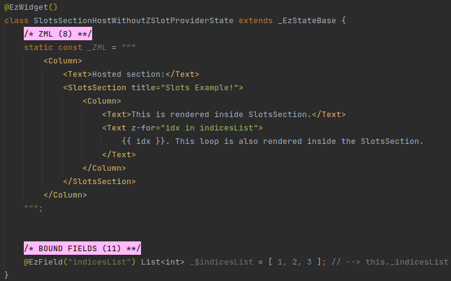

All the standard ezFlap attributes and behaviors can be used with the tags that are provided inside the
`<ZSlotProvider>` tag.

All of them will be processed in the context of the host widget, so:
 * `z-if`, `z-for`, text interpolations, etc. can reference the reactive data in the host widget, invoke bound methods,
   emit events, etc.
 * They **cannot** access the reactive data of the hosted widget.

::: warning SLOT PROVIDERS ARE LIMITED
The only attributes allowed on a `<ZSlotProvider>` tag are:
 * z-name
 * z-scope (covered in [Parameters From Consumer Slot](#parameters-from-consumer-slot) below).
:::

## Consumer Slot
`<ZSlotConsumer>` tags are used at the hosted widget side, to consume (render) the slots passed from the host with
`<ZSlotProvider>` tags.

Like `<ZSlotProvider>`, `<ZSlotConsumer>` tags can be named (and, like with `<ZSlotProvider>`, a single unnamed
`<ZSlotConsumer>` is allowed).

ezFlap will render the content of `<ZSlotProvider>` tags in place of their corresponding `<ZSlotConsumer>` tags at the
hosted widget side.

It is valid to not provide slots for any or all `<ZSlotConsumer>` tags of a hosted widget.

By default, if no corresponding `<ZSlotProvider>` is provided - ezFlap replaces the `<ZSlotConsumer>` tag with a
_Container_ widget.

It is possible to define an alternative default inside the `<ZSlotConsumer>` tag:

#### Hosted
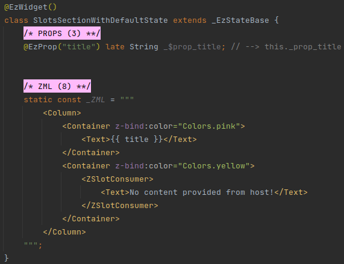

#### Host
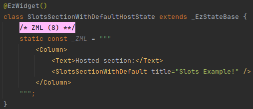

::: warning SLOT CONSUMERS ARE LIMITED
The only attributes allowed on a `<ZSlotConsumer>` tag are:
 * z-name
 * z-bind attributes (covered in [Parameters From Consumer Slot](#parameters-from-consumer-slot) below).
:::

::: warning PAY ATTENTION TO CHILD / CHILDREN
`<ZSlotConsumer>` is replaced with the provided content "as-is".

This means that when providing content to a slot in a hosted widget, we need to know if the corresponding
`<ZSlotConsumer>` tag is inside a widget that accepts a single child or multiple children.

For example, if the `<ZSlotConsumer>` is in a _Container_, and in its corresponding `<ZSlotProvider>` we pass multiple
_Text_ widgets - the application will not compile.
:::

`<ZSlotConsumer>` can be used inside named parameters:

#### Hosted
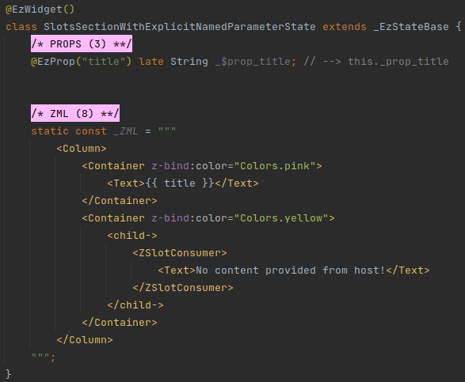

#### Host
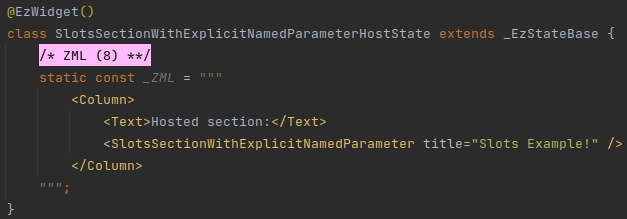

## Parameters From Consumer Slot
It is possible to pass parameters from a `<ZSlotConsumer>` to a `<ZSlotProvider>`.

For example, the hosted widget may want to render the a certain `<ZSlotProvider>` multiple times, and pass different
data to it each time.

Data can be passed to the `<ZSlotProvider>` by adding `z-bind` or prefix-less attributes to the `<ZSlotConsumer>` tag.

#### Example
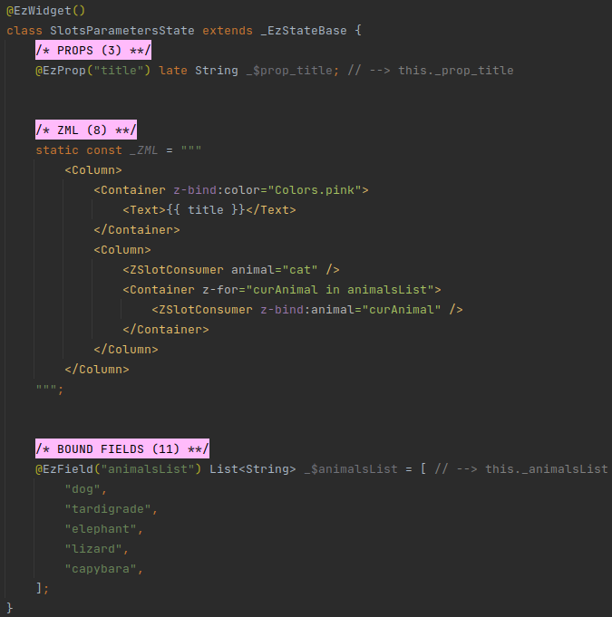

The ZML inside `<ZSlotProvider>` needs to access these parameters.

To do that, we need to assign a scope name, by adding the `z-scope` attribute to the `<ZSlotProvider>`.

Then, we will access the parameters with the syntax `<scope name>.<parameter's attribute name>`. For example:

#### Host
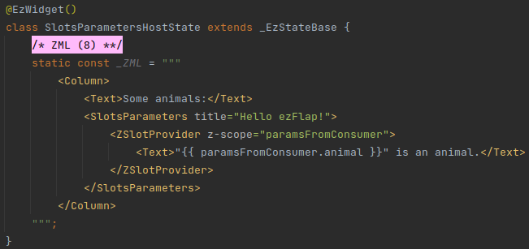
