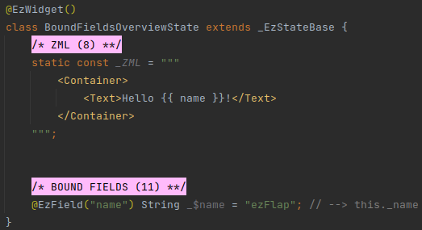
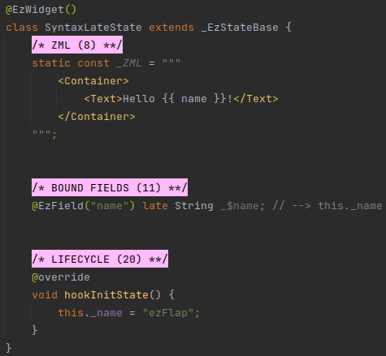
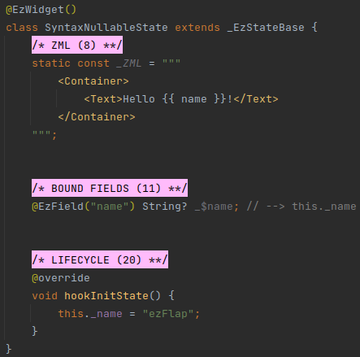
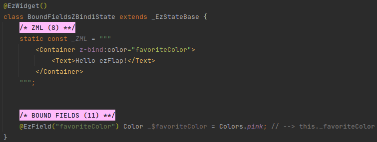
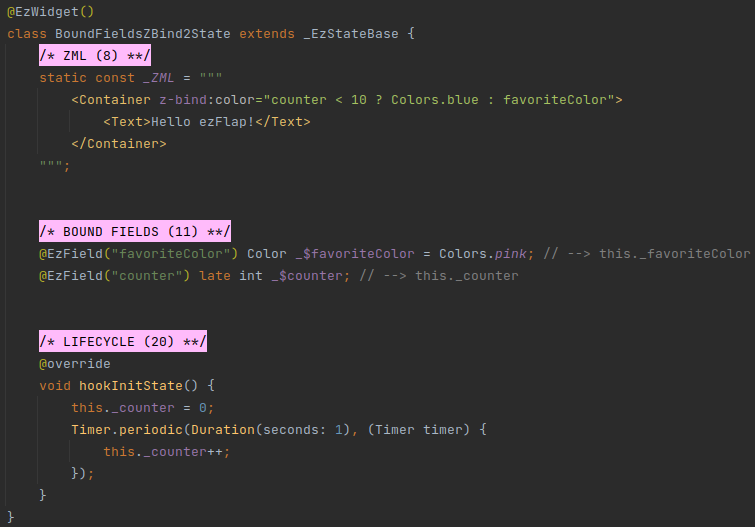
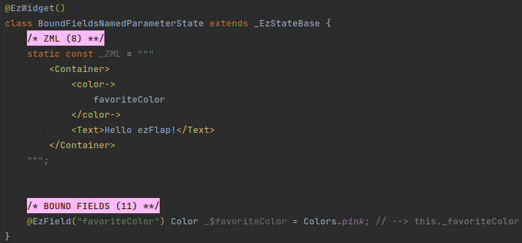
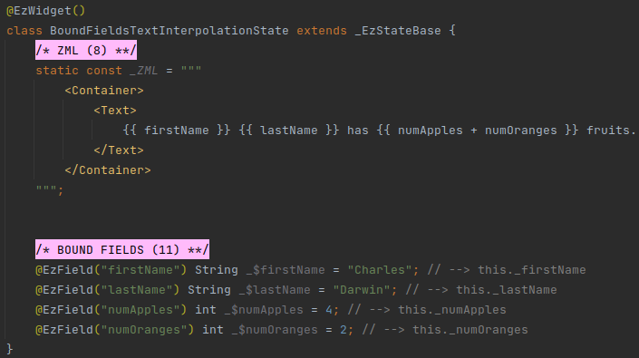
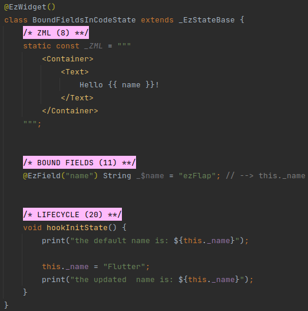

# Bound Fields

## Overview

ezFlap bound fields are accessible in the ZML:

ezFlap bound fields are declared like regular Dart fields.

When generating the code for the widget (i.e. in the `.g.dart` file) - ezFlap generates a property with a getter and a
setter for each bound field.

In the above example, the `name` field is declared with a default value (`"ezFlap"`).

The property that ezFlap will generate for this field will also be initialized with `"ezFlap"`, and the widget will
render the text: `Hello ezFlap!`.

::: tip HEREINAFTER
In the rest of this guide, we will refer to "ezFlap bound fields" simply as "bound fields", or "fields", when the
meaning is clear from the context.
:::

## Reactivity

Bound fields are **reactive**.

Whenever the value of an ezFlap bound field changes - the widget's `build()` method is called automatically, and the
display is refreshed to reflect the new value.

## Syntax

Bound fields can be declared in three variations: *late*, *Nullable*, and *Default Value*.

### late

#### Example

If a bound field is declared as *late*, then like a regular Dart field - it must be initialized before it is first
accessed, or a runtime exception is thrown.

In the above example, the `name` field is accessed using the ZML (`{{ "{" }}{ name }}`).

Fields that are accessed from the ZML need to be initialized before the ZML is rendered.

The ezFlap widget's `hookInitState()` is invoked before the ZML is rendered for the first time, and is meant exactly for
this purpose.

`hookInitState()` and other hook methods will be covered in [Life-Cycle](/essentials/life-cycle/life-cycle.html)

::: tip THERE'S MORE TO IT
*late* fields **can** be used in the ZML and be initialized some time _after_ the ZML is rendered, as long as their
portion of the ZML is not rendered before they are initialized.

This can be achieved using [Conditional Rendering](/essentials/conditional-rendering/conditional-rendering.html).
:::

### Nullable

Like regular fields, bound fields can be declared as nullable.

#### Example

### Default Value

Fields can be initialized with a default value.

#### Example

### Conventions

Strongly-recommended conventions that may become mandatory in a future version:
 * The field's Assigned Name (the name provided as parameter to the `@EzField` annotation) should be in camelCase.
 * The field's name should begin with `_$`, followed by the Assigned Name.

Optional suggested conventions:
 * Place the `@EzField` annotation at the same line as the declaration.
 * Add a `// --> this._<Assigned Name>` comment at the end of every field declaration.
 * Use [Live Templates](/tooling/live-templates/live-templates.html) to generate field declarations quickly and
   consistently, and without having to remember the syntax.

## Usage

Bound fields can be accessed in `z-bind` Dart expressions, named parameters, text interpolation, and regular code.

### Usage in z-bind

`z-bind` attributes accept a Dart expression.

Reference bound fields in these Dart expressions using the fields' Assigned Names.

#### Example 1 - pass field in z-bind

In the above example, the background color of the *Container* will be pink.

#### Example 2 - use field in an expression in z-bind

In the above example, the background color of the *Container* will be blue for 10 seconds, and then will switch to pink.

::: warning POSSIBLE LEAK
*Example 2* above does not stop the timer when the widget is disposed.

Cleaning up when the widget is being disposing is important, and easy, by passing a callback to `this.onDispose()`
function.

This is covered in [Disposing](/essentials/life-cycle/life-cycle.html#disposing).
:::

### Usage in Named Parameters
Named parameters accept a Dart expression.

Reference bound fields in these Dart expressions using the fields' Assigned Names.

#### Example

### Usage in Text Interpolation

Bound fields can be referenced inside mustache expressions (`{{ '{' }}{ }}`) in a text block (e.g. in `<Text>`, or in string
attributes).

#### Example

### Usage in Code

When using ezFlap bound fields - always use the generated properties, and not the declared field itself.

#### Example

Note how, in the above example, the `name` field is accessed using the code using `this._name`.

`this._name` is the getter/setter property that was generated by ezFlap for the `_$name` field.

Bound fields can be accessed from any class method. We will see such examples when we cover [Bound Methods](/essentials/bound-methods/bound-methods.html).