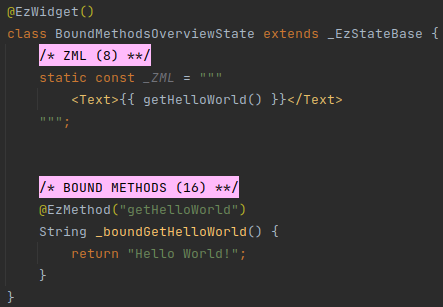
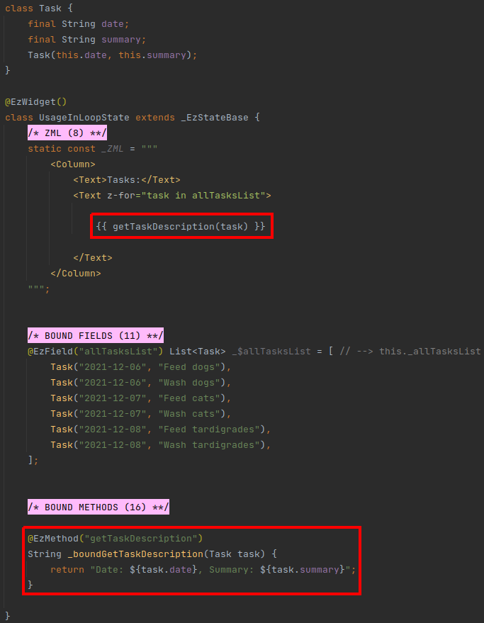
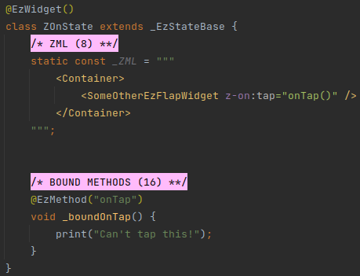
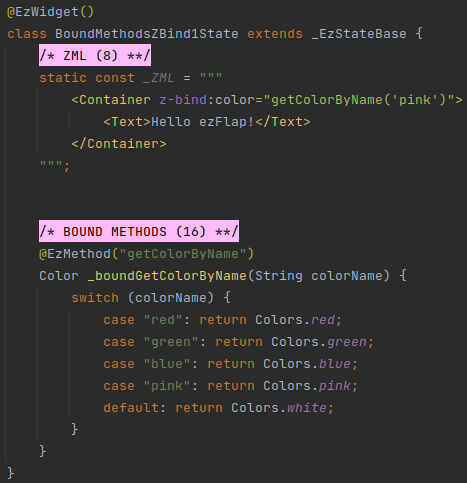
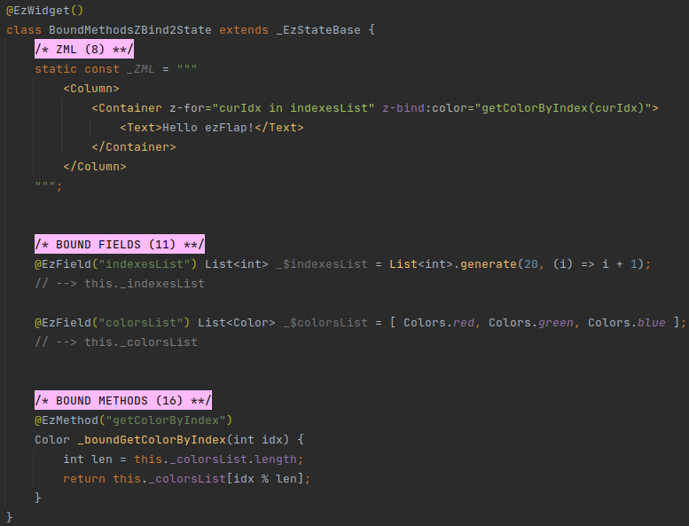
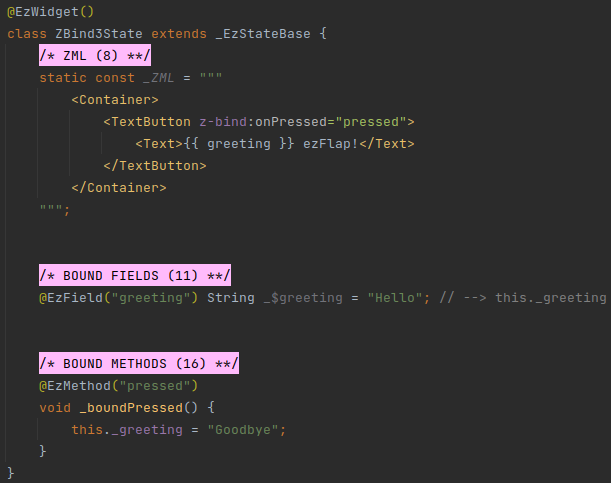
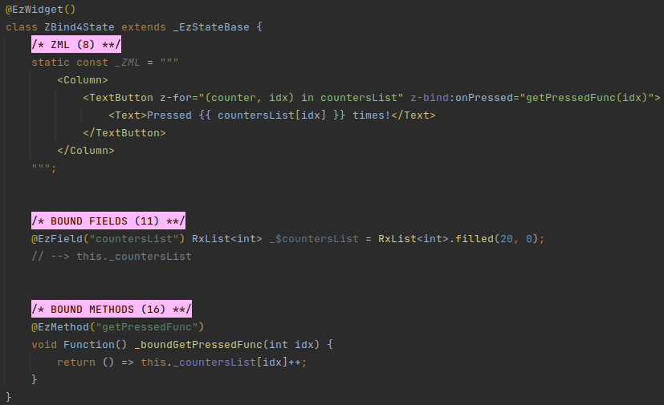
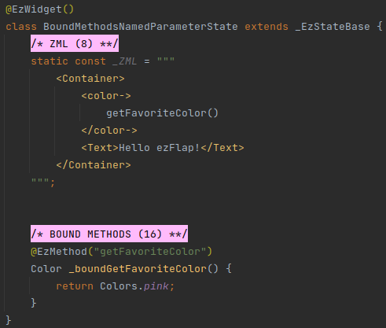
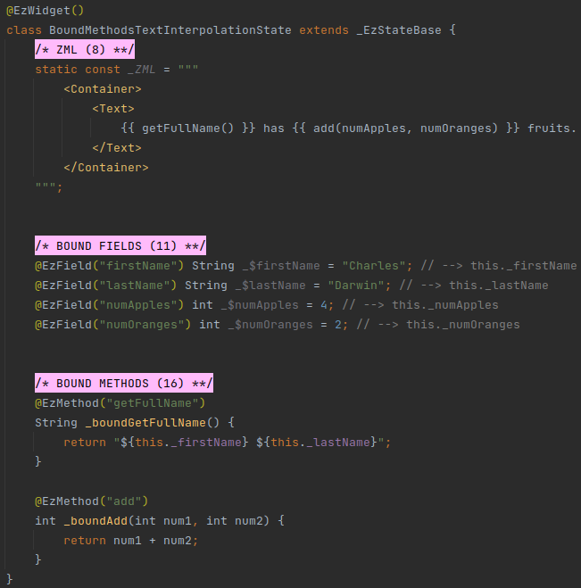
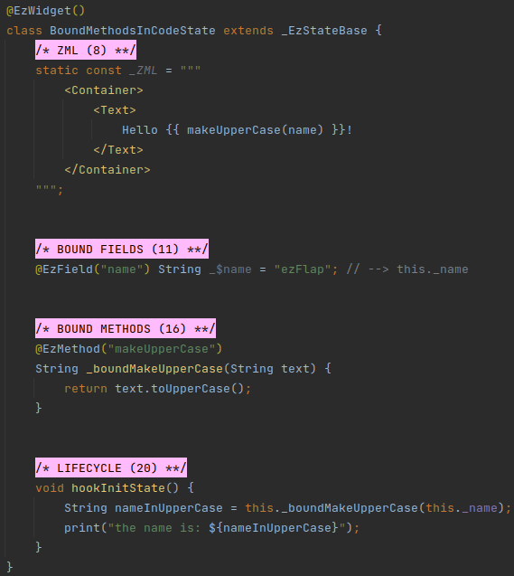

# Bound Methods

## Overview
**Bound Methods** are methods with the `@EzMethod` annotation.

#### Example

 * Bound methods are accessible in the ZML.
 * Unlike computed methods, the value returned from bound methods is **not** cached.
 * Bound methods may return a value, but can also have a `void` return type.
 * Bound methods may accept parameters.
 * Bound methods are never asynchronous.

Bound methods are useful in these scenarios:
 * Retrieve or calculate a value that depends on parameters (e.g. inside a `z-for` loop).
 * Assign bound methods to handle events as the user interacts with the UI (covered in
   [z-on](/deep-dive/events/events.html#z-on)).

#### Example

## Reactivity
Bound methods are **reactive**.

Bound methods can access reactive data (e.g. bound fields, computed methods) in order to generate their return value
or perform other actions (when invoked to handle an event).

Whenever underlying reactive data changes - the widget's `build()` method is invoked, and consequently, the bound
method is also invoked if needed (e.g. if it's referenced in the rendered ZML in a text interpolation or a `z-bind`).

The reactivity rules of bound methods are similar to those of computed methods (except that the return value of bound
methods is not cached).

For a recap on computed methods reactivity - see [Computed Methods Reactivity](/essentials/computed/computed.html#reactivity).

## Syntax
Bound methods are written like regular Dart methods, and are prefixed with the `@EzMethod` annotation.

The `@EzMethod` annotation accepts a single parameter: the Assigned Name of the bound method, which will be used
in the ZML to invoke the bound method, or assign it as an event handler (covered in 
[z-on](/deep-dive/events/events.html#z-on)). 

In the ZML, bound methods are referenced with their Assigned Name.

Unlike computed methods, bound methods can appear in the ZML with or without parentheses.

Both options are valid, but have different results, which also depend on where in the ZML the bound method is
referenced.

All the variations are covered below, under [Usage](#usage).

#### Example

### Conventions
Strongly-recommended conventions that may become mandatory in a future version:
 * The bound method's Assigned Name (the name provided as parameter to the `@EzMethod` annotation) should be in camelCase.

Optional suggested conventions:
 * Place the `@EzMethod` above the method declaration.
 * Prefix the bound method's method name with `_bound` (e.g. `_boundGetTaskDescription()`).
 * Use [Live Templates](/tooling/live-templates/live-templates) to generate bound method declarations quickly and
   consistently, and without having to remember the syntax.

## Usage

Bound methods can be accessed in `z-on`, `z-bind` Dart expressions, named parameters, text interpolation, and regular
code.

::: warning AVOID SIDE EFFECTS
When used as event handlers - bound methods may freely update state, save data, etc.

When used to retrieve or calculate data to be displayed in interpolated text or passed to another widget using `z-bind`,
such actions are considered side effects, and should be avoided.
:::

### Usage in z-on

The usage of bound methods in `z-on` is covered in full in [z-on](/deep-dive/events/events.html#z-on).

This section doesn't go into details because Events have not been introduced yet.

The `z-on` attribute can only appear on ezFlap widgets. Its purpose is to assign an event handler to an event.

The bound method will be provided to the `z-on` attribute on its own (i.e. not as part of a longer expression), and
may or may not have parentheses (with some difference in behavior).

#### Example

### Usage in z-bind

`z-bind` attributes accept a Dart expression.

Reference bound methods in these Dart expressions using the bound methods' Assigned Names.

#### Example 1 - pass Bound Method in z-bind

In the above example, the background color of the *Container* will be pink.

#### Example 2 - pass Bound Method in z-bind in loop

The above example renders a strip of _Hello ezFlap!_ with in repeating red, green, and blue backgrounds.

#### Example 3 - Bound Method Without Parentheses in z-bind

In the above example, `z-bind:onPressed="pressed"` doesn't cause `pressed` to be invoked when the ZML is rendered,
because there are no parentheses after `pressed`. Instead, ezFlap passes the `pressed` method in _TextButton_'s
`onPressed` named parameter.

When the user presses the "Hello ezFlap!" greeting - the `pressed` bound method is invoked, and the displayed text
changes to "Goodbye ezFlap!".

#### Example 4 - pass Bound Method in z-bind in loop - Advanced Scenario
Suppose that we have multiple _TextButtons_, rendered in a loop, each with a counter in its caption.

And suppose that we want a press on each of them to increase its own counter.

We can implement this by creating a bound method that returns a method:

::: tip A BETTER WAY
There is a better way to do such things, and avoid creating a bound method that returns a function, by using
[ezFlap Widgets](/core-widgets/core-widgets) and [z-on](/deep-dive/events/events.html#z-on).
:::

### Usage in Named Parameters
Named parameters accept a Dart expression.

Reference bound methods in these Dart expressions using the bound methods' Assigned Names.

#### Example

### Usage in Text Interpolation
Bound methods can be referenced inside mustache expressions (`{{ '{{' }} }}`) in a text block (i.e. in `<Text>`, or in
string attributes).

#### Example

### Usage in Code
Bound methods can be invoked like any other method.

#### Example

