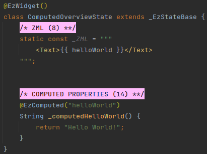
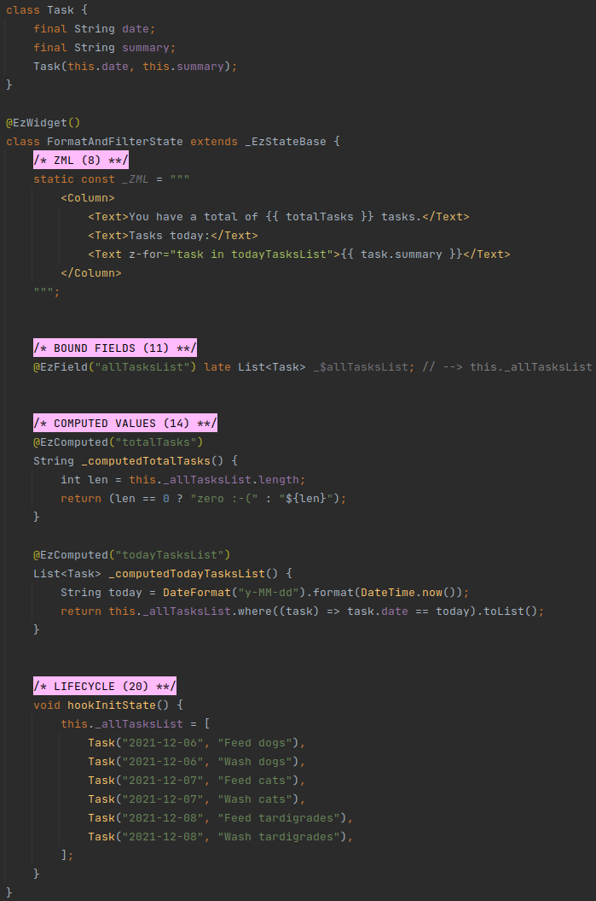
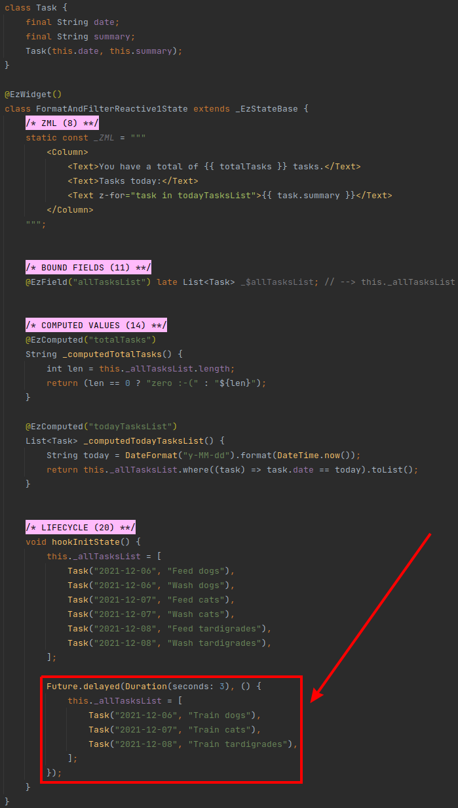
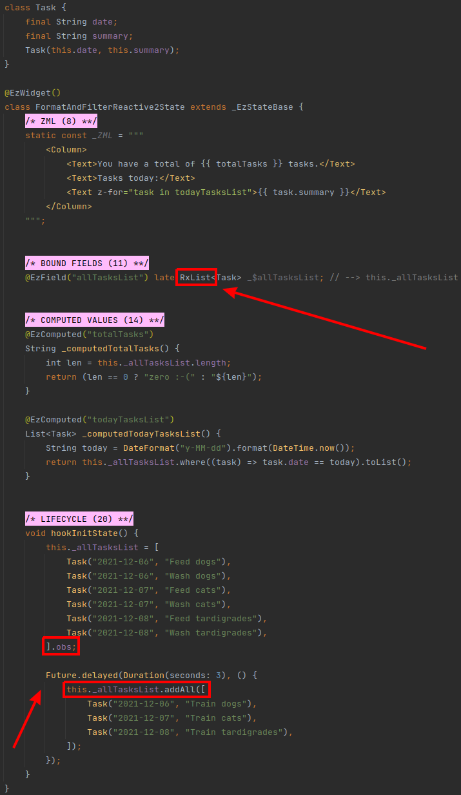
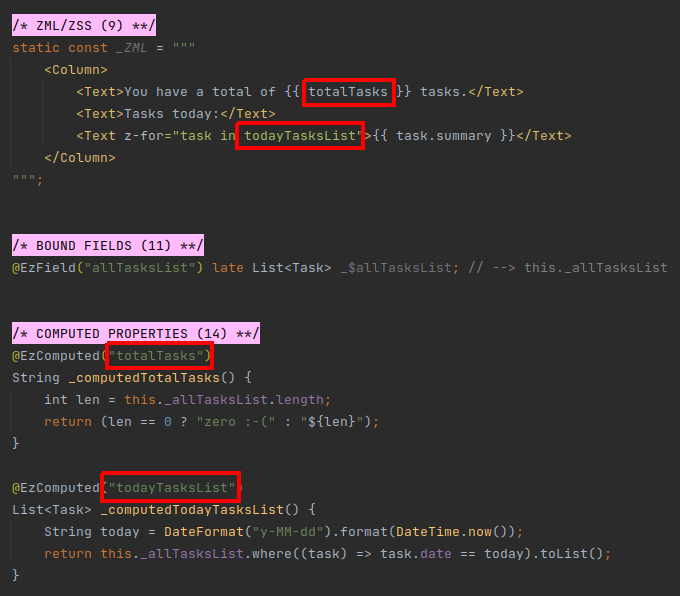
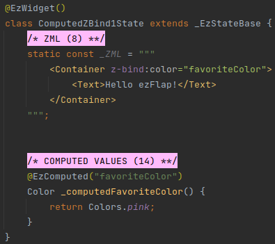
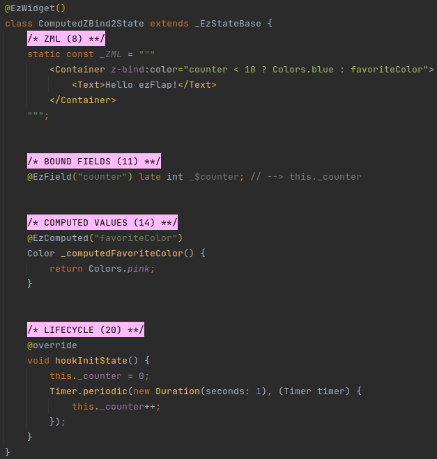
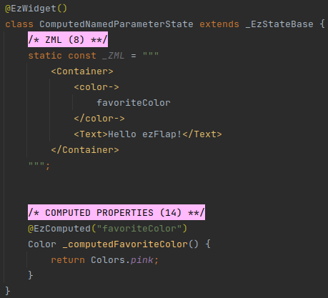
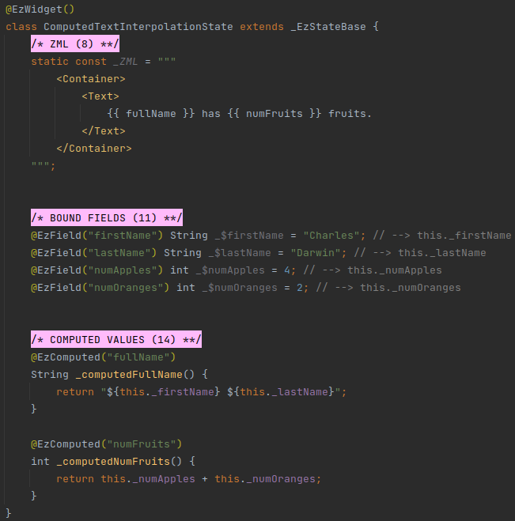
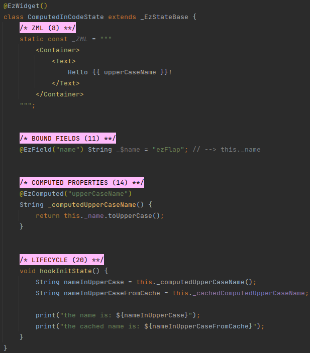

# Computed

## Overview
**Computed Methods** are methods with the `@EzComputed` annotation.

Computed methods are invoked when ZML that references them is rendered.

The value a computed method returns is used in the ZML, in the spot where it is referenced.

#### Example

 * Computed methods are accessible in the ZML.
 * Computed methods always return a value.
 * Computed methods do not accept parameters.
 * Computed methods are never asynchronous.
 * The value returned from computed methods is cached.

Computed methods are useful when we need to perform a transformation of some data before exposing it to the ZML.
For example, we might want to format a string or filter a list.

#### Example

## Reactivity
Computed methods are **reactive**.

Computed methods can access reactive data (e.g. bound fields) in order to generate their return value.

When a computed method accesses other reactive data (e.g. such as a bound field) - it becomes "dependent" on this data.

Then, whenever this data changes - the computed method gets re-invoked and the UI updates with the updated result (i.e.
the value returned from the computed method when it's invoked after the data it depends on changed).

To see an example for the reactivity of computed methods, let's look at a variation of the example from the previous
section:

In the above example, the UI will change after three seconds because the bound field `_allTasksList` is set to a new
*List* instance (and bound fields are reactive).

However, if we were to manipulate the existing list (e.g. add or delete an item) instead of
assigning a **new** *List* instance to `_allTasksList` - then the UI would **not** update.

This is because the bound field itself is reactive, but if its value is an object - then the object itself needs to
support reactivity in its fields and methods.

In other words, the object's internal state needs to be reactive in order for changes to automatically invoke the
widget's `build()` method.

ezFlap supports the reactive types offered by the [GetX](https://pub.dev/packages/get) library: _Rx_, _RxList_, _RxSet_,
and _RxMap_ (covered in detail in [Reactive Data Entities](/deep-dive/reactive-data-entities/reactive-data-entities.html)).

[GetX](https://pub.dev/packages/get) is also used internally by ezFlap.

We can change the above example to use _RxList_ instead of _List_ to achieve this:

Now, assigning a new list to `_allTasksList` will be reactive, and modifying `_allTasksList` internally will be
reactive.

Assigning new _Task_ instances to existing elements in `_allTasksList` will also be reactive.

::: tip REACTIVE DATA ENTITIES
If we make _Task_ mutable, and then write code that changes the values of the fields in `_allTasksList` _Task_
instances - these changes would not be reactive, and so would not update the UI.

To make it reactive, we need to make some small changes.

These changes, as well as the [GetX](https://pub.dev/packages/get) reactive classes are covered in
[Reactive Data Entities](/deep-dive/reactive-data-entities/reactive-data-entities.html).
::: 

## Caching
When a computed method is invoked by the ZML for the first time - the return value is cached.
 
Whenever the widget is re-built - the cached value is used.

If the computed method accesses reactive data (e.g. a bound field) - the cached value will be invalidated when
the underlying data is changed.

::: tip WHY CACHE?
Some computed methods can be trivial, but some may be computationally-heavy. In the example above,  `todayTasksList`
filters `_allTasksList`. With large lists, this can become resource-consuming.

By caching the result, we make sure that computed methods are not re-invoked unless their underlying data has actually
changed.

So, if the widget's `build()` method is called because *some other* reactive data has changed (i.e. not data that the
computed method depends on) - then the widget will be built with the cached value, instead of re-running the filter.  
:::

## Syntax
Computed methods are written like regular Dart methods, and are prefixed with the `@EzComputed` annotation.

The `@EzComputed` annotation accepts a single parameter: the Assigned Name of the computed method, which will be used
in the ZML to invoke the computed method (or retrieve the previously-cached value, if one exists).

In the ZML, computed methods are referenced with their Assigned Name **without** parentheses.

#### Example

### Conventions
Strongly-recommended conventions that may become mandatory in a future version:
 * The computed method's Assigned Name (the name provided as parameter to the `@EzComputed` annotation) should be in camelCase.

Optional suggested conventions:
 * Place the `@EzComputed` above the method declaration.
 * Prefix the computed method's method name with `_computed` (e.g. `_computedTotalTasks()`).
 * Use [Live Templates](/tooling/live-templates/live-templates.html) to generate computed method declarations quickly and
   consistently, and without having to remember the syntax.

## Usage

Computed methods can be accessed in `z-bind` Dart expressions, named parameters, text interpolation, and regular code.

::: warning AVOID SIDE EFFECTS
Computed methods can technically update state (e.g. increase a widget field's value, save data into a database).

Such actions are considered side effects, and should not be done from within a computed method.
:::

### Usage in z-bind

`z-bind` attributes accept a Dart expression.

Reference computed methods in these Dart expressions using the computed methods' Assigned Names.

#### Example 1 - pass Computed Method in z-bind

In the above example, the background color of the *Container* will be pink.

#### Example 2 - use Computed Method With an Expression in z-bind

In the above example, the background color of the *Container* will be blue for 10 seconds, and then will switch to pink.

::: warning POSSIBLE LEAK
*Example 2* above does not stop the timer when the widget is disposed.

Cleaning up when the widget is disposing is important, and easy, by passing a callback to `this.onDispose()` function.
This is covered in [Disposing](/essentials/life-cycle/life-cycle.html#disposing).
:::

### Usage in Named Parameters
Named parameters accept a Dart expression.

Reference computed methods in these Dart expressions using the computed methods' Assigned Names.

#### Example

### Usage in Text Interpolation
Computed methods can be referenced inside mustache expressions (`{{ '{' + '{ }' + '}' }}`) in a text block (e.g. in `<Text>`, or in
string attributes).

#### Example

### Usage in Code
Computed methods can be invoked like any other method.

Alternatively, their last cached value can be retrieved, with the `_cached` prefix (e.g.
`this._cachedComputedupperCaseName` in the example below).

::: tip RELAX!
If we try to get the cached value of a computed method before the computed method was invoked for the first time -
ezFlap will invoke it automatically, cache the returned value, and return it.
:::

#### Example

