# Conditional Rendering
Use the `z-if` attribute to control whether a widget is rendered or not.

Use the `z-show` attribute to control whether a rendered widget is actually displayed or not.

## z-if
`z-if` accepts a Dart expression that evaluates to a boolean.

::: tip AND ALSO...
`z-if` expressions can reference any data that is exposed to the ZML:
 * Bound fields.
 * Props.
 * Computed methods.
 * Bound methods.
 * Route params.
 * Models.

These are covered later in this guide.
:::

#### Example
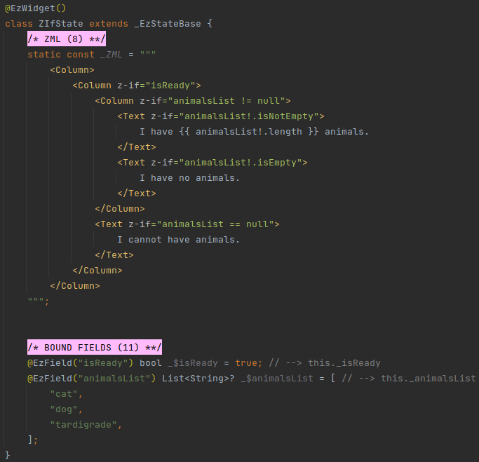

##### Builder
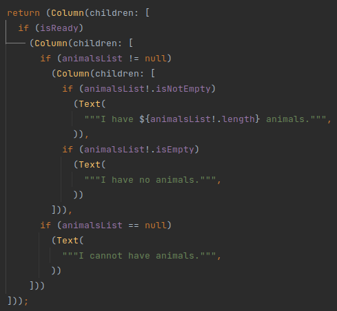

When a `z-if` expression evaluates to _false_ - the widget is not rendered.

`z-bind`, `z-for`, and any other Dart expressions provided to the widget or to its children are not evaluated.

::: tip EVALUATION STOP
The rules that apply to `z-if` expression evaluation are the same as the rules applied to any Dart expression.

The expression is evaluated from left to right, and as soon as it is determined that it cannot evaluate to _true_ - the
evaluation stops.

So, for example, this is allowed:

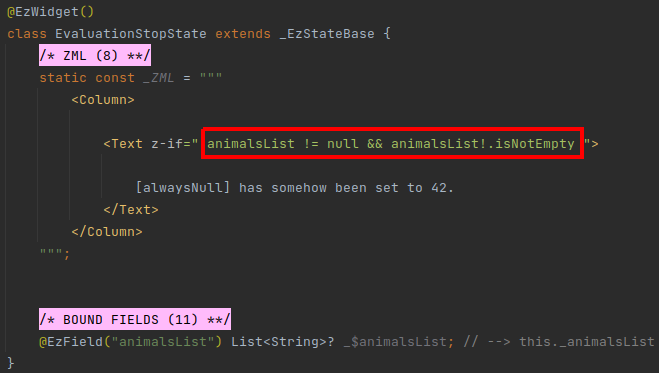

In the above example, the value of `animalsList` is _null_ (because it is _Nullable_, and not explicitly initialized).

Nevertheless, the expression doesn't crash on `animalsList.isNotEmpty` because it stops evaluating when
`animalsList != null` is evaluated to _false_.
:::

## z-show
`z-show` accepts a Dart expression that evaluates to a boolean.

ezFlap wraps widgets that have the `z-show` attribute with a *Visibility* widget.

The *Visibility* widget is initialized with the following parameters:
 * `child`: the widget with the `z-show`.
 * `maintainState`: _true_.
 * `visible`: the Dart expression provided to the `z-show`.

#### Example
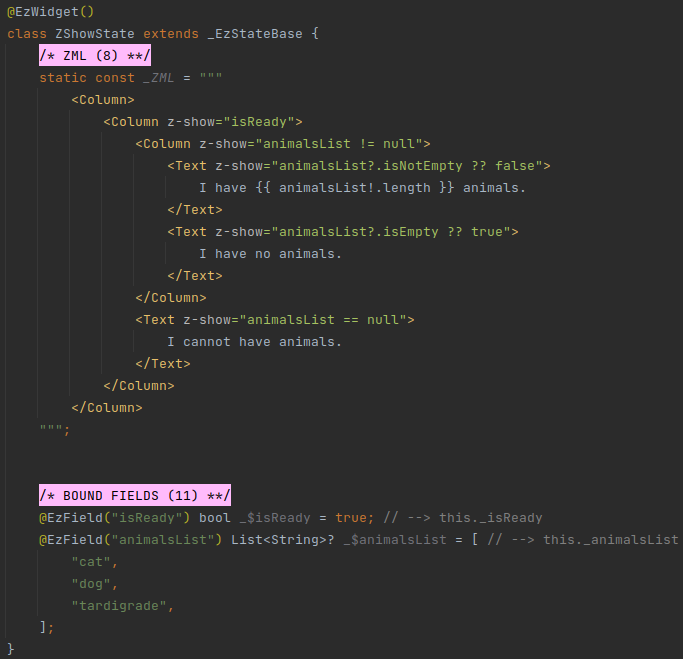

##### Builder
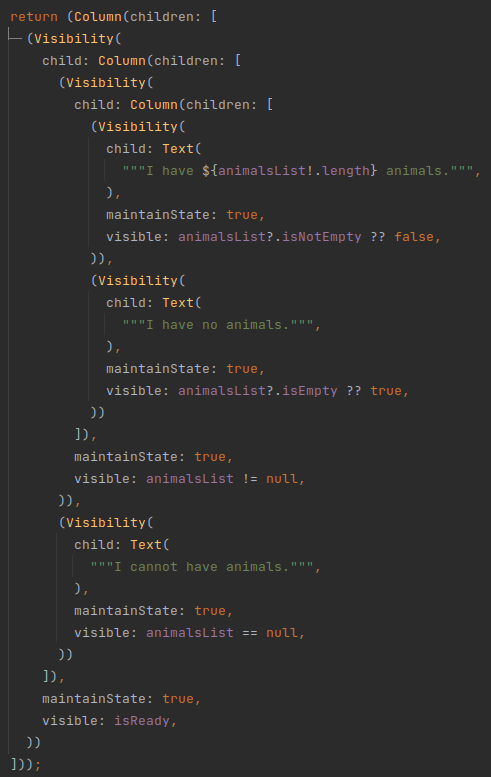

::: warning WIDGETS WITH Z-SHOW ARE ALWAYS RENDERED
Remember that, unlike `z-if`, widgets with `z-show` are always rendered, even if the `z-show` expression evaluates to
_false_.

This is the reason we have an expression like `animalsList?.isEmpty ?? true` instead of `animalsList!.isEmpty`.

This expression is on a *Text* widget that is inside a *Column* widget with `z-show="animalsList != null"`.

However, the *Column* widget is always rendered, and so the `z-show` expressions on the widgets inside it can get
evaluated when `animalsList` is null.

Therefore, we need the `?` (in `animalsList?.isNotEmpty`), in order to make sure we don't access `isNotEmpty` on
`null`. We also need the `?? false` at the end, because `z-show` expects a boolean value.
:::

## z-if with z-show
`z-if` can be placed on a class tag alongside `z-show`.

When provided together, the `z-if` is applied first, and so if it evaluates to _false_ - the widget is not rendered,
and neither is the _Visibility_ widget that is added by the `z-show` attribute.

#### Example
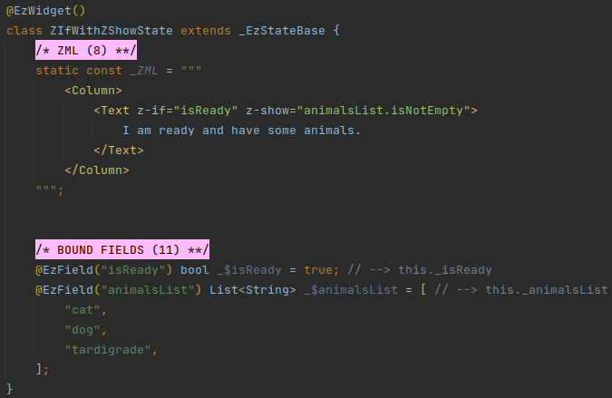

##### Builder
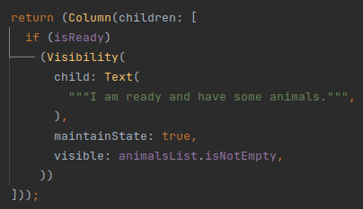

## z-if with z-for
`z-if` can be placed on a class tag alongside `z-for`.

When provided together, the `z-if` is applied to each generated widget separately.

In other words - when provided together - `z-for` is applied first.

The expression in the `z-if` can access the `z-for` value, key, or index variables.

## z-show with z-for
`z-show` and `z-for` together behave similar to `z-if` and `z-for`, and each generated widget is wrapped with its own
*Visibility* instance.

#### Example
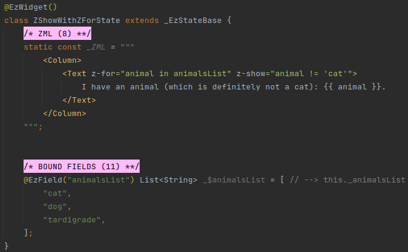

## z-if with z-show with z-for
The entire triplet of `z-if`, `z-show`, and `z-for` can appear together on the same class tag.

In such case, `z-for` takes priority, then the `z-if` is applied on top of  *Visibility* instances that wrap each
generated widget.

#### Example
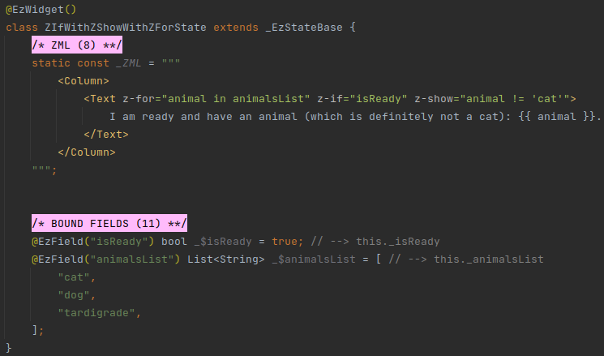

## Applying z-if to Unnamed Children for Single-Child Parameter
In the examples above `z-if` is always applied to widgets that are passed to the containing widget's `children`
parameter.

#### Example
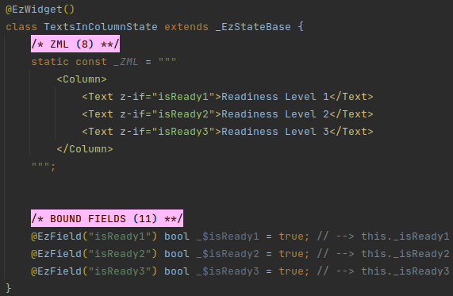

##### Builder
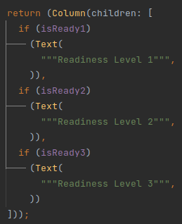

There are three *Texts* in the example above.

It's possible for all three to be rendered at the same time, or only a couple, or just one, or zero.

All of these variations are acceptable, because the containing widget is *Column*, which has a `children` parameter
(i.e. and not `child`).

But what if we want to render only one of the *Texts* at any given time?

#### Example
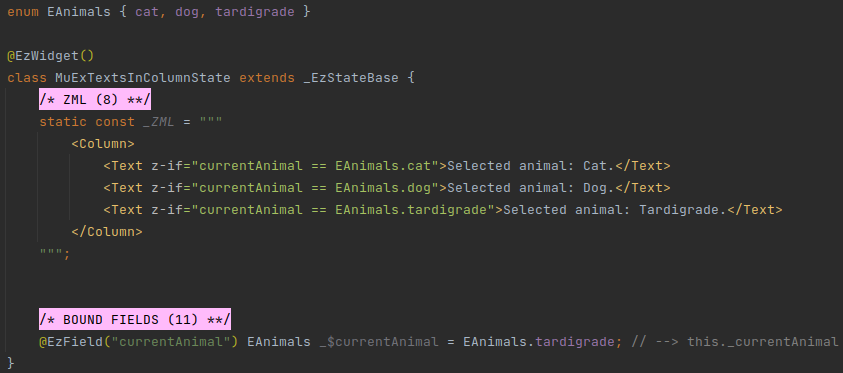

##### Builder
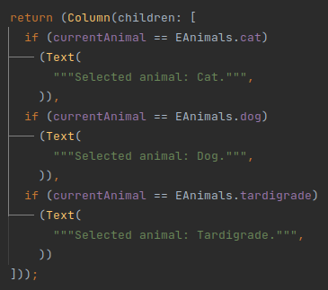

If all unnamed children of a class tag are mutually-exclusive (i.e. only one of them can be rendered at any given
moment) - then we can place them in a widget that has the `child` parameter (i.e. and not `children`).

For example, we could place them in a *Container*:

#### Example
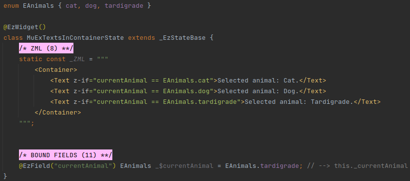

##### Builder
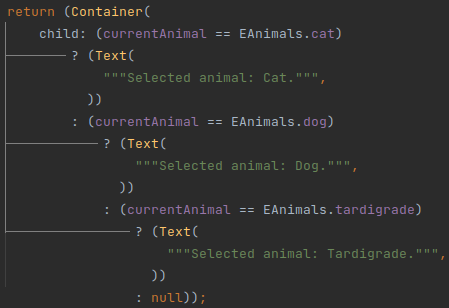

ezFlap automatically provides a fallback, to be used if the `z-if` expressions of all of the _Texts_ evaluate to
*false*.

The fallback depends on whether the single-child parameter is nullable or not.

If it is nullable - the fallback would simply be `null`.

Otherwise - the fallback would be an empty *Container* (i.e. `Container()`).

::: warning WITH GREAT POWER...
It is the developer's responsibility to ensure that the `z-if` expressions of the unnamed children class tags are
mutually-exclusive.

If they are not - ezFlap will not detect it in compile time; there will be no compilation or runtime error.

Which unnamed child will be rendered when more than one `z-if` evaluate to _true_ is undefined.
:::