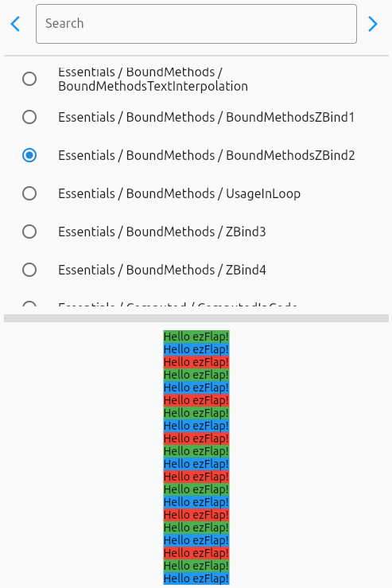
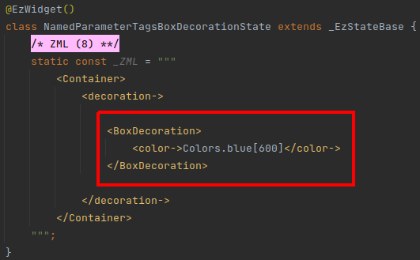
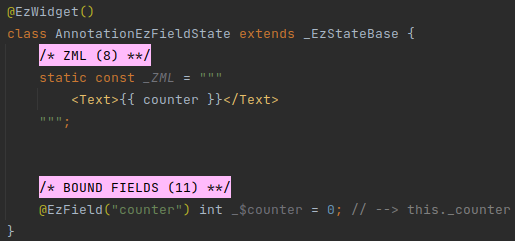

---
{
   
}
---

# Introduction
## What is ezFlap?
ezFlap is a reactive markup library for Flutter.

With ezFlap, you can:

* Use XML to define your user interface.
* Style widgets with CSS-like selectors.
* Control the rendering flow with XML attributes.
* Forget about `setState()`.
    * The UI updates automatically when the underlying data is modified.
* Easily communicate with parent widgets, using:
    * Events.
    * Bi-directional models.
* Easy access to hosted widgets from their parent widgets' code.
* Separate business logic from widget tree building.
* Easier conversion of Vuejs and Angular web applications to Flutter.

ezFlap is inspired by [Vuejs](https://vuejs.org/) and a little bit by [Angular](https://angular.io/).

### What ezFlap Looks Like
This is what an ezFlap version of the Flutter bootstrap project may look like:

#### MyApp


#### MyHomePage


::: tip XML? ZML!
The XML in the above code expresses the structure and behavior of the UI.

It follows a simple set of rules that define how XML tags and attributes are converted to Flutter widgets and
parameters.

It is called **ZML**.
:::

## This Documentation
It is highly recommended to clone the ezFlap Docs repository:

```bash
git clone https://github.com/ozlao/ezflap_docs.git
cd ezflap_docs
flutter pub get
```

The examples in this documentation are provided as images of code.

The reason is that it allows to have both Dart and XML syntax coloring at the same time.

However, almost all examples are available in the ezFlap Docs project, under `/Examples`.

Further, the ezFlap Docs project comes with an Examples Player application that allows to easily find and execute
examples.

It looks like this:




## Getting Started
ezFlap is mainly a build-time tool, used to "compile" ezFlap widgets to Dart.

An "ezFlap widget" is a Flutter widget that provides its render tree using ezFlap's ZML and annotations.

When developing ezFlap widgets - we do not write a `build()` method. ezFlap generates it for us automatically.

We will refer to Flutter widgets that are not ezFlap widgets as "native widgets".

ezFlap analyzes:
 * The ezFlap widget class.
 * ezFlap annotations.
 * ZML code (that provides the build tree).
 * ZSS code (that provides styling).
 * ZSS files in the directory hierarchy.

Then, it generates the Dart code that will:
 * Build the widgets tree
 * Perform additional logic expressed in the ZML and ZSS of the widget.

::: tip WHAT IS ZSS?
ZSS is also XML-based.

It is used to define selectors (similar to CSS selectors), and the ZML that should be applied for widgets that match
these selectors.

It is optional, and will not be used in the first several chapters of this guide.

It will be covered thoroughly in [ZSS](/essentials/zss/zss.html).
:::

The generated code is written into a file named `<classs file name>.g.dart` (for example: `MyApp.g.dart` in MyApp
[above](#myapp)).

## ezFlap Widget Classes
ezFlap widgets are stateful widgets.

We create a "MyApp" ezFlap widget like this:
 * Create a *MyApp* class that extends *_EzStatefulWidgetBase*.
   * (instead of extending Flutter's *StatefulWidget*).
 * Add the *createState* method:
   * `MyAppState createState() => MyAppState();`
 * Create a *MyAppState* class that extends *_EzStateBase*.
   * (instead of extending *State{{ '<' }}MyApp>*).
 * Define the ZML in *MyAppState*.

::: warning IMPORTANT
The return type of the `createState()` method **must** be the widget's state class.

### Valid


In the above example, the return type of `Valid.createState()` is `ValidState`.

This is because `ValidState` is the state class that corresponds to the `Valid` class.

### Invalid


The code in the above example is invalid, because , the return type of `Invalid.createState()` should be `InvalidState`,
and it's not.

Instead, it is `State<Invalid>`, which is a valid return type from the perspective of the Dart compiler, but is not
valid in ezFlap.
:::


## ZML
ZML is the heart of the ezFlap widget.

ZML is an XML-based language that directly maps to how a native widget's `build()` is written.

ZML has two types of tags:

#### Class Tags
 * The name of Class Tags is written in CamelCase. For example: `<Column>`.
 * Class Tags correspond to classes.
   * For example, the tag `<Column>` corresponds to the `Column` native widget class.
   * As another example, the tag `<Border>` corresponds to the `Border` class.
 * Class Tags can have attributes and can contain child Named Parameter Tags (will be introduced in a minute).
 * Attributes of Class Tags represent the parameters of their classes' constructors.
   * For example, in the tag `<MaterialApp title="Flutter Demo">`, the `title` attribute corresponds to the `title`
     named parameter of the default constructor of `MaterialApp`. 

::: warning WARNING
ZML uses Class Tags to reference widgets and other classes.

The referenced widgets and classes must be imported into the file.

For example, to use Material widgets, the ezFlap widget's file must import `material.dart` (i.e. with
`import 'package:flutter/material.dart';`).
:::

#### Named Parameter Tags
 * Named Parameter Tags correspond to a named parameter of the constructor of the widget of their parent Class Tag.
   * For example, the `<appBar->` Named Parameter Tag inside the `<Scaffold>` Class Tag corresponds to the `appBar`
     named parameter of the default constructor of `Scaffold`.
 * The name of Named Parameter Tags is written as: `<camelCase->`. For example: `<appBar->`.
 * Named Parameter Tags are always direct children of Class Tags.
 * Named Parameter Tags have no attributes.

::: tip NOT JUST FOR WIDGETS
Named Parameter Tags usually appear inside Class Tags that represent widgets.

However, they can also appear for Class Tags that represent "regular" classes.

For example, _BoxDecoration_ is not a widget, and we can use a Named Parameter Tag to provide a value to its `color`
parameter:



In the above example, the **BoxDecoration** Class Tag corresponds to the _BoxDecoration_ class.

The constructor of the _BoxDecoration_ class has a _color_ parameter, and the above code passes the Dart expression
`Colors.blue[600]` to that parameter.

The generated `build()` code for the above example looks like this:


:::

#### Unnamed Parameter Tags
 * Some Class Tags can contain child Class Tags directly.
 * Such child Class Tags are called: **Unnamed Parameter Tags**.
 * ezFlap automatically passes Unnamed Parameter Tags to the `child` or `children` named parameter of their
   parent Class Tag's constructor.

For example, when parsing this ZML:


ezFlap will automatically pass the two _Text_ widgets to the `children` parameter of the parent _Column_.

It will generate something like this:


#### More About ZML
 * ZML supports a lot more:
   * Conditions.
   * Loops.
   * Handling events.
   * Gaining access to hosted widgets.
   * Text interpolation.
   * And more!
   
Learn all about it in [ZML](/essentials/zml/zml.html).

## Annotations
Annotations are used to tell ezFlap about the special purpose of certain elements in the code.

For example, we place the `@EzWidget` annotation right above a widget class to tell ezFlap that it is an ezFlap widget:


`@EzWidget` comes before a class declaration.

Some ezFlap annotations come before fields. For example, we can place the `@EzField` annotation before a field, and
ezFlap will make it accessible from inside the ZML (e.g. to use in text interpolation):



We can use the `@EzMethod` annotation to make methods accessible in the ZML:


In the above example, two methods are marked as `@EzMethod`.

Both methods are used from inside the ZML.

 * `incrementCounter` is passed to the `onPressed` parameter of the _TextButton_ widget.
 * `calculateNextCounter` is invoked from inside text interpolation, and the value it returns is appended to the text:
"Increase to ".

Text interpolation and the `z-bind` attribute prefix syntax is covered in detail later in this guide.

### Naming
Notice how the ZML references the fields and methods.

Instead of using the "actual" method names - it uses a simplified form, that is provided as parameter to the `@EzMethod`
annotation.

This simplified form is called **Assigned Name**.

::: v-pre
For example, the `_boundCalculateNextCounter` method is not invoked by writing: `Increase to {{ _boundCalculateNextCounter() }}`.
Instead, we use the Assigned Name that was passed to the `@EzMethod` annotation: "calculateNextCounter".
:::

<h3>$$$</h3><br/>
Notice the name of the `@EzField` field: `_$counter`.

This dollar sign in the name means that this field **should not be accessed** by our code.

::: tip CONVENTION
Do not access fields, invoke methods, read constants, or do anything else with things that have `$` in their name.

For example: do not store data in or read data from the `_$counter` field.

When developing with ezFlap, we come across classes, methods, properties, and fields that have a dollar sign in them.

This dollar sign means that they are internal to ezFlap and should not be used by our own code.
:::

Notice the comment after the field declaration: `// --> this._counter`.

This comment reminds us to access `this._counter` (or just `_counter`) instead of `_$counter`.

**This is an important, repeating implementation detail of ezFlap.**

ezFlap creates a getter/setter pair **instead** of the field marked with `@EzField`, in the generated `_EzStateBase`
class, which the ezFlap widget class extends.

Therefore, if we need to access the field from our code, we access it as `_counter` instead of `_$counter`.

And when we need to access it from ZML - we use the Assigned Name: `counter`.

::: tip CONVENTION
ezFlap offers several different annotations for fields.

`@EzField` is one example, but there are others.

Some of these annotations generate a property that needs to be used by our code instead of the field, just like
`@EzField` does.

When using such annotations, the convention is to add a comment at the end of the line, like `// --> this._counter`.

This comment reminds us the actual name to use if we need to access the field from the code.

Import the [ezFlap Live Templates](/tooling/live-templates/live-templates.html) for Android Studio/IntelliJ IDEA.

They will take care of the annotations syntax, and also add such comments automatically, for annotations that need it. 
:::

## Build
When we are ready to test out our creation, we need to invoke ezFlap to compile the ZML and annotations to Dart code.

We do this with Dart's [Build Runner](https://pub.dev/packages/build_runner) tool.

We run the following command in our project's root:

```bash
dart run build_runner watch --delete-conflicting-outputs
```

This command invokes *build_runner* and generates the `.g.dart` files (like our `MyApp.g.dart`).

Its output may look kind of like this:
```
[INFO] Generating build script completed, took 358ms
[INFO] Setting up file watchers completed, took 14ms
[INFO] Waiting for all file watchers to be ready completed, took 302ms
[INFO] Reading cached asset graph completed, took 56ms
[INFO] Checking for updates since last build completed, took 856ms
[INFO] Running build completed, took 19ms
[INFO] Caching finalized dependency graph completed, took 48ms
[INFO] Succeeded after 79ms with 0 outputs (0 actions)
```

It may look different the first time it runs, or after running `flutter pub get` or `flutter clean`.

The first run may also take a while (10-20 seconds, or even more than a minute for larger or complex projects).

However, this command puts *build_runner* in watch mode, and subsequent changes to ezFlap widgets (e.g. change to the
ZML) will be compiled quickly as soon as the file is saved (usually in under a second).

::: tip DO NOT BE ALARMED
After creating a new ezFlap widget, before running *build_runner* - there will be errors:


This is normal. These errors are because `_EzStateBase` has not been generated yet.

They will go away after running *build_runner*.
:::

## Declarative Rendering
ezFlap has several predefined attributes to control rendering.

We will look at a couple here.

### `z-if`
The value of the `z-if` attribute is a Dart expression that evaluates to a boolean.

#### Example


The widget in which we put the `z-if` will be rendered only if the Dart expression in the `z-if` evaluates to _true_.

The `z-if` expression can reference:
 * `@EzField` fields by their Assigned Name.
 * `@EzMethod` methods, also by their Assigned Name.
 * Other elements that will be introduced soon, in the [ZML](/essentials/zml/zml.html) chapter.

[z-if](/essentials/conditional-rendering/conditional-rendering.html#z-if) is covered in more detail later in this guide.

### `z-for`
The value of the `z-for` attribute has a special syntax, similar to `v-for` and `ngFor` in Vuejs and Angular.

#### Example


The above code renders:


[z-for](/essentials/conditional-rendering/conditional-rendering.html#z-for) is covered in more detail later in this guide.

## Pink Sections
By convention, an ezFlap widget is divided into sections.

Each section contains a well-defined part of the widget class.

To visually differentiate between the sections, we start each section with its own Pink Section label:


The number in the parentheses tells us the order of the sections. Not every widget uses all types of pink sections, so
usually there will be gaps between the numbers.

The pink section labels are just regular Dart comments and have no effect on ezFlap or on the application itself.

This convention is followed throughout this documentation, but it's optional.

::: tip CONVENTION
Divide ezFlap widgets into Pink Sections.

Use [Live Templates](/tooling/live-templates/live-templates.html) to add them easily. No need to
memorize them!

Head over to [Pink Sections](/tooling/pink-sections/pink-sections.html) to read about all the types of pink sections, and to
find instructions (and RGB!) to configure the Pink in Android Studio/IntelliJ IDEA.
:::

## What's Next
This documentation is meant to be read in the order of the chapters.

It is best to read it in order, because later parts depend on earlier parts.

If you haven't installed the ezFlap package or the documentation examples project yet - now would be a good time to do
that. Just follow the instructions in [Installation](/essentials/installation/installation.html).

To get fully set up, be sure to furnish your IDE with Pink Sections, Live Templates, and the such, in [Tooling](/tooling/tooling.html).

Once you are all set up - proceed to the [ZML](/essentials/zml/zml.html) chapter.