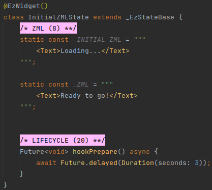

# Life-Cycle

## Overview
An ezFlap widget is also a Flutter widget, and it goes through the same life-cycle phases as all stateful Flutter
widgets.

ezFlap widgets have an additional life cycle on top of the native Flutter life-cycle.

ezFlap widgets also have their own high-level hook methods that can be overridden to perform various
actions in key points during the ezFlap widget's life cycle transitions:
 * **hookInitState** - initialize state necessary for the initial render of the ezFlap widget.
 * **hookPrepare** - asynchronously initialize state necessary for future rendering of the widget.
 * **hookReady** - any additional actions to be taken after the widget is initialized and rendered.

An ezFlap widget goes through the following ezFlap life-cycle states:
 * **Created** - the initial state when the widget is instantiated.
 * **Mounted** - set at the start of the native `initState()` function.
 * **Initialized** - set after `hookInitState()` is called (also in the native `initState()` function).
 * **Ready** - set when `hookPrepare()` returns.
 * **Disposing** - set at the start of the native `dispose()` function.
 * **Disposed** - set at the end of the native `dispose()` function.


## Initialization
ezFlap widgets are initialized in two steps:
 * Synchronously, before the first build.
 * Asynchronously, after the first build.

ezFlap provides two hook functions to write synchronous and asynchronous initialization code in:
 * `void hookInitState()`
 * `Future<void> hookPrepare() async`

They are covered in detail below.


## Disposal
ezFlap widgets are disposed when the native `dispose()` method is called (by Flutter).

Like any other native Flutter widget, ezFlap widgets need to perform cleanups and release any resources that don't get
released automatically by Flutter when a widget is disposed.

The recommended way to do these cleanups with ezFlap is by registering disposal callbacks, using the `onDispose` method
provided by ezFlap.

#### Example


In the above example, `Timer.periodic` is used to increase a counter and print it to the console every second.

The _Timer_ needs to be stopped when the widget is disposed. Otherwise, it will keep running in the background
indefinitely.

In the above example, the `onDispose()` ezFlap utility method is called to register a callback that would be called
automatically, by ezFlap, when the widget is disposed, and will cancel the _Timer_.

### Disposal Steps
When an ezFlap widget is disposed, ezFlap performs the following actions:
 * Set life-cycle state to **Disposing**.
 * Clear `@EzRef` and `@EzRefs` parent widget references to the disposing widget (more details in [Refs](/deep-dive/refs/refs.html)).
 * Call `hookDispose()` (see below).
 * Invoke disposal callbacks (that were previously registered with `onDispose()`).
   * In reverse order: the callback that was registered first will be called last.
 * Set life-cycle state to **Disposed**.

## Hooks
ezFlap exposes several hooks that allow ezFlap widgets to invoke custom code at key points during the life cycle.

To use a hook - override it.

::: tip NO NEED TO CALL SUPER HOOKS
The hook functions are for application use.

It is not necessary to call the parent version of the hook.

For example, in the following example, calling `super.hookInitState()` is not necessary:
```dart
@override
void hookInitState() {
	super.hookInitState(); // <-- not necessary!
	// stuff...
}
```
:::

The following hooks are available:


### hookInitState
#### Signature
```dart
void hookInitState()
```

#### Schedule
Called synchronously from the native `initState()`, before the first widget build.


#### Purpose
Initialize _late_ bound fields and other data that will be accessed during the first build.

When `hookInitState` returns - the widget enters the **Initialized** life-cycle state, and shortly afterwards - the
widget is built for the first time.


### hookBuildInitialWidget
#### Signature
```dart
Widget? hookBuildInitialWidget()
```

#### Schedule
Called whenever the widget is built while in the **Initialized** state (i.e. before reaching the
**Ready** state).

#### Purpose
In some cases we need to perform asynchronous initializations before we can properly render our
widget.

For example, we may need to get data from a storage device or an API.

ezFlap supports such cases by allowing to split the rendering of the widgets into two phases:
 * Phase 1: after the synchronous initializations but before the asynchronous initializations.
 * Phase 2: after the asynchronous initializations.

By default, the same builder is used for both phases (i.e. the content of the widget's `_ZML` is
rendered as defined as soon as `hookInitState()` is finished).

However, it is possible to override this behavior, and tell the ezFlap widget to build a different
widgets tree, until the ezFlap widget is fully initialized.

There are two ways to do this:
 * Using the `_INITIAL_ZML` constant (i.e. in addition to `_ZML`; this is covered later in this
   chapter).
 * By returning the alternative top-level widget to render from `hookBuildInitialWidget()`.

The `hookBuildInitialWidget` hook can be used to return an alternative widget, which would then be
returned from the builder instead of the widget's regular ZML while the widget is initializing (i.e.
until `hookPrepare()` is finished).

This hook is called in every build, until the widget reaches the **Ready** state.

Once the widget reaches the **Ready** state - this hook is no longer called (and will never be called again for the
widget).

If we want to instruct ezFlap to use the regular ZML, even while the widget is being initialized - we can return _null_
from this hook (or simply not override it).

::: tip INITIAL ZML PRECEDENCE
If the `hookBuildInitialWidget()` hook returns a widget, then even if an `_INITIAL_ZML` constant is provided for the
widget - it is ignored, and the widget returned from this hook is used instead.

The `_INITIAL_ZML` constant is described later in this chapter.
:::


### hookPrepare
#### Signature
```dart
Future<void> hookPrepare() async
```

#### Schedule
Called one tick after the native `initState()` returns.

It may get called before the first widget build (i.e. before the widget is rendered for the first time), or afterwards.

In other words - do not assume that the widget has already been built, and do not assume that it hasn't.


#### Purpose
This hook is used to perform asynchronous initializations (e.g. such as calling a web service) that the regular
widget's ZML depends on.

It is also ok to perform synchronous initializations in this hook, as long as they are not needed for the initial ZML.

When this hook returns (i.e. after its _Future_ is resolved) - the widget is put into the **Ready** state.

If a specialized initial ZML was used - ezFlap will now switch to use the widget's regular ZML.


### hookReady
#### Signature
```dart
Future<void> hookReady() async
```

#### Schedule
Called after the widget is put in the **Ready** state (i.e. after `hookPrepare()` returns).

#### Purpose
This hook is used to perform initializations that the ZML does not depend on.

This is the last initialization hook.


### hookDispose
#### Signature
```dart
void hookDispose()
```

#### Schedule
Called from the native `onDispose()` method, before calling the registered disposal callbacks (see below).

#### Purpose
This hook provides a method to free up resources or do any kind of cleanup before the disposal callbacks are invoked.

::: tip USE DISPOSAL CALLBACKS
The recommended way to handle cleanups is by registering disposal callbacks, using `onDispose()`.

The cleanup callbacks should be registered right after allocating the resource that needs to be cleaned up.

This approach helps to ensure that we don't forget to clean up, and keeping the initialization and cleanup code
together makes the code more maintainable.
:::


### Initial ZML
Initial ZML is a ZML snippet that is used instead of the regular widget ZML while the widget is initializing.

The initial ZML is used until the widget reaches the **Ready** life-cycle state.

An initialization-time widget can be provided by the `hookBuildInitialWidget` hook, but the recommended way is to
provide it in the form of ZML markup instead.

Initial ZML can be provided in two ways:
 * By specifying the ZML in an `_INITIAL_ZML` constant.
 * By passing the ZML to the `initialZml` parameter of the `@EzWidget` annotation.

The two ways are mutually-exclusive.

#### Example


In the above example, the text "Loading..." will appear while the initial ZML is used.

The initial ZML will be used for three seconds (i.e. until `hookPrepare()` returns), after which the text "Ready to go!"
will appear.
