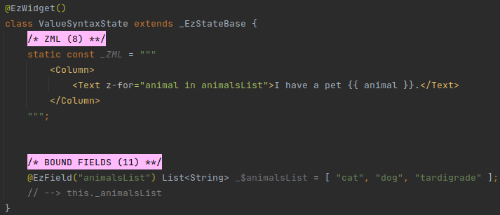
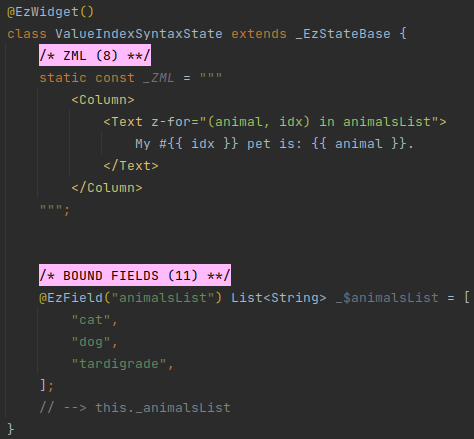
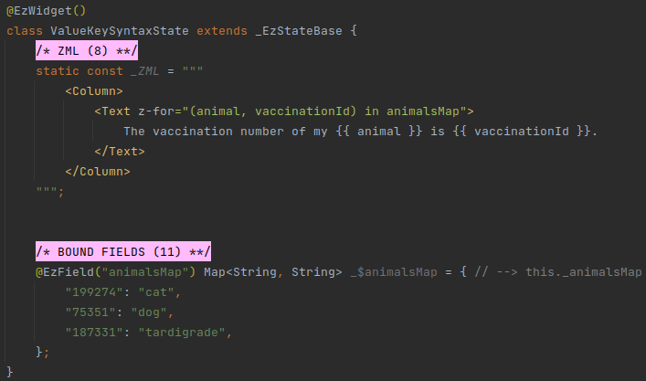
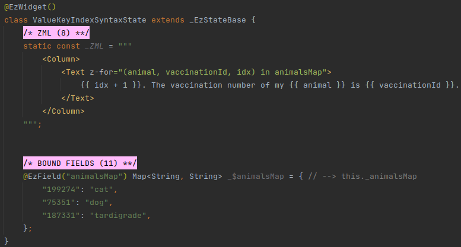

# Loops

## Overview

The `z-for` attribute allows to create multiple instances of a widget (or a class).

`z-for` allows to:
 * Iterate over an ezFlap bound field of type *List*, *Set*, or *Map*.
 * Access the current value (e.g. to render it, or pass it in a `z-bind` attribute).
 * Access the loop index.
 * When iterating over a *Map* - access the key.
 
::: tip AND ALSO...
`z-for` can iterate over any data that is exposed to the ZML, not just bound fields:
 * Props.
 * Computed methods.
 * Bound methods.
 * Route params.
 * Models.

These are covered later in this guide.
:::

`z-for` has four flavors:
 * *Value*
 * *Value + Index*
 * *Value + Key*
 * *Value + Key + Index*

## Flavor: Value

Syntax: `z-for="item in itemsListOrSetOrMap"`

#### Example

 * `animalsList` is the collection bound field to be looped over.
 * `animal` is a local variable, accessible in the ZML, that contains the value of `animalsList` in the current
   iteration.

## Flavor: Value + Index
Syntax: `z-for="(item, idx) in itemsListOrSetOrMap"`

#### Example

 * `animalsList` is the collection bound field to be looped over.
 * `animal` contains the value of `animalsList` in the current iteration.
 * `idx` contains the zero-based ordinal index of the current iteration.

## Flavor: Value + Key
Syntax: `z-for="(item, key) in itemsMap"`

#### Example

This is the same syntax as in *Value + Index*, when the field is of type *Map*.

 * `animalsMap` is the *Map* bound field to be looped over.
 * `animal` contains the value of `animalsMap` in the current iteration.
 * `vaccinationId` contains the key of the current iteration.

## Flavor: Value + Key + Index
Syntax: `z-for="(item, key, idx) in itemsMap"`

#### Example

This syntax is only used with fields of type *Map*.

 * `animalsMap` is the *Map* bound field to be looped over.
 * `animal` contains the value of `animalsMap` in the current iteration.
 * `vaccinationId` contains the key of the current iteration.
 * `idx` contains the zero-based ordinal index of the current iteration.

::: tip TYPES
The values and keys of a collection used in `z-for` can be of any type.
:::

## Reactivity
ezFlap is a reactive library.

ezFlap bound fields are reactive. If a bound field's value changes - ezFlap reflects it automatically in the UI.

However, if the field's value is a collection and it is manipulated - the UI will not be refreshed automatically.

For example, if the field is of type *List*, and is used in a `z-for`, and a new element is added to it - the UI will
not be refreshed.

ezFlap supports reactivity with the help of [GetX](https://pub.dev/packages/get).

The *get* package provides reactive collections:
 * *RxList*
 * *RxSet*
 * *RxMap*

`z-for` supports all three, and they should be used instead of the native *List*, *Set*, and *Map* for the UI to be
properly reactive.

_Rx_ are covered in detail later, in [Rx* Types](/deep-dive/reactive-data-entities/reactive-data-entities.html#rx-types).
