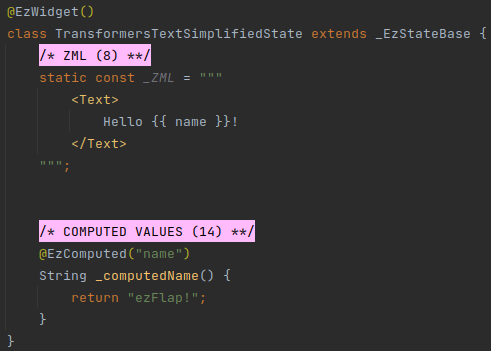

# Transformers

## Overview
Transformers allow to simplify certain repetitive patterns in the ZML.

Transformers are invoked automatically for all ZML, including named parameters in ZSS.

The available transformers are described in this chapter.

## Children
### Purpose
The _Children_ transformer allows to provide children tags as unnamed children, without explicitly specifying the
`children` or `child` named parameter.

### Transformation
#### Simplified ZML

#### Explicit ZML

### Conditions
Applied to class tags that satisfy all of the following criteria:
 * Has unnamed children tags.
 * Has a named parameter by the name of `children` or `child`.

### Additional Logic
 * If the parent widget has both a `child` parameter and a `children` parameter, then:
   * If there are two or more unnamed children - then the `children` parameter will be used.
   * Otherwise - the `child` parameter is used.
 * Otherwise, if only the `child` parameter is available, and two or more unnamed children are provided - then an error
   is logged and the transformation aborts.
 

## Text
### Purpose
The _Text_ transformer allows to:
 * Provide text directly inside the `<Text>` tag without explicitly specifying the positional parameter.
 * Provide interpolated text instead of a Dart expression.

### Transformation
#### Simplified ZML

#### Explicit ZML

### Conditions
Applied to _Text_ tags that satisfy all of the following criteria:
 * Has text.
 * Has no unnamed children tags.
 * Does not have the first positional parameter explicitly specified:
   * In a `<:0->` positional parameter tag.
   * Or in a `z-bind:0` attribute.

### Additional Logic
First, all XML comments are removed. Everything between `<!--` and `-->` is removed, according to standard XML rules.

::: warning EVEN INSIDE MUSTACHE
Comments are removed before the text is parsed and processed, so they get removed even if according to Dart rules they
would not.

#### Example

##### Builder

:::

#### Text Processing 
Then, the text is processed in multiple steps, in the following order:

First, the text is broken into parts, where each part is either a mustache section, or text.

For example, the content `Hello {{ '{{' }} name }}!` will be broken into three parts:
 * `Hello `
 * `{{ '{{' }} name }}`
 * `!`

Then, ezFlap iterates over the parts.

The mustached parts are converted to a Dart interpolation string, e.g. `${ name }`.

Non-mustached parts are processed in multiple steps, in the following order:
 * `&lt;` is changed to `<`.
 * `&gt;` is changed to `>`.
 * `&amp;` is changed to `&`.
 * Newlines are replaced with spaces (each newline is replaced with a single space).
   * `\r\n` is also replaced with a single space.
 * Multiple consecutive spaces are replaced with a single space.
 * If the text part is the first one (i.e. the text before the first mustache) - it is trimmed on the left.
 * If the text part is the last one - it is trimmed on the right.
 * ` ` is changed to a newline.
 * For each newline followed by a space the space is removed.
   * E.g. so that `a  b` will give `a\nb` and not `a\n b`.
 * For each `&nbsp;` that has preceding and/or following spaces - the spaces are removed.
 * `&nbsp;` is changed to a space.

## TextSpan
### Purpose
The _TextSpan_ transformer does for `<TextSpan>` the same thing it does for `<Text>`.

The interpolated text is passed to its `text` named parameter.

### Transformation
#### Simplified ZML

#### Explicit ZML

### Conditions
Applied to _TextSpan_ tags that satisfy all of the following criteria:
 * Has text.
 * Has no unnamed children tags.
 * Does not have the `text` named parameter explicitly specified:
   * In a `<text->` named parameter tag.
   * In a `z-bind:text` attribute.
   * In a `text` interpolated string attribute.

### Additional Logic
Applies the same logic as the [Text](#additional-logic-2) transformer.
