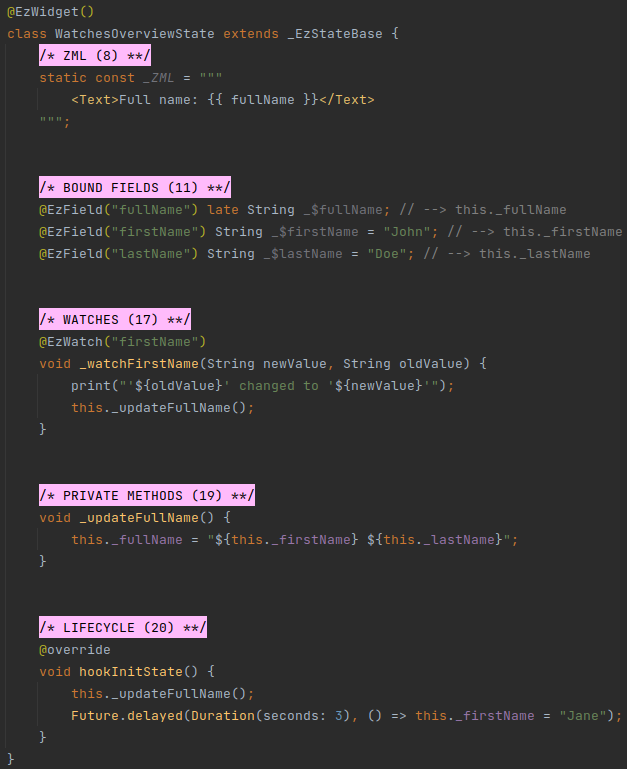

# Watches

## Overview
**Watches** are methods with the `@EzWatch` annotation.

Watches are invoked when the reactive value they watch is updated.

#### Example

In the above example, `firstName` and `lastName` are initialized to "John" and "Doe" in their declarations.

Then, `hookInitState()`:
 * Invokes `_updateFullName()`, which constructs the full name and stores it in `fullName`.
 * Schedules a function to run in three seconds and update `firstName` to "Jane".

At this point, the text "full name: John Doe" is rendered.

After three seconds, the reactive bound field `firstName` is set to "Jane".

The `@EzWatch` annotation of `_watchFirstName` watch is passed "firstName" as its parameter, and so the watch is
set to watch the `firstName` bound field.

When `firstName` is set to "Jane", the watch is invoked:
 * It calls `_updateFullName()`, which updates the display to "full name: Jane Doe".
 * It prints the text "'John' changed to 'Jane'" in the console.

## Syntax
Watches are written like regular Dart methods, and are prefixed with the `@EzWatch` annotation.

 * Watches must accept exactly two parameters.
 * Both parameters need to be of the same type.
 * The type needs to be consistent with the type of the value that is being watched.
 * The return type of watches is always `void`.

The `@EzWatch` annotation accepts a single parameter: the Assigned Name of the value that is to be watched.

Watches can watch any type of reactive value:
 * Bound fields.
 * Computed methods.
 * Props (covered later, in [Props](/deep-dive/props/props.html)).
 * Models (covered later, in [Models](/deep-dive/models/models.html)).
 * Route parameters (covered later, in [Route Params](/deep-dive/routing/routing.html)).

## Caution
::: warning AVOID WATCHES
It's generally best to avoid watches.

 * Watches are implicit; they make the flow and logic more difficult to reason about.
 * When multiple watches are invoked following a value update - the order in which they are invoked is undefined.
 * It is almost always better to use Computed methods, Bound fields, and to explicitly react to changes using events
   (with `z-on`, which is covered later, in [z-on](/deep-dive/events/events.html#z-on)).
:::

One scenario in which watches are useful is when we need to imperatively invoke a function when a
[Prop](/deep-dive/props/props.html) changes.

::: warning WATCHES ACCESS THEIR WATCHEES
Watches access the data they watch after `hookInitState()` is invoked.

This means that `late` bound fields that are accessed when a watch accesses its data must be initialized during
`hookInitState()`.

Bound field are accessed by a watch when the watch watches them directly (i.e. when their Assigned Name is passed to
`@EzWatch`), or when the watch watches a computed method that accesses them.
:::
