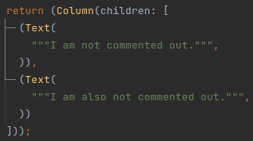

# ZML

## Overview
ZML is the XML-based language ezFlap uses to render and control widgets.

The ZML is used by ezFlap to generate the widget's `build()` functionality.

It can be provided in one of two ways:
 * In the `_ZML` constant.
 * In the `zml` parameter of the `@EzWidget` annotation.

### In _ZML Constant
#### Example

### In @EzWidget Parameter
The ZML can be provided as a parameter to the `@EzWidget` annotation.

The provided ZML needs to be a const _String_.

The common practice is to create a separate, abstract class, and define the ZML inside it, in a `static const ZML`
field:

And then, pass it to `@EzWidget` of the widget class:

## Mapping to Dart
ZML tags and attributes map to Flutter widgets and their parameters.

Some special-purpose ZML tags and attributes affect the rendering, flow, and logic in special ways.

All special-purpose tags and attributes are covered in this guide (in this and in later chapters).

## Tags
As explained in the [ZML introduction](/essentials/introduction/introduction.html#zml), there are two types of ZML tags:
  * Class Tags (which map to widgets or other classes).
  * Parameter Tags (which map to constructor parameters of the widget or class).

Class Tags can have attributes; Parameter Tags have no attributes.

Parameter Tags are always direct children of Class Tags.

There are three types of Parameter Tags:
 * Named Parameter Tags.
 * Unnamed Parameter Tags.
 * Positional Parameter Tags.

Class Tags and all types of Parameter Tags are described below.

### Class Tags
A ZML block must always have exactly one root tag, and this root tag is always a Class Tag.

#### Example

In the above example, there is a single Class Tag: `<Container>`, which is a reference to Flutter's _Container_ 
native widget.

This class is a valid ezFlap widget, that will always render (i.e. `build()`) a single, empty _Container_.

Its builder looks like this:

### Named Parameter Tags
Named Parameter Tags:
 * Are direct children of Class Tags.
 * Map to a parameter of their parent Class Tag's constructor.
 * Begin with a lower-case letter.
 * End with a hyphen.
 * Have no attributes.
 * Contain:
   * A Dart expression, OR -
   * One or more Class Tags.

#### Example 1

In the above example:
 * `<child->` is a Named Parameter Tag.
 * Its name is `child`.
 * It maps to the `child` parameter of the parent _Container_.
 * It contains a single Class Tag: `<Row>`.

Its builder:

#### Example 2

Its builder:

Remember that the content of Named Parameter Tags is either Class Tags, or a Dart expression.

ezFlap determines automatically which one it is; if it's an XML tag - then ezFlap treats it as a Class Tag. Otherwise -
as a Dart expression.

::: warning DART EXPRESSION EVALUATION TYPE
When writing Dart expressions inside Named Parameters - make sure that the expression evaluates to the same type as
expected by the widget's parameter.

For example, for `Container.clipBehavior` a value of the enum type `Clip` must be provided.
:::

::: tip IN CASE OF A MISTAKE
If your Dart expression evaluates to an incompatible type - the compiler will complain and direct you to the right spot
in the generated code (i.e. in the widget's `.g.dart` file).

From there, it should be simple to figure out where the mismatch is in the ZML code.
:::

### Positional Parameter Tags

Positional Parameter Tags:
 * Are direct children of Class Tags.
 * Map to a positional parameter of their parent Class Tag's constructor.
 * Begin with a colon.
 * Are followed by a number.
   * The number is the zero-based index of the positional parameter to which the tag is mapped.
 * End with a hyphen.
 * Have no attributes.
 * Contain:
   * A Dart expression, OR -
   * One or more Class Tags.
   

#### Builder

::: tip WHAT'S WITH THE QUOTES?
You may have noticed the double quotes around the `Hello ezFlap!` text in the ZML.

They are needed because the content is a Dart expression. Without the quotes it would be just `Hello ezFlap!`, and this
is not valid Dart syntax.

Thanks to the Transformations feature, when using `<Text>`, we can omit the quotes and even omit the Positional
Parameter Tag itself, like this:

This is covered in detail in [Transformers](/essentials/transformers/transformers.html).
:::

### Unnamed Parameter Tags

Unnamed Parameter Tags are Class Tags that are placed as the direct children of a Class Tag.

#### Example

In the above example, `<Row>` is an Unnamed Parameter Tags, because it is a Class Tag that is a direct child of a Class
Tag (i.e. it is a direct child of `<Container>`).

Unnamed Parameter Tags can be used when the parent widget has a `child` or a `children` parameter (but not both).

Another example:

#### Widget

##### Builder

In the above example, the `child` and `children` parameters of _Column_, _Container_, and _Row_ are not specified
explicitly.

ezFlap figures them out automatically and generates the correct `build()` code.

::: warning SHARED RESPONSIBILITY
It is our responsibility to not put multiple Unnamed Parameter Tags in a Class Tag that has a `child` parameter.

If we accidentally do this - ezFlap will report an error in the next build, and will not generate code for the widget.
:::

## Class Tag Attributes

Unlike Parameter Tags, Class Tags can have attributes.

There are different kinds of special-purpose attributes and attribute prefixes; they will be covered in depth in the
remainder of this guide.

For now, we will focus on four of them:
 * Attribute prefix: `z-bind`.
 * Prefix-less attributes.
 * The `z-constructor` attribute.
 * The `z-key` attribute.

### z-bind

#### Widget

##### Builder

Attributes with the `z-bind` prefix are mapped to the class' constructor's parameters, and their values are always
Dart expressions.

We have seen how to pass data to the parent class' constructor using Named Parameters and Positional Parameters.

`z-bind` is another way to do this.

`z-bind` attributes can also be used to pass data to positional parameters.

In such case, the attribute name (i.e. following the `z-bind:` prefix) is the zero-based index of the desired
positional parameter.

##### Builder

`z-bind` attributes are effectively the same as Tag Parameters, except that:
 * They are more concise.
 * They can be assigned only Dart expressions.
   * (i.e. and not Class Tags).

### Without prefix

Another type of attributes is prefix-less attributes.

Prefix-less attributes are processed by ezFlap as strings, and **not** as Dart expressions.

#### Widget

##### Builder

In the above example, we pass the text "Hello ezFlap!" in the prefix-less `title` attribute.

Note that we don't need to put quotes around the text, because ezFlap processes it as a string, and not as a Dart
expression.

Prefix-less attributes can also be matched against by [ZSS Selectors](/essentials/zss/zss.html#selectors).

## Text Processing
ezFlap supports Mustache-like text interpolation.

When we provide text in a prefix-less attribute - ezFlap processes Mustache snippets inside it.

The same also happens when passing text inside a `<Text></Text>` tags pair.

#### Widget

Everything inside a mustache is treated as a Dart expression.

ezFlap will generate the following `build()` code for the above widget:

##### Builder

ezFlap does additional processing beyond handling mustaches, with rules that are similar (but not identical) to the
rules of HTML:
 * Multiple consecutive spaces (or space-like characters) coalesce to a single space.
 * ` ` makes a newline.
 * `&lt;`, `&gt;`, and `&amp;` are replaced with `<`, `>`, and `&`.
 * `&nbsp;` is replaced with a single space.

Some differences are:
 * With ZML text, the space-like characters at the beginning of each line are stripped.

#### Widget

##### Builder

### z-constructor
By default, when ezFlap processes a Class Tag, it uses the class' default constructor.

We can instruct ezFlap to use a different constructor by providing the constructor's name in the  `z-constructor` attribute.

For example, if we want to use the `Text.rich()` constructor of `<Text>`, we can write:

#### Builder

### z-key
Native Flutter widgets accept a `Key` parameter.

This parameter can be provided as any other parameter, using a Named Parameter Tag or `z-bind`.

ezFlap offers a simple shortcut to provide string keys, using the `z-key` attribute:

#### Builder

Note that `z-key` accepts a literal string, and not a Dart expression.

## Comments

When a ZML tag or attribute begins with an underscore - it is considered to be commented out:

#### Builder

Regular XML comments are also supported:

#### Builder

## Import Referenced Classes

Remember that all classes referenced from the ZML need to be imported into the file.

::: tip BUT WHY?
These classes are referenced from the generated `build()` method (i.e. in the `.g.dart` file), and Dart needs them
to be imported in the non-generated class file in order to compile the application.

However, ezFlap itself also relies on these imports when generating the code; it uses
[analyzer](https://pub.dev/packages/analyzer) to figure out things like the types of the constructor parameters that
are passed in a Class Tag.

Therefore, if a library of a class used in the ZML is not imported - ezFlap will output `Cannot find the class
corresponding to tag` and not generate the `.g.dart` file.

For example, if we use `<Card>` but forget to import `package:flutter/material.dart`:

We get this error:

:::
