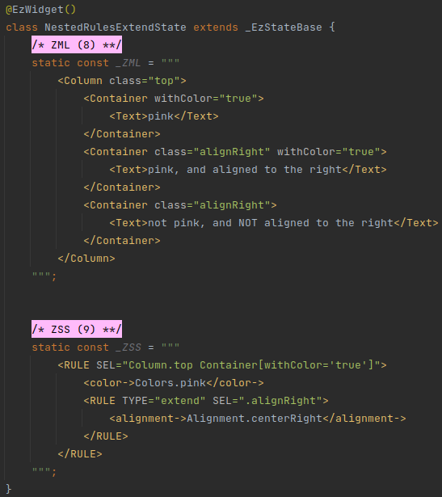

# ZSS

## Overview
ZSS is a simple XML-based language that is used alongside ZML to construct a widget tree.

ZSS allows to separate styling markup from structure/logic markup, in a similar way to how CSS moves styling code out
of the HTML.

The ZSS language consists of:
 * Selector-based rules to find matching class tags in the widget's ZML.
 * Named (and positional) parameters, written in ZML, to apply to the matched tags.


#### Example


In the above example, the text "Hello ezFlap!" will appear on a pink background.

::: tip ZSS FILES
In most of the examples in this chapter, the ZSS is provided alongside the ZML, in the same class.

However, it is possible, and convenient, to keep ZSS code in separate files.
 
This is covered later in this chapter.
:::


## Syntax
 * When the ZSS is provided alongside the ZML, inside the widget class, it is assigned to a `String` constant with the
   name: **_ZSS**.
   * i.e. `static const _ZSS = "(ZSS stuff)"`.
 * The text of the `_ZSS` constant is written in the XML-based ZSS language.
 * The ZSS language consists of two tags:
   * A rule tag: `<RULE>`.
   * A root tag: `<ZSS>`.
     * The root tag is usually optional; it is only mandatory when providing the ZSS in a `.zss` file (more details on
       this below).
 * The `<RULE>` tag supports two attributes:
   * `SEL`: the CSS-like selector that determines to which tags the rule should be applied.
     * The _SEL_ attribute is mandatory.
   * `TYPE`: determines the type of the rule.
     * The _TYPE_ attribute is omitted for most rules.
     * The _TYPE_ attribute can be set to:
       * `extend` - to indicate that the _RULE_ should extend its parent rule (similar to `&` in SCSS; more on this later
         in this chapter).
 * The `<RULE>` tag's children are the named parameter tags (and positional parameter tags) that should be applied to
   the class tags that match the rule's selector.
 * Like in SCSS, rules can contain other rules.
   * The selectors of nested rules are "concatenated" to the right of selectors of outer rules (more on this later in
     this chapter).


## Selectors
ZSS selectors share the following similarities with CSS selectors:
 * Allow to match by tag name.
 * Allow to match by classes.
 * Allow to match by attributes.
 * Tags in the selector are separated by spaces.
 * When matching, the ZML may have any number of tags between two matched tags.

An incomplete list of the differences from CSS selectors:
 * The `>` operator (i.e. the "immediate child" operator) is not supported.
 * Selectors only match in the widget to which the ZSS is applied.
   * We will see later that it is possible to apply the same ZSS to multiple (even all) widgets.
   * However, when matching against a ZML - the rules will not be matched against the ZML of ezFlap widgets that are
     referenced in that ZML.


### Tag Name
To match tags according to their names, we write the tag's name as-is in the selector.

A selector can contain multiple parts, separated by spaces. The last part in a selector must include a tag name.


#### Example 1
Match all _Containers_ in the widget:


#### Example 2
Match all _Containers_ that are inside a _Row_:


#### Example 3
The above ZSS matches also matches _Containers_ that are not direct children of the _Row_:


### Class
Selectors can also match by classes.


#### Example 1
Match by a single class:


#### Example 2
Match by multiple classes (i.e. the class tag would need to have all of the listed classes):


### Attributes
Selectors can also match by attributes.


#### Example 1
Match by a single attribute:


#### Example 2
Match by multiple attributes:


#### Example 3
Match by attribute existence:


### Runtime Matching
In the examples so far, the classes and attributes are all hardcoded, and so ezFlap handles the matching when it
compiles the ZML (i.e. and not in runtime).

It is often useful to apply styles conditionally with runtime conditions.

For example, we may want to apply a red border to a _TextField_ when its content is invalid.

ezFlap allows to match against dynamic classes and dynamic attributes, whose values are not yet known when the ZML is
compiled.


### Runtime Matching by Classes
The `class` attribute accepts a hardcoded space-delimited string of classes.

To provide the classes dynamically, we add the `z-attr` prefix and set the value of the `z-attr:class` attribute to the
Assigned Name of a reactive value of type _Set&lt;String>_.

Each item in the _Set_ will be treated as a class that is applied to the tag.


#### Example


In the above example, `pinkClassesSet` is first initialized with the class "withColor".

The ZSS rule requires the _Container_ to have both "withColor" and "pink", so its background remains white.

After three seconds, the "pink" class is added to `pinkClassesSet`, and the _Container_'s background turns pink.

::: tip REACTIVE SETS
Note that `pinkClassesSet` is of type _RxSet&lt;String>_, and not _Set&lt;String>_.

This is necessary because we want the contents of the set to be reactive, so that the UI will update when the "pink"
class is added.
:::


### Runtime Matching by Prefix-less Attributes
Prefix-less attributes are matched as hardcoded strings.

#### Example 1:


In the above example, `withColor` is a prefix-less attribute with the hardcoded text "pink", and it is matched by the
`Container[withColor='pink']` selector.

Prefix-less attributes support text interpolation.

When using interpolation, the matching is done in runtime, by the evaluated, interpolated text.

#### Example 2


  
### Runtime Matching by z-attr
So far we have seen ZSS applied by prefix-less attributes.

ezFlap can also match ZSS by dynamic attributes whose values are known only in runtime.

Prefix an attribute with `z-attr` to make it dynamic.

#### Example 1


When using `z-attr`, the value is interpreted as a Dart expression:

#### Example 2


It is also possible to match non-String values.

#### Example 3


In the above example, the ZSS rule matches _Containers_ that have a `withColor` attribute with the value `Colors.red`.

Not a string `"Colors.red"`, but Dart's `Colors.red`.

::: tip NO QUOTES
Observe how the selector does not have quotes around `Colors.red`: `SEL="Container[withColor=Colors.red]"`.

When matching by non-String values - omit the quotes.

Note that spaces in the expression are not supported.
:::

Another useful case is when using an enum:

#### Example 4


In the above example, the background color starts out as yellow, and after three seconds changes to green.

::: tip STRONG TYPING
When the ZSS references non-String types, Dart's compiler's type checks will catch type mismatches.
 
For example, if the ZSS references an invalid enum value - the application will not compile.
:::


## Nested Rules
ZSS rules can contain nested ZSS rules.

When a ZSS rule is inside another ZSS rule - its selector is combined with the selector of the parent rule.

The two selectors can be combined in two ways:
 * Addition
 * Extension

### Added Selectors
When a rule is contained in another rule, by default, its selector is appended to the right of its parent selector,
with a space between the parent rule's selector and the nested rule's selector.

In other words, the left-most part of the nested rule's selector is added after the right-most part of its parent
rule's selector.

This is similar to cascading selectors in SCSS.

#### Example


The above example shows three rules. Two of them are nested, and have the named parameters `color` and `alignment` to
apply to matching tags.

The effective selectors of these rules are:
 * Top rule: `Column.top`.
 * Middle rule: `Column.top Container`.
 * Bottom rule: `Column.top Container Container.bottom`.

Note that the inner-most _Container_ (the one with the `bottom` class) matches both the middle and the bottom rules,
and so the named parameters of both rules are combined and applied to it.


### Extended Selectors
By default, selectors of nested rules are concatenated together, but their parts are not merged in any way.

The `<RULE>` tag supports the `TYPE` attribute.

When `TYPE` is set to `extend` - the left-most part of the rule's selector will be merged with the right-most part of
its parent rule's selector.

#### Example


The effective selectors of the rules in the above example are:
 * Top rule: `Column.top Container[withColor='true']`.
 * Nested rule: `Column.top Container.alignRight[withColor='true']`.

Note how the last _Container_ is neither pink nor aligned right, because it lacks the `withColor='true'` attribute,
which is required by the top selector.


## Specificity
When multiple rules match a tag, the named and positional parameters of the rules are merged, and then applied to the
tag.

When some named or positional parameters are provided from multiple rules (i.e. when there are conflicts) - ezFlap
determines which rule takes priority by looking at:
 * The specificity of the rules' selectors.
 * The order in which the rules were defined (later rules override earlier rules).

This is similar to how CSS styles are applied to elements in HTML.

The specificity of a selector is calculated as follows:
 * Each tag in the selector is worth 1 point.
 * Each class or attribute in the selector is worth 100 points.

A higher specificity means a higher priority.

If multiple rules have the same specificity - the rule that appears last in the ZSS will get the highest priority.

::: tip PARAMETERS ARE MERGED
The priority of rules only matters when these rules have conflicting parameters to apply.

For example, if two rules have the `<color->` named parameter, one with the value `Colors.red` and the other with
`Colors.blue` - the color provided by the rule with the higher priority will be used.

However, if the lower-priority rule also has `<alignment->`, and the higher-priority rule doesn't - then the alignment
will be applied as well (because only one rule has an `<alignment->`, and so there is no conflict)
:::

If a named or positional parameter applied by a rule conflicts with an inline value of a class tag (i.e. a value that
is provided in a `z-bind`, or a named or positional parameter tag) - the inline value always takes precedence over the
ZSS rule.


#### Example


In the above example, the first rule (`Container.withColor.pink`) has a specificity of 201.

The second rule (`Container.withColor`) has a specificity of 101.

The third rule (`Container.special`) has a specificity of 101 as well.

Therefore, the first rule gets the highest priority and overrides the `<color->` of both other rules.

The second rule and third rule have the same specificity, but the third rule comes later - so it gets the next
priority, and its `<alignment->Alignment.bottomCenter</alignment>` overrides the `<alignment->` of the second rule.


## Applied Effects
ZSS rules can contain named and positional parameters that would be applied to their matching tags.

ZSS rules' parameters are the same as named and positional parameters in the ZML.

They have the same syntax, and the same principles.

Further, just like in ZML, it is possible to:
 * Reference the widget's reactive data from ZSS rules' parameters.
 * Write logic attributes, such as `z-if`, `z-for`, etc.

::: warning LESS IS MORE
Try to avoid both: avoid referencing reactive data from ZSS rule parameters, and avoid placing logic attributes on
class tags inside ZSS rules' parameters.

It's best to keep logic in the ZML, and styling in the ZSS.

Mixing them together will make the code harder to reason about and less maintainable.
:::


::: tip BEHIND THE SCENES
When working with hardcoded classes and attributes, ezFlap can do the ZSS rules matching when compiling the ZSS, and
generate code that instantiates the widget with the applied parameters.

However, when working with dynamic classes and attributes (i.e. whose values can only be determined in runtime) -
ezFlap cannot match while compiling.

Instead, ezFlap generates Dart code that applies the necessary logic, in runtime.

Consider the following ZSS and ZML:


ezFlap uses the ternary operator to apply parameter values conditionally, and will generate something like this:
```dart
Widget build() {
    return Container(
        clipBehavior: someTestLogic ? Clip.antiAlias : Clip.none
    );
}
```

The `Clip.antiAlias` part comes from the applied rule.

The `Clip.none` part is added by ezFlap automatically as the alternative option, for which no ZSS is supplied, because
`Clip.none` is the default value of the `clipBehavior` parameter of a _Container_'s constructor.
:::


## Providing ZSS
ZSS can be provided from multiple sources:
 * Directly from the widget class.
 * From another Dart file, by referencing it in the widget's `@EzWidget` annotation.
 * From a ZSS file, to be included automatically according to the folder hierarchy of the application.

It is possible to combine multiple sources together. In such case, the ZSS from all sources will be concatenated
according to the priorities of the sources (described later in this chapter). 


### Source: Widget
A widget's ZSS can be provided as a string in the `_ZSS` constant.

#### Example


### Source: EzWidget Annotation
The `@EzWidget` annotation accepts two optional parameters for specifying the widget's ZSS:
 * `zss` - for providing a single ZSS (the ZSS itself is provided in a string).
 * `zsses` - for providing any number of ZSSes, in a _List&lt;String>_.

The two parameters can be used individually or together.


#### Example 1 - `zss`

##### SourceAnnotationSingleZss.dart


##### SourceAnnotationSingle.dart


In the above example, the ZSS is defined in `SourceAnnotationSingleZss.dart` and is provided to the widget via the
`zss` parameter of the `@EzWidget` annotation.

Note that the names of the `SourceAnnotationSingleZss.dart` file and the class in it are arbitrary. The only
requirement is to provide a ZSS in a `const String` value to the `zss` parameter.


#### Example 2 - `zsses`

##### SourceAnnotationMulti1Zss.dart


##### SourceAnnotationMulti2Zss.dart


##### SourceAnnotationMulti.dart


The ZSS in the `zss` parameter has higher priority than ZSSes in the `zsses` parameter.

Within the ZSSes in the `zsses` parameter, ZSSes that appear later (i.e. further down in the _List_) have higher
priority than ZSSes that appear before them.

If a `_ZSS` constant is provided in the widget, then it receives a higher priority than all other ZSSes.


### Automatically
The last way to apply ZSS to a widget is by placing a `.zss` file in the same folder or in a parent folder of the
widget.

#### Example

##### Global.zss


##### SourceZssFile.dart


If the `Global.zss` file is placed in the same directory as `SourceZssFile.dart`, or above it (under the project's
root path) - the ZSS in it will be applied to the `SourceZssFile` widget.

::: danger CAVEAT
ezFlap cannot automatically re-generate code for the widgets that depend on the ZSS in a `.zss` file.

When a `.zss` file is modified - the change will apply in widgets that use that ZSS the next time they are built.

It is recommended to use `.zss` files sparingly, and only for relatively global styles.
:::

`.zss` files have lower priority than all other methods of providing ZSS to a widget.

Among `.zss` files, the closer a `.zss` file is to a widget (i.e. the less directory levels there are between them) -
the higher the `.zss` file's priority will be.

Within the same folder, `.zss` files' priority is determined by the alphabetical order of their names; later files have
higher priority than earlier files (e.g. `z.zss` would have a higher priority than `a.zss`).


## Performance Considerations

Applying parameters to tags with ZSS does not have a significant performance penalty.

Matching logic that can be applied in advance is applied during compilation and doesn't incur runtime costs.

Selectors that can be completely ruled out at compile time are ruled out.

Selectors that must be matched at runtime require having a ternary operator for each parameter, on each class tag that
is a possible match (i.e. according to the tag name, hardcoded classes, and hardcoded attributes).

Additionally, applying a parameter from ZSS involves a local function call (in runtime).

This added overhead should not make a difference for anything but highly time-critical applications.

Attribute comparisons are a little more efficient than class comparisons, because the latter require _Set_ comparisons.


### Caveat
Keep in mind that when a tag has dynamic class or attributes - it can significantly increase the number of
potentially-matching selectors, and could add a large number of conditions to the generated code.

#### Example


In the above example, it may seem clear that the `z-attr:class="curAlignmentClass"` attribute on the _Container_ is
meant to contain either the "alignedRight" or the "alignedLeft" class, but technically, any of the colors could match
this _Container_ as well.

The generated code looks like this:

#### Builder


::: tip PREFER DYNAMIC ATTRIBUTES
Prefer dynamic attributes over dynamic classes.

The same situation could also happen with attributes, but it is less likely, and easier to avoid, because every category
of possible values will likely have its own attribute (e.g. `z-attr:status` for statuses, and `z-attr:currentAnimal` for
pets).
:::