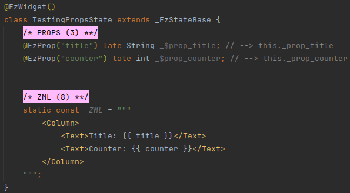

# Initialize
ezFlap's _WidgetWrapper_ class wraps around ezFlap widgets and helps to initialize their props, route parameters, and
models.


## Props
Use _WidgetWrapper_'s `mapProps` constructor parameter to provide values for the wrapped widget's props.

For example:

#### Widget


#### Test


## Route Params
Use _WidgetWrapper_'s `mapRouteParams` parameter to provide route parameters to populate `@EzRouteParam` fields.

#### Widget


#### Test


## Emit Handlers
_WidgetWrapper_ allows to register callbacks as emit handlers.

If we actually want some test code to be invoked when an event is emitted - we can register a callback using the
_WidgetWrapper_'s constructor's `mapEmitHandlers` parameter:

#### Widget


#### Test


However, if all we want is to make sure the event was emitted - then it is not necessary to register
emit handlers.

Instead, we can use _WidgetWrapper_'s `getNumEmits` method to get the number of times a certain event has been emitted.

For example, using the widget from the previous example, we can verify that events are emitted as expected like this:

#### Test


## Models
Models need to be initialized individually.

"Initializing a model" in _WidgetWrapper_ is like providing a model with `z-model`.

There are two variations
 * Initialize a model with a value.
 * Initialize a model with an _Rx_ instance that contains the value.

### With Value
Use the `WidgetWrapper.initModel()` function.

#### Signature
```dart
Rx<T> initModel<T>({
	String? key,
	required T value,
})
```

#### Widget


#### Test


### With Rx
It is also possible to initialize a model with a pre-existing _Rx_ variable.

This is useful in case we want multiple models to read from and write to the same variable.

For example:

#### Widget


#### Test


### Assertions
_WidgetWrapper_ allows the test code to get and set the current value of a model.

This is done with _WidgetWrapper_'s `getModelValue` and `setModelValue` methods.

For example:

#### Widget


#### Test

