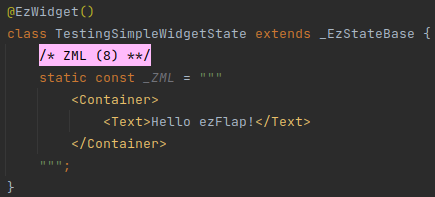
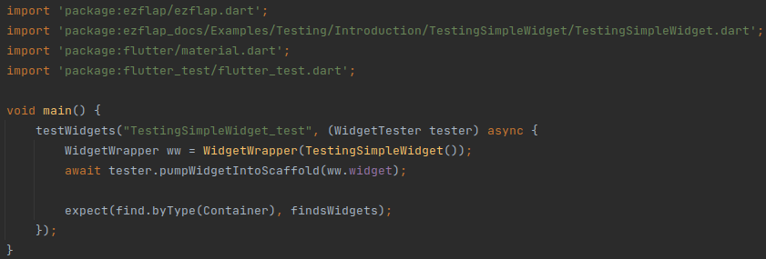

# Introduction
## Overview
ezFlap offers several classes and utilities on top of Flutter's built-in component testing framework, to help testing
ezFlap widgets.

These allow to:
 * Initialize ezFlap widgets with props, models, and route parameters.
 * Mock services and hosted widgets.
 * Test emits, models, and service method calls.

ezFlap widgets can be tested like native Flutter widgets, but in order to initialize, mock, and access ezFlap-specific
capabilities - we use ezFlap's _WidgetWrapper_ class.
 
## Widget Wrapper
ezFlap's _WidgetWrapper_ class wraps around an ezFlap widget, and provides a convenient interface to interact with the
ezFlap capabilities implemented by the widget (such as props, emits, etc).

The simplest use-case is wrapping a widget without providing props or other data to it.

Consider the following widget:

It can be wrapped in a _WidgetWrapper_ class and used in a test like this:

All the capabilities of the _WidgetWrapper_ class will be covered in the following chapters.

::: tip PUMP WIDGET INTO SCAFFOLD
The above example uses the ezFlap `pumpWidgetIntoScaffold()` utility function.

This function wraps around Flutter's `WidgetTester.pumpWidget`, and creates a _MaterialApp_ and _Scaffold_ around the
tested widget.

This, and other utilities are covered in full detail below.
:::

## Extension Methods on WidgetTester
The below extension methods are applied to Flutter's _WidgetTester_ class.

### pumpWidgetIntoScaffold
#### Signature
`Future<void> pumpWidgetIntoScaffold(Widget widget, [ bool withExtraTick = true ]) async`

#### Description
Creates a _MaterialApp_ and _Scaffold_ widgets, and passes `widget` to the `body` parameter of the _Scaffold_.

By default, pumps a single tick (by calling `WidgetTester.pump()` with a _Duration_ of zero milliseconds).

### pumpTick
#### Signature
`Future<void> pumpTick() async {`

#### Description
Pumps a single tick by calling `WidgetTester.pump()` with a _Duration_ of zero milliseconds.

### pumpWithMilliseconds
#### Signature
`Future<void> pumpWithMilliseconds(int milliseconds) async`

#### Description
Pumps `milliseconds` milliseconds.

### pumpWithSeconds
#### Signature
`Future<void> pumpWithSeconds(int seconds) async`

#### Description
Pumps `seconds` seconds.

### pumpWithSecondsPlusTick
#### Signature
`Future<void> pumpWithSecondsPlusTick(int seconds) async`

#### Description
Pumps `seconds` seconds, and then pumps another tick.

This is useful because in some cases, the UI may require an additional tick to update after some reactive data changes.

### tapAndTick
#### Signature
`Future<void> tapAndTick(String key) async`

#### Description
Finds a widget by a string key (e.g. that was provided in the ZML with a `key` attribute), taps on it, and pumps a tick.

### tapAndTickByFinder
#### Signature
`Future<void> tapAndTickByFinder(Finder finder) async`

#### Description
Taps `finder` and then pumps a single tick (so that `z-on` handlers will get invoked).

### setScreenDimensions
#### Signature
`void setScreenDimensions(double width, double height)`

#### Description
Sets the dimensions of the virtual test viewport.

### multiplyScreenDimensionsBy
#### Signature
`void multiplyScreenDimensionsBy(double widthFactor, double heightFactor)`

#### Description
Multiplies the dimensions of the viewport by the provided factors.

### multiplyScreenWidthBy
#### Signature
`void multiplyScreenWidthBy(double factor)`

#### Description
Multiplies the width of the viewport by `factor`.

### multiplyScreenHeightBy
#### Signature
`void multiplyScreenHeightBy(double factor)`

#### Description
Multiplies the height of the viewport by `factor`.
