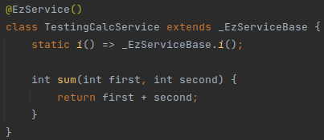

# Mock
## Overview
ezFlap has built-in support for:
 * Partial mocking of dependency-injected services.
 * Mocking hosted widgets.

## Services
Services are semi-mocked: the mock class must extend the original service class.

### Declaration
A mock class can override all of the original service's public methods.

Note: when the tested widget calls a service method that wasn't mocked - the original method's code is invoked.

Mock example:

#### Original Service

#### Mocked Service

In the above example we define a `_Mock_TestingCalcService` class that extends our `TestingCalcService` service, and
overrides its `sum()` method.

### Provide to Widget Wrapper
Mocked services are provided to _WidgetWrapper_ using its constructor's `mapDIOverrides` parameter.

#### Original Service

#### Widget

#### Test

In the above example:
 * We use _WidgetWrapper_'s constructor's `mapDIOverrides` parameter to provide _WidgetWrapper_ with the mocked version
   of _TestingCalcService_.

Note the following points:
 * The name *_Mock_TestingCalcService* is arbitrary; any name can be used.
 * In the above example, *_Mock_TestingCalcService* is defined "locally" in the test file, but for real-life
   applications, it is often convenient to create a separate library of mocks that can be re-used by multiple tests.
 * The keys of the `mapDIOverrides` parameter need to match the names of the service classes.
 * Only services that are made available to the widget using ezFlap dependency injection (i.e. have an `@EzDI`
   annotation) can be mocked this way.
 * The mock is made available **only** to the widget wrapped by the _WidgetWrapper_ instance.
   * If that widget hosts other widgets, and these hosted widgets also have the service injected as a dependency (i.e.
     with `@EzDI`), then these hosted widgets **will not** get the mocked service.

### Log Function Calls
ezFlap offers the _TestWrapperMixin_ utility mixin.

This mixin offers some utility functions that can be used by mocks to keep track of invocations of the mocked service's
methods.  

#### Mocked Service

In the above example, `TestWrapperMixin.tw_logInvocation()` is used to log every invocation of the `sum()` method.

#### Widget

In the above example, `TestingCalcService.sum()` is invoked three times.

#### Test

The above example shows the different ways to check whether a certain mocked method was called, and how many times,
using the `TestWrapperMixin.tw_wasInvoked()` method with various combinations of its named parameters:
 * `key` - specify the key under which the invocation was recorded (i.e. the value passed to
   `TestWrapperMixin.tw_logInvocation()` in the mocked service).
 * `exactlyNumTimes` - the exact number of times the method is expected to have been invoked.
 * `atLeastNumTimes`
 * `atMostNumTimes`

Only `key` is mandatory.

When the exact, minimum, and maximum number of times are not specified - `tw_wasInvoked()` will return _true_ if the
method was invoked at least once.

### Log Function Calls With Data
_TestWrapperMixin_ allows to record additional data alongside the logging of method invocations:
 * A custom _String_.
 * A _List_ of parameters.

For example:

#### Mocked Service

#### Widget

#### Test

In the above example:
 * `TestWrapperMixin.tw_getParam` is called twice - once to get the first parameter (i.e. `num1`), and once to get the
   second (`num2`).
   * Note: `tw_getParam` always gets the parameters of the **last** invocation of the method (i.e. the last invocation
     of the method whose key is passed to `tw_getParam`).
 * `TestWrapperMixin.tw_getExtraOfLastInvocation` gets the text that was passed to `tw_logInvocation` in the `extra`
   parameter (in the last invocation). 

## Hosted Widgets
It is common for ezFlap widgets to host other ezFlap widgets.

When testing an ezFlap widget, all of its hosted ezFlap widgets will be instantiated as they would in the real
application.

Sometimes we may want to mock such hosted ezFlap widgets during a test, or even to just "disable" them (i.e. make the
widget that is being tested not instantiate them).

Mocked ezFlap widgets are passed to _WidgetWrapper_'s constructor using the `mapHostedWidgetMockFactories` parameter.

### Disable Hosted Widget
The simplest form is to just prevent a hosted widget from being instantiated:

#### Hosted Widget

#### Host Widget

#### Test

As seen in the above example, `mapHostedWidgetMockFactories` expects:
 * A _String_ key, with the name of the hosted widget to be mocked or disabled.
 * A _WidgetMockFactory_ instance.

_WidgetMockFactory_ is a helper class provided by ezFlap.

The simplest way to use it is as seen above - instantiate it without any parameters and pass it to
`mapHostedWidgetMockFactories`.

In such case, the hosted _TestingHostedWidget_ widget will be replaced with an empty _Container_.

If we want to have _TestingHostedWidget_ replaced with a different widget - we will provide a builder function to
_WidgetMockFactory_'s constructor, in the `funcWidgetFactory` parameter:

#### Test

### Mock Hosted Widget
In rare occasions, we will want to actually have the hosted ezFlap widget replaced with another ezFlap widget.

This is mainly useful when the widget we are testing obtains a reference to its hosted widget (i.e. using `@EzRef`),
and invokes public methods that the hosted widget exposes.

In such case we may want to not actually render the hosted widget, but to make a mock available to the tested widget,
because it may have code that relies on the `@EzRef` field being populated, and will crash if it's not.

We may also want to capture calls to the hosted widget's public methods, to verify that the host widget behaves
correctly, and also to return sensible values to it (again, so that it won't behave incorrectly, or even crash).

Mocking a hosted widget consists of the following steps:
 * Define an interface (i.e. abstract class) and declare the same public methods that are exposed by the hosted widget
   we wish to mock.
 * Have the to-be-mocked hosted widget implement the interface.
 * Set the type of the tested widget's `@EzRef` to the interface.
 * Create the class to actually do the mocking. This class will:
   * Implement the aforementioned interface.
   * Extend ezFlap's _MockWidgetStateBase_ helper class.

We will go over these steps one by one, in the following examples:

#### Interface
An abstract class that declares the public functions that can be mocked:

#### Hosted Widget
The to-be-mocked hosted widget implements the _ITestingHostedWidgetForRefState_ interface:

#### Host Widget
The type of the `@EzRef` field in the host widget is set to the interface (i.e. _ITestingHostedWidgetForRefState?_):

#### Mock Class
The actual mock class extends ezFlap's utility _MockWidgetStateBase_ and implements the
_ITestingHostedWidgetForRefState_ interface:

#### Test
In the test, _WidgetWrapper_ is initialized with the `mapHostedWidgetMockFactories` constructor parameter, with an
instance of _WidgetMockFactory_, which is passed a factory function that instantiates the mock class in its
`funcCreateMockWidgetState` constructor parameter:

### Interact with Mocked or Disabled Hosted Widget
_WidgetWrapper_ offers method to access and interact with mocked or "disabled" hosted widgets.

The below example shows how to check that the desired prop values were provided by a hosted widget to a hosted widget
that has been disabled.

#### Hosted Widget
The to-be-disabled hosted widget has a couple of props defined.

#### Host Widget
The host widget provides values for the hosted widget's props.

#### Test
The test disables the hosted widget by using the _WidgetMockFactory_ class instantiated with the defaults.

Then, it gets the instance of _WidgetMock_ (described later), which provides utility methods for getting information
concerning the mocked widget.

Then, it verifies that both props were actually populated (i.e. by the host widget), and also verifies their values. 

#### _WidgetMock_
The _WidgetMock_ class is created and initialized automatically by ezFlap, and is used as a container around a widget
mock.

It provides the following methods:
 * `bool isPropPopulated(String assignedName)` - returns true if a prop with the Assigned Name `assignedName` was
   populated (e.g. with a `z-bind` attribute).
 * `dynamic getPropValue(String assignedName)` - returns the value the prop was populated with.
   * Returns _null_ if the prop was not populated.

_WidgetWrapper_ provides three methods that allow to retrieve _WidgetMock_ instances of the wrapped widget:
 * `List<WidgetMock> getWidgetMocks(String widgetName)` - returns a _List_ with zero or more _WidgetMock_ instances of
   the mocks of the widget with the name `widgetName`.
 * `WidgetMock getSingleWidgetMock(String widgetName)` - returns a single _WidgetMock_ and throw exception if there are
   no mock instances of `widgetName`, or if there are more than one.
 * `WidgetMock? tryGetSingleWidgetMock(String widgetName)` - the same as `getSingleWidgetMock`, but returns _null_ if
   there are zero or suitable multiple mock instances.
