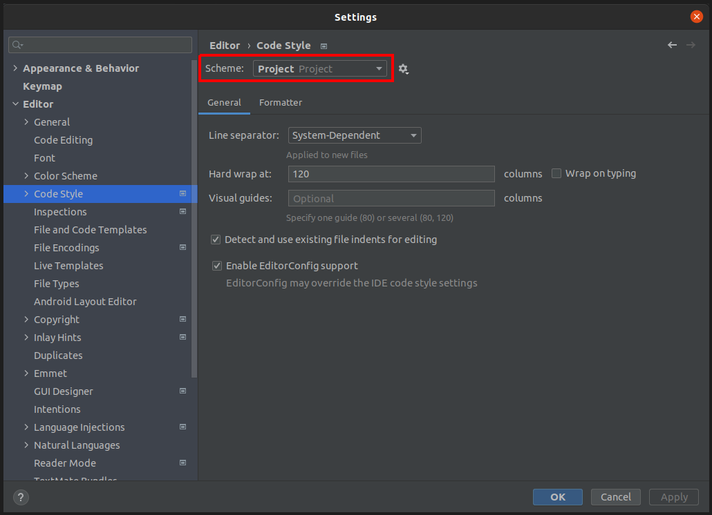
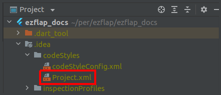

# Enable Tabs
## Android Studio / IntelliJ IDEA
ezFlap's own source code and examples use tabs instead of spaces, and are not formatted with `dartfmt`.

The reasons for this are explained in [Code Style](/misc/code-style/code-style.html).

::: tip YOU DO YOU
When using ezFlap, you can follow Google's standard conventions if you prefer.
:::

Unfortunately, current Android Studio and IntelliJ IDEA (hereinafter: IDEA) versions don't have great support for
non-standard Dart styling.

IDEA relies on `dartfmt` internally for auto-formatting; it can be disabled, but there is no way to configure custom
rules.

Additionally, there is no way in the UI to configure IDEA to use tabs instead of spaces.

This section shows how to manually configure IDEA to use tabs.

 * Open the Settings dialog (File --> Settings).
 * Navigate to Editor --> Code Style.
 * Change Schema to "Project":



 * Click on "OK".
 * Navigate to the `.idea/codeStyles` directory under your project's root.
   * If it doesn't exist - create it.
 * Open or create the file `Project.xml`:



 * Add the `<codeStyleSettings>` tag, as provided below.
   * If the _Project.xml_ file did not exist before - just paste the entire below XML into it, as-is.

```xml
<component name="ProjectCodeStyleConfiguration">
	<code_scheme name="Project" version="173">
		<codeStyleSettings language="Dart">
			<indentOptions>
				<option name="INDENT_SIZE" value="4"/>
				<option name="CONTINUATION_INDENT_SIZE" value="4" />
				<option name="TAB_SIZE" value="4"/>
				<option name="USE_TAB_CHARACTER" value="true"/>
				<option name="SMART_TABS" value="true"/>
			</indentOptions>
		</codeStyleSettings>
	</code_scheme>
</component>
```
