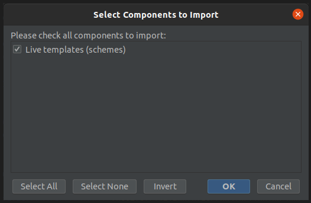
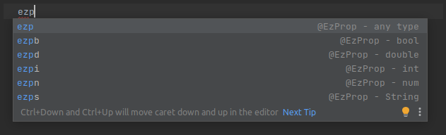
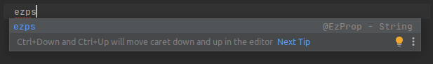
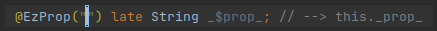
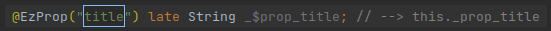
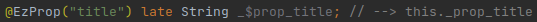
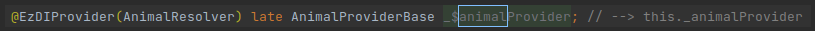

# Live Templates
## Overview
Live Templates are an Android Studio / IntelliJ IDEA feature.

Live Templates allow to define shortcuts that can be automatically expanded when the user starts to type them.

Live Templates can also include parameters. In such case, when expanded, we are prompted to fill them out, one by one.

This chapter offers Live Templates for:
 * [Pink Sections](/tooling/pink-sections/pink-sections).
 * ezFlap annotations.

Read more about Live Templates in [JetBrains' documentation](https://www.jetbrains.com/help/idea/using-live-templates.html)


## How to Install
The ezFlap Live Templates can be imported using JetBrains' "Import Settings" feature.

 * Download this exported settings file: [Exported ezFlap Live Templates](/assets/ezFlap_LiveTemplates.zip).
 * Open the Import Settings dialog (File --> Manage IDE Settings --> Import Settings...).
 * Locate the file you have just downloaded and open it.
 * Press OK:




::: tip EZFLAP LIVE TEMPLATES ARE SEPARATE
ezFlap Live Templates have their own, separate XML file, and importing them should not override your other existing
Live Templates.

However, you can also get the raw XML file and copy it to the IDE's Live Templates folder manually.

For example, on Linux, when using IntelliJ IDEA 2021.2 - the Live Templates folder is:
`~/.config/JetBrains/IntelliJIdea2021.2/templates`.

Download [the XML](/assets/ezFlap.xml).
:::

## How to Use
To generate a _String_ prop with Live Templates, we use the `ezps` shortcut (the `p` is for "prop", and the `s` is for
_String_):

Start typing the shortcut:




Finish typing the shortcut:




Press enter or tab:




Type the prop's Assigned Name:



Notice how the field name and comment at the end are generated automatically according to the Assigned Name that is
being typed.

Press enter, and the prop is complete:




Another, more sophisticated example, is the `@EzDIProvider` annotation:



Notice how we type `animal` once, and it is added automatically in three other places.

In two of these places, the letter `a` is capitalized automatically by the Live Template (in `AnimalResolver` and
`AnimalProviderBase`).


## Pink Sections
Pink Section shortcuts are covered in [Pink Sections Shortcuts](/tooling/pink-sections/pink-sections.html#shortcuts)


## ezFlap Annotations
Generally speaking, for annotations that have types (e.g. `@EzProp`, `@EzField`) - the format of the shortcut is:
`<prefix><first letter of type>`.

For example, the shortcut of `@EzProp` is `ezp`, followed by:
 * `b` for _bool_.
 * `d` for _double_.
 * `i` for _int_.
 * `n` for _num_.
 * `s` for _String_.

The text `ezp` in itself is also a shortcut. When used, you will be prompted to enter the type manually.


### @EzComputed
Shortcut: **ezc**
```dart
@EzComputed("hello")
List<String> _computedHello() {
	
}
```

| Value Type  | Shortcut |
| ----------- | ---------|
| Custom type | **ezc**  |
| bool        | **ezcb** |
| double      | **ezcd** |
| int         | **ezci** |
| num         | **ezcn** |
| String      | **ezcs** |


### @EzDI
Shortcut: **ezdi**
```dart
@EzDI() late Hello _hello;
```


### @EzDIProvider
Shortcut: **ezdip**
```dart
@EzDIProvider(HelloResolver) late HelloProviderBase _$helloProvider; // --> this._helloProvider
```


### @EzEmit
Shortcut: **eze**
```dart
@EzEmit("hello") late void Function() _$emit_hello; // --> this._emit_hello
```


### @EzField
Shortcut: **ezf**
```dart
@EzField("hello") List<String> _$hello; // --> this._hello
```

| Field Type  | Shortcut |
| ----------- | ---------|
| Custom type | **ezf**  |
| bool        | **ezfb** |
| double      | **ezfd** |
| int         | **ezfi** |
| num         | **ezfn** |
| String      | **ezfs** |


### @EzMethod
Shortcut: **ezm**
```dart
@EzMethod("hello")
List<String> _boundHello() {
    
}
```

| Return Type | Shortcut |
| ----------- | ---------|
| Custom type | **ezm**  |
| bool        | **ezmb** |
| double      | **ezmd** |
| int         | **ezmi** |
| num         | **ezmn** |
| String      | **ezms** |
| void        | **ezmv** |


### @EzModel
#### Default Model (Nameless Model)
Shortcut: **ezmodel**
```dart
@EzModel() late List<String> _$model; // --> this._model
```

#### Named Model
Shortcut: **ezmo**
```dart
@EzModel("hello") late List<String> _$model_hello; // --> this._model_hello
```

| Model Type | Shortcut |
| ----------- | ---------|
| Custom type | **ezmo**  |
| bool        | **ezmob** |
| double      | **ezmod** |
| int         | **ezmoi** |
| num         | **ezmon** |
| String      | **ezmos** |


### @EzOptionalModel
#### Default Optional Model (Nameless Optional Model)
Shortcut: **ezomodel**
```dart
@EzOptionalModel() List<String> _$model = [ ]; // --> this._model
```

#### Named Optional Model
Shortcut: **ezomo**
```dart
@EzOptionalModel("hello") List<String> _$model_hello = ; // --> this._model_hello
```

| Model Type | Shortcut |
| ----------- | ---------|
| Custom type | **ezomo**  |
| bool        | **ezomob** |
| double      | **ezomod** |
| int         | **ezomoi** |
| num         | **ezomon** |
| String      | **ezomos** |


### @EzProp
Shortcut: **ezp**
```dart
@EzProp("hello") late List<String> _$prop_hello; // --> this._prop_hello
```

| Prop Type   | Shortcut |
| ----------- | ---------|
| Custom type | **ezp**  |
| bool        | **ezpb** |
| double      | **ezpd** |
| int         | **ezpi** |
| num         | **ezpn** |
| String      | **ezps** |


### @EzRef
Shortcut: **ezref**
```dart
@EzRef("hello") HelloWidget? _$ref_hello; // --> this._ref_hello
```


### @EzRefs
Shortcut: **ezrefs**
```dart
@EzRefs("hello") late Map<String, HelloWidget> _$refs_hello; // --> this._refs_hello
```


### @EzRouteParam
Shortcut: **ezrp**
```dart
@EzRouteParam("hello") late List<String>? _$route_hello; // --> this._route_hello
```


### @EzValue
Shortcut: **ezv**
```dart
@EzValue() List<String> _$hello; // --> this.hello
```

| Value Type  | Shortcut |
| ----------- | ---------|
| Custom type | **ezv**  |
| bool        | **ezvb** |
| double      | **ezvd** |
| int         | **ezvi** |
| num         | **ezvn** |
| String      | **ezvs** |


### @EzWatch
Shortcut: **ezw**
```dart
@EzWatch("hello")
void _watchHello(List<String> newValue, List<String> oldValue) {
    
}
```

| Value Type  | Shortcut |
| ----------- | ---------|
| Custom type | **ezw**  |
| bool        | **ezwb** |
| double      | **ezwd** |
| int         | **ezwi** |
| num         | **ezwn** |
| String      | **ezws** |
