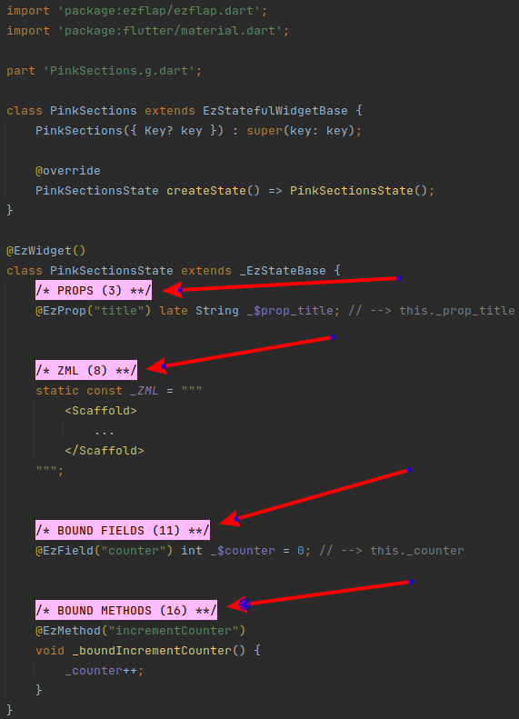
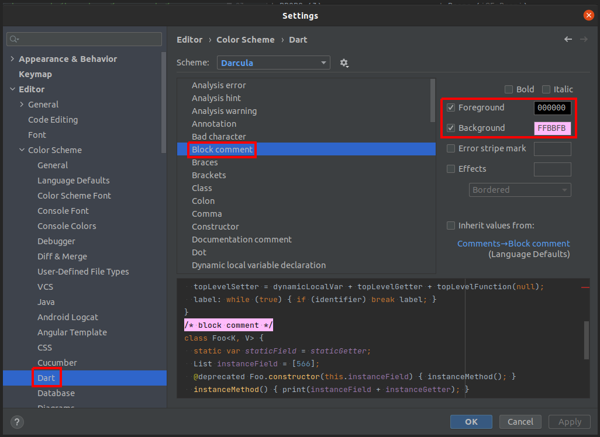

# Pink Sections
## Overview
By convention, an ezFlap widget is divided into sections.

Each section contains a well-defined part of the widget class.

To visually differentiate between the sections, we start each section with its own Pink Section label:

The number in the parentheses tells us the order of the sections. Not every widget uses all types of pink sections, so
usually there will be gaps between the numbers.

The pink section labels are just regular Dart comments and have no effect on ezFlap or on the ~~~~application itself.

## Table
| Title                             | Description                                      | Live Template Shortcut             |
| --------------------------------- | ------------------------------------------------ | -----------------------------------|
| ROUTE PARAMS (1)                  | Route parameters (`@EzRouteParam`)               | **sec01_routeParams**              |
| MODELS (2)                        | Models (`@EzModel`, `@EzOptionalModel`)          | **sec02_models**                   |
| PROPS (3)                         | Props (`@EzProp`)                                | **sec03_props**                    |
| EVENT EMITTERS (4)                | Event emitters (`@EzEmit`)                       | **sec04_eventEmitters**            |
| PUBLIC METHODS (5)                | Public methods                                   | **sec05_publicMethods**            |
| CONSTS (6)                        | Constants                                        | **sec06_consts**                   |
| DEPENDENCIES (7)                  | Injected (and other) dependencies (e.g. `@EzDI`) | **sec07_dependencies**             |
| ZML (8)                           | `_ZML` and `_INITIAL_ZML`                        | **sec08_zml**                      |
| ZSS (9)                           | The `_ZSS` constant                              | **sec09_zss**                      |
| REFERENCES TO HOSTED WIDGETS (10) | References to hosted ezFlap widgets (`@EzRef`)   | **sec10_refs**                     |
| BOUND FIELDS (11)                 | Fields exposed to the ZML (`@EzField`)           | **sec11_boundFields**              |
| PRIVATE FIELDS (12)               | Private fields                                   | **sec12_privateFields**            |
| PROTECTED FIELDS (13)             | Protected fields                                 | **sec13_protectedFields**          |
| COMPUTED VALUES (14)              | Methods for computed values (`@EzComputed`)      | **sec14_computed**                 |
| PROTECTED METHODS (15)            | Protected methods                                | **sec15_protectedMethods**         |
| BOUND METHODS (16)                | Methods exposed to the ZML (`@EzMethod`)         | **sec16_boundMethods**             |
| WATCHES (17)                      | Watches (`@EzWatch`)                             | **sec17_watches**                  |
| INTERFACE IMPLEMENTATIONS (18)    | Implementation of interface functions            | **sec18_interfaceImplementations** |
| PRIVATE METHODS (19)              | Private methods                                  | **sec19_privateMethods**           |
| LIFECYCLE (20)                    | Life-cycle hook overrides (e.g. `hookInitState`) | **sec20_lifecycle**                |

## Shortcuts
Import Android Studio/IntelliJ IDEA Live Templates to be able to start typing the Live Template Shortcut of the desired
Pink Section, and have the Pink Section auto-completed for you.

Get the import file and instructions in [Live Templates](/tooling/live-templates/live-templates.html).

## How to Configure
To get the actual pink background in the Pink Section labels - we need to configure our editor to display block comments
(i.e. `/* */`) in pink background.

In Android Studio / IntelliJ IDEA, it can be done like this:

 * Open the Settings dialog (File --> Settings).
 * On the left-hand navigation, go to Editor --> Color Scheme --> Dart.
 * In the center list, select "Block comment".
 * If the "inherit values from" checkbox on the right side is ticked - untick it.
 * Set Foreground to: `000000`.
 * Set Background to: `FFBBFB`.
 * If any other visual effects are ticked - untick them.
 * Press OK.

 